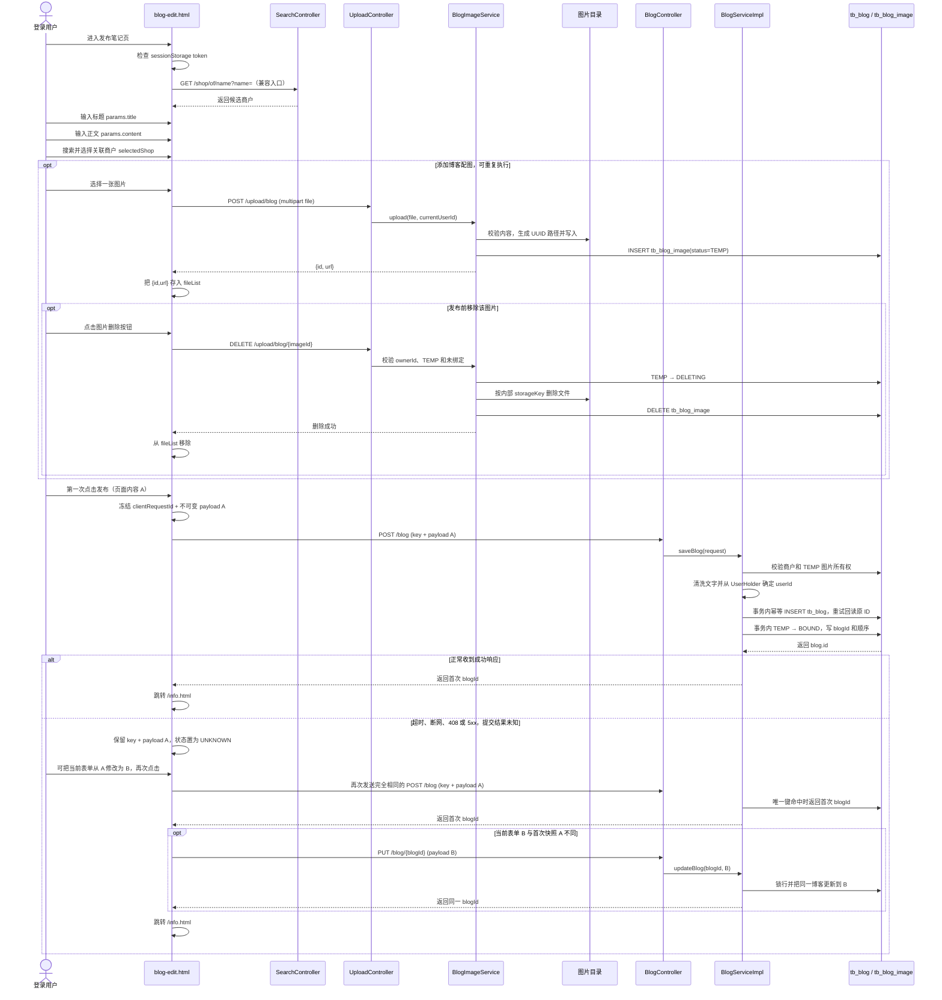
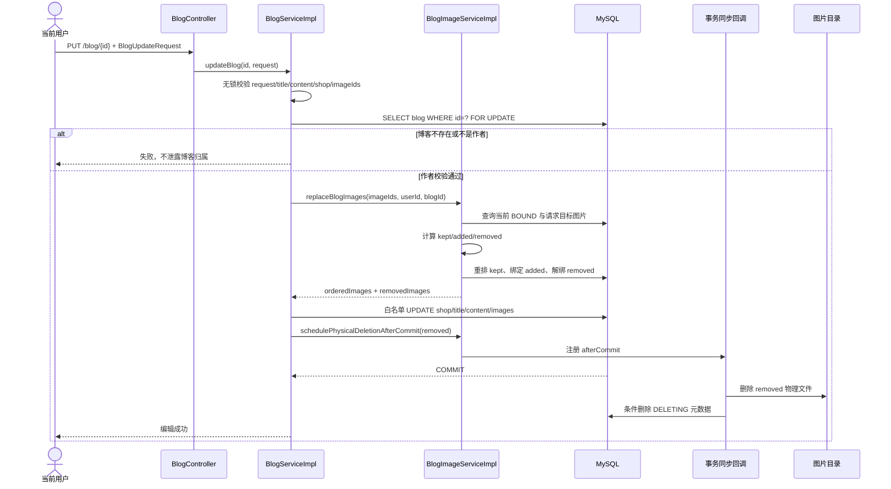
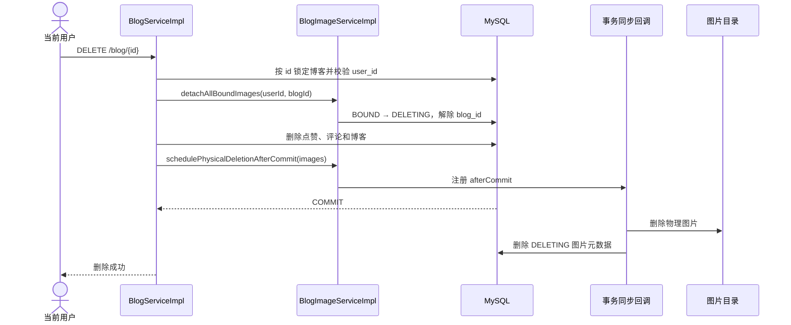

[[博客索引|返回博客索引]]

---

> [!tip] 分阶段阅读
> 如果当前目标是先掌握基础业务，再学习数据库回滚、缓存一致性和网络故障，请先阅读 [[hmdp-分阶段实现与故障处理]]。该文档把正常功能、不可删除的数据库基础正确性，以及第二轮可靠性机制分开说明。

## 项目概览

- **技术栈**：Java 8 / Spring Boot 2.7.4 / MyBatis-Plus 3.5.2 / Redis / Flyway / MySQL
- **启动类**：`HmDianPingApplication.java`（端口 9090）
- **数据库**：`hmdp`（单库）
- **前端**：`frontend/` 是当前 Nuxt 4 基础功能前端；`src/main/resources/nginx-1.18.0/html/hmdp/` 保留为旧静态页面和历史资源兼容层

```
hmdp/
├── src/main/java/com/hmdp/
│   ├── HmDianPingApplication.java
│   ├── auth/          ← 鉴权解析器（Redis-token 已闭环；JWT / Session 为模板）
│   ├── config/        ← MVC 拦截器、MyBatis-Plus、全局异常
│   ├── controller/    ← REST 控制器
│   ├── dto/           ← 请求/响应 DTO（Result, ScrollResult, UserDTO...）
│   ├── entity/        ← 实体（映射数据库表）
│   ├── interceptor/   ← 登录拦截器、认证上下文
│   ├── mapper/        ← MyBatis-Plus Mapper
│   ├── service/
│   │   ├── blog/      ← 博客命令、查询、点赞、DTO 装配与幂等服务
│   │   ├── impl/      ← 服务实现
│   │   ├── cleanup/   ← 临时图片等后台清理任务
│   │   ├── feedcache/ ← Feed 缓存（Redis List + Caffeine）
│   │   ├── follow/    ← 关注变更事件与事务提交后缓存同步
│   │   ├── search/    ← 独立检索能力及 MySQL/搜索引擎适配器
│   │   ├── storage/   ← 图片等文件存储适配
│   │   └── strategy/  ← 策略模式（召回 + 排序）
│   ├── sms/           ← 短信发送（开发环境打日志）
│   └── utils/         ← 工具类（Redis 锁、常量、密码加密）
├── src/main/resources/
│   ├── application.yaml
│   └── db/migration/  ← Flyway 迁移脚本
├── src/main/resources/nginx-1.18.0/html/hmdp/
│                       ← 旧静态页面与历史图片资源兼容层
└── frontend/          ← 当前 Nuxt 4 前端，已覆盖除下单/订单外的基础业务入口
```

当前按业务职责划分为六个领域和一组共享基础设施：

| 边界     | 核心职责                          | 当前主要数据                                                           |
| ------ | ----------------------------- | ---------------------------------------------------------------- |
| 用户与身份域 | 注册、登录、Token、资料、签到             | `tb_user`、`tb_user_info`、Redis Token/Bitmap                      |
| 内容域：博客 | 博客生命周期、图片资产、Feed、点赞、评论、内容查询   | `tb_blog`、`tb_blog_image`、`tb_blog_like`、`tb_idempotency_record` |
| 店铺域    | 店铺查询、缓存、地理位置检索                | `tb_shop`、`tb_shop_type`、Redis Cache/GEO                         |
| 搜索域    | 统一入口、垂直域召回、查询标准化、分页和分组结果、热榜/趋势（探索性榜单，见十、热榜与趋势） | `tb_shop`、`tb_blog`、`tb_user` 的 MySQL 关键词基线；热榜当前为 `tb_blog.liked` 排序；未来可接可重建搜索索引       |
| 社交关系域  | 关注关系、共同关注、关注缓存                | `tb_follow`、Redis Set、Caffeine                                   |
| 营销与交易域 | 优惠券、秒杀资格与订单                   | `tb_voucher`、`tb_seckill_voucher`、`tb_voucher_order`             |
| 共享基础设施 | 鉴权入口、文件存储、异常、Redis Key、Flyway | `auth/`、`config/`、`storage/`、`db/migration/`                     |

> [!note] 边界说明
> “发布博客”只是博客聚合的创建命令，不是编辑、删除、点赞或评论的外层模块。图片资产服务同时支撑发布、编辑和删除，因此放在博客生命周期中说明；底层存储能力再由共享基础设施章节统一描述。搜索是面向店铺、博客、用户等多类内容的横向读取能力，因此接口和实现独立于任一业务 Controller；当前三个 MySQL 垂直域均由 `SearchController` 对外提供。热榜（`GET /blog/hot`）按 Twitter 的先例（趋势是实时搜索基础设施的聚合产物）归入搜索/探索域（详见十、热榜与趋势），其当前实现仍是内容域的 MySQL 查询。

## 全域业务方法说明（统一格式）

本节统一记录当前所有 Controller 对外暴露的业务方法。代码中共有 45 个对外接口方法：44 个已有业务实现，只有 1 个秒杀下单接口按当前范围保持未实现；其中 `/shop/of/name` 是由 `SearchController` 承接的旧搜索兼容入口，不代表仍有两套查询实现。每个方法固定使用“状态、现实触发、调用、输入、正常流程、示例、数据与边界”七项；“现实触发”先说明用户在什么页面做了什么，避免把后端方法误解为用户需要手工执行的技术动作。示例数据只用于说明调用方式，不代表数据库中的固定值。内部私有辅助方法不在这里逐个罗列，其机制继续在后面的领域章节展开。

状态约定：

- ✅ **已实现**：正常调用链已有代码。
- 🟡 **已实现但有边界缺口**：可以运行，但存在文中明确列出的正确性、安全性或可靠性问题。
- ⬜ **未实现**：只保留空白位置，不虚构流程和返回结果。

### A. 用户与身份方法

#### `POST /user/code` — `sendCode()`

- **状态：** 🟡 已实现，但日志短信和 Redis 写入顺序仍有安全/故障缺口。
- **现实触发：** 用户在登录、手机号注册或绑定手机号页面填写手机号，然后点击“获取验证码”。
- **调用：** `UserController.sendCode()` → `IUserService.sendCode()` → `UserServiceImpl.sendCode()`。
- **输入：** Query 参数 `phone`。
- **正常流程：** 校验手机号 → Redis `SETNX` 限制 60 秒重复发送 → 生成 6 位验证码 → 调用 `SmsSender` → Redis 保存验证码和 TTL。
- **示例：** `POST /user/code?phone=13800138000` → `{"success":true}`。
- **数据与边界：** 使用 `login:code:{phone}` 和发送锁 Key；短信发送成功后 Redis 保存失败时，用户可能收到无法验证的验证码。

#### `POST /user/login` — `login()`

- **状态：** 🟡 已实现，Redis Token 故障尚未形成稳定 503 语义。
- **现实触发：** 用户在登录页输入账号密码、手机号密码或手机号验证码，然后点击“登录”。
- **调用：** `UserController.login()` → `IUserService.login()` → `UserServiceImpl.login()`。
- **输入：** `account + password`、`phone + password` 或 `phone + code` 三种组合之一。
- **正常流程：** 根据字段组合选择登录方式 → 查询 `tb_user` → 校验 BCrypt 密码或 Redis 验证码 → 初始化用户资料 → Redis Hash 保存 `UserDTO` → 返回 Token。
- **示例：** `POST /user/login`，Body `{"account":"alice","password":"Pass@123"}` → `{"success":true,"data":"<token>"}`。
- **数据与边界：** MySQL 保存账号，Redis 保存登录态；Hash 写成功而 TTL 失败时可能留下无过期时间的 Token。

#### `POST /user/signup` — `signUp()`

- **状态：** 🟡 已实现，但手机号默认密码和注册原子性存在 P0/P1 缺口。
- **现实触发：** 新用户第一次使用系统，在注册页提交账号密码，或者手机号和验证码。
- **调用：** `UserController.signUp()` → `IUserService.signUp()` → `UserServiceImpl.signUp()`。
- **输入：** 账号注册使用 `account + password`；手机号注册使用 `phone + code`，也可携带密码。
- **正常流程：** 校验字段和唯一性 → 创建 `tb_user` → 可选绑定手机号 → 手机号注册时签发 Redis Token。
- **示例：** `POST /user/signup`，Body `{"account":"alice","password":"Pass@123"}` → `{"success":true,"data":{"requiresPhoneBinding":true,"message":"账号注册成功，请绑定手机号"}}`。
- **数据与边界：** 账号与手机号有数据库唯一索引；账号创建和可选绑定不在同一事务，无密码手机号注册还会生成可预测初始密码。

#### `POST /user/bind-phone` — `bindPhone()`

- **状态：** 🟡 已实现，但当前存在账号主体校验漏洞。
- **现实触发：** 只用账号完成第一阶段注册的用户，在后续页面补充手机号以完成绑定并取得登录 Token。
- **调用：** `UserController.bindPhone()` → `IUserService.bindPhone()` → `UserServiceImpl.bindPhone()`。
- **输入：** Body 中的 `account`、`phone`、`code`。
- **正常流程：** 按 `account` 查询用户 → 校验手机号验证码 → 更新 `tb_user.phone` → 删除验证码 → 返回新 Token。
- **示例：** `POST /user/bind-phone`，Body `{"account":"alice","phone":"13800138000","code":"123456"}` → `{"success":true,"data":"<token>"}`。
- **数据与边界：** 当前公开接口信任客户端提供的目标账号，掌握任意新手机号验证码的人可能绑定他人账号；必须改为登录主体或一次性绑定凭证。

#### `POST /user/sign` — `sign()`

- **状态：** ✅ 已实现。
- **现实触发：** 已登录用户在每日签到入口点击“签到”。
- **调用：** `UserController.sign()` → `IUserService.sign()` → `UserServiceImpl.sign()`。
- **输入：** 无业务参数；用户 ID 来自登录上下文。
- **正常流程：** 计算当前年月和日序号 → Redis Bitmap 对当日 offset 执行 `SETBIT true`。
- **示例：** 携带 Token 调用 `POST /user/sign` → `{"success":true}`。
- **数据与边界：** Key 为 `sign:{userId}:yyyyMM`；签到当前只存在 Redis，Redis 数据丢失后没有 MySQL 恢复源。

#### `GET /user/sign/count` — `signCount()`

- **状态：** ✅ 已实现。
- **现实触发：** 签到页面打开或签到成功后，页面需要展示“已连续签到几天”。
- **调用：** `UserController.signCount()` → `IUserService.signCount()` → `UserServiceImpl.signCount()`。
- **输入：** 无业务参数；读取当前登录用户。
- **正常流程：** `BITFIELD` 读取本月截至今天的位图 → 从最低位向前统计连续的 1。
- **示例：** `GET /user/sign/count` → `{"success":true,"data":3}`，表示含今天连续签到 3 天。
- **数据与边界：** 只统计当前自然月；跨月不会继续累计上个月的连续天数。

#### `POST /user/logout` — `logout()`

- **状态：** 🟡 已实现，Redis 删除失败时旧 Token 仍可能有效。
- **现实触发：** 用户在头像菜单或设置页点击“退出登录”。
- **调用：** `UserController.logout()` → `IUserService.logOut()` → `UserServiceImpl.logOut()`。
- **输入：** `Authorization` 请求头，兼容原始 Token 和 `Bearer <token>`。
- **正常流程：** 规范化 Token → 删除 `login:token:{token}` → 返回成功；空 Token 按幂等成功处理。
- **示例：** `POST /user/logout`，Header `Authorization: abc123` → `{"success":true}`。
- **数据与边界：** 登录态位于 Redis；删除失败不会在数据库留下事务问题，但会延迟实际登出。

#### `GET /user/me` — `me()`

- **状态：** ✅ 已实现。
- **现实触发：** 页面刷新后，导航栏或个人中心需要知道“当前登录的是谁”。
- **调用：** `UserController.me()` 直接读取 `UserHolder`。
- **输入：** `Authorization` 请求头。
- **正常流程：** 认证拦截器从 Token 解析 `UserDTO` 并放入线程上下文 → Controller 返回当前用户摘要。
- **示例：** `GET /user/me` → `{"success":true,"data":{"id":1,"nickName":"示例用户"}}`。
- **数据与边界：** 返回认证时保存的 DTO 快照；用户刚修改昵称后，旧 Token 中的资料可能暂时不更新。

#### `GET /user/{id}` — `queryUserById()`

- **状态：** ✅ 已实现。
- **现实触发：** 用户从点赞榜、关注列表或共同关注列表点击另一个人的头像，页面需要加载对方的公开摘要。
- **调用：** `UserController.queryUserById()` → MyBatis-Plus `userService.getById()`。
- **输入：** Path 参数 `id`。
- **正常流程：** 按主键查询 `tb_user` → 复制成 `UserDTO` → 用户不存在时返回空数据。
- **示例：** `GET /user/2` → `{"success":true,"data":{"id":2,"nickName":"示例用户"}}`。
- **数据与边界：** 不返回账号、手机号和密码；当前查询逻辑直接写在 Controller。

#### `GET /user/info/{id}` — `info()`

- **状态：** 🟡 已实现，但直接返回 `UserInfo` Entity。
- **现实触发：** 用户打开自己或他人的个人主页，需要展示城市、简介、性别和生日等扩展资料。
- **调用：** `UserController.info()` → `IUserInfoService.getById()`。
- **输入：** Path 参数 `id`。
- **正常流程：** 按 `user_id` 查询 `tb_user_info` → 清空创建/更新时间 → 返回资料。
- **示例：** `GET /user/info/2` → `{"success":true,"data":{"userId":2,"city":"杭州","gender":1}}`。
- **数据与边界：** 当前没有专用响应 DTO；资料不存在时返回成功但 `data` 为空。

#### `PUT /user/info` — `changeInfo()`

- **状态：** 🟡 已实现，但请求仍直接使用 `UserInfo` Entity。
- **现实触发：** 当前用户在“编辑个人资料”页面修改城市、简介、性别或生日并点击保存。
- **调用：** `UserController.changeInfo()` → `IUserService.changeInfo()` → `UserServiceImpl.changeInfo()`。
- **输入：** Body 中的 `city`、`introduce`、`gender`、`birthday`；用户 ID 取自登录上下文。
- **正常流程：** 确保资料行存在 → 构造只含白名单字段的更新对象 → `updateById()`。
- **示例：** `PUT /user/info`，Body `{"city":"杭州","introduce":"喜欢探店","gender":1}` → `{"success":true}`。
- **数据与边界：** Service 不接受请求体伪造的 userId；仍应增加请求 DTO 和字段长度/枚举校验。

### B. 店铺方法

#### `GET /shop/{id}` — `queryShopById()`

- **状态：** 🟡 已实现，但 Redis 故障回源和锁等待仍有缺口。
- **现实触发：** 用户点击店铺列表卡片、打开别人分享的店铺链接，或在博客详情中查看关联商户；前端从列表项、路由或博客的 `shopId` 自动取得 ID，不要求用户手工输入。
- **调用：** `ShopController.queryShopById()` → `IShopService.queryById()` → `ShopServiceImpl.queryById()`。
- **输入：** Path 参数 `id`。
- **正常流程：** 查 Redis 店铺缓存 → 未命中时获取 Redis 锁 → 查询 `tb_shop` → 写入正常值或空值缓存 → 返回。
- **示例：** `GET /shop/1` → `{"success":true,"data":{"id":1,"name":"示例店铺","typeId":1}}`。
- **数据与边界：** MySQL 是真相；已删除店铺的旧分享链接、过期列表数据、爬虫或伪造 URL 仍可能请求不存在的 ID，空值缓存用于阻止这些请求反复穿透 MySQL。当前 Redis 异常不会直接回源，锁失败使用无上限递归重试。

#### `GET /shop/of/type` — `queryShopByType()`

- **状态：** 🟡 已实现，两条查询分支缺少统一参数校验和稳定分页测试。
- **现实触发：** 用户在首页选择“美食/KTV”等分类，或允许定位后查看当前位置 5km 内同类店铺；继续下拉会请求下一页。
- **调用：** `ShopController.queryShopByType()` → `IShopService.queryShopByType()` → `ShopServiceImpl.queryShopByType()`。
- **输入：** `typeId`、`current`，以及可选的 `x/y`；只有两者都非空时才进入附近查询。
- **正常流程：** 无完整坐标时按 `type_id` 查询 MySQL 页；有坐标时 Redis GEO 查 5km 内 ID 和距离，再由 MySQL 批量补全店铺详情。
- **示例：** `GET /shop/of/type?typeId=1&current=1&x=120.1&y=30.2` → `{"success":true,"data":[{"id":1,"distance":153.2}]}`。
- **数据与边界：** 当前没有校验 `x/y` 必须成对出现，单独传一个坐标会静默退回 MySQL 类型分页；GEO 只存 ID 和坐标，新增、修改、删除店铺后也不会同步 GEO。

#### `GET /shop-type/list` — `queryTypeList()`

- **状态：** ✅ 已实现。
- **现实触发：** 首页或店铺列表页首次打开时，需要加载“美食、KTV、美发”等分类标签供用户筛选。
- **调用：** `ShopTypeController.queryTypeList()` → MyBatis-Plus `typeService.query()`。
- **输入：** 无。
- **正常流程：** 查询 `tb_shop_type` → 按 `sort ASC` 排序 → 返回全部类型。
- **示例：** `GET /shop-type/list` → `{"success":true,"data":[{"id":1,"name":"美食","sort":1}]}`。
- **数据与边界：** 当前直接查 MySQL 并返回 Entity；类型数量少时无需为了形式强加缓存。

#### `POST /shop` — `saveShop()`

- **状态：** 🟡 已实现，但管理权限、DTO、写结果和 GEO 同步均未收口。
- **现实触发：** 运营人员在管理后台录入一家新店的名称、分类、地址和坐标；当前项目尚未真正建立管理员权限边界。
- **调用：** `ShopController.saveShop()` → MyBatis-Plus `shopService.save()`。
- **输入：** `Shop` JSON。
- **正常流程：** 插入 `tb_shop` → 返回生成的店铺 ID。
- **示例：** `POST /shop`，Body `{"name":"示例店铺","typeId":1,"x":120.1,"y":30.2}` → `{"success":true,"data":15}`。
- **数据与边界：** 当前 `/shop/**` 在匿名白名单；保存结果未检查，新增坐标也不写 Redis GEO。

#### `PUT /shop` — `updateShop()`

- **状态：** 🟡 已实现，但写结果和 GEO 一致性未收口。
- **现实触发：** 运营人员在管理后台修改店名、地址、分类、营业时间或坐标并点击保存。
- **调用：** `ShopController.updateShop()` → `IShopService.update()` → `ShopServiceImpl.update()`。
- **输入：** 包含 `id` 和待更新字段的 `Shop` JSON。
- **正常流程：** `updateById()` 更新 MySQL → 删除 `cache:shop:{id}`。
- **示例：** `PUT /shop`，Body `{"id":1,"name":"新店名"}` → `{"success":true}`。
- **数据与边界：** 当前不检查影响行数，直接接收 Entity；坐标或类型变化后不更新 GEO，缓存删除失败还可能让接口在数据库成功后返回异常。

### C. 博客与点赞方法

#### `POST /blog` — `saveBlog()`

- **状态：** ✅ 已实现。
- **现实触发：** 用户在发布页选好店铺、填写标题和正文、上传图片后点击“发布笔记”。
- **调用：** `BlogController.saveBlog()` → `IBlogService.saveBlog()` → `BlogServiceImpl.saveBlog()` → `BlogCommandService.publish()`。
- **输入：** `clientRequestId`、`shopId`、`title`、`content`、有序 `imageIds`。
- **正常流程：** 校验登录与请求 → 取得幂等创建资格 → 校验商户和临时图片 → 插入博客 → 绑定图片 → 保存首次结果，全部位于同一事务。
- **示例：** `POST /blog`，Body `{"clientRequestId":"req-001","shopId":1,"title":"探店","content":"很好吃","imageIds":[10]}` → `{"success":true,"data":101}`。
- **数据与边界：** 写入 `tb_blog`、`tb_blog_image`、`tb_idempotency_record`；同一请求 ID 重试返回第一次 blogId。

#### `PUT /blog/{id}` — `updateBlog()`

- **状态：** ✅ 已实现。
- **现实触发：** 博客作者在自己的笔记详情或管理入口点击“编辑”，修改文字、关联店铺或图片顺序后保存。
- **调用：** `BlogController.updateBlog()` → `IBlogService.updateBlog()` → `BlogServiceImpl.updateBlog()` → `BlogCommandService.update()`。
- **输入：** Path `id`；Body 为编辑后的完整 `shopId/title/content/imageIds`。
- **正常流程：** 本地参数校验 → 校验商户 → 行锁读取博客并验证作者 → 替换图片关系 → 白名单 UPDATE 博客 → 提交后删除被移除文件。
- **示例：** `PUT /blog/101`，Body `{"shopId":1,"title":"修改标题","content":"修改正文","imageIds":[10,11]}` → `{"success":true,"data":101}`。
- **数据与边界：** 只允许作者编辑；`shopId` 当前必须指向有效店铺，图片列表表示最终完整集合，不是仅新增的图片。

#### `DELETE /blog/{id}` — `deleteBlog()`

- **状态：** ✅ 已实现。
- **现实触发：** 博客作者在自己的笔记菜单中点击“删除”并确认。
- **调用：** `BlogController.deleteBlog()` → `IBlogService.deleteBlog()` → `BlogServiceImpl.deleteBlog()` → `BlogCommandService.delete()`。
- **输入：** Path `id`。
- **正常流程：** 行锁读取并验证作者 → 图片标记 `DELETING` → 删除点赞和评论关系 → 删除博客 → 事务提交后物理删文件。
- **示例：** `DELETE /blog/101` → `{"success":true}`。
- **数据与边界：** 幂等发布记录不会随博客删除，避免旧 POST 重放后重新创建；文件删除失败由后台任务重试。

#### `PUT /blog/{id}/like` — `likeBlog()`

- **状态：** ✅ 已实现。
- **现实触发：** 当前用户看到一篇尚未点赞的博客，点击空心点赞按钮，希望最终状态变成“已点赞”。
- **调用：** `BlogController.likeBlog()` → `IBlogService.likeBlog()` → `BlogServiceImpl.likeBlog()` → `BlogLikeService.like()`。
- **输入：** Path `id`；当前用户来自登录上下文。
- **正常流程：** 校验博客 → 插入点赞关系 → 只有首次插入才增加 `tb_blog.liked` → 回读最终状态。
- **示例：** `PUT /blog/101/like` → `{"success":true,"data":{"liked":true,"likeCount":8}}`。
- **数据与边界：** `UNIQUE(blog_id,user_id)` 保证重复 PUT 幂等；关系与计数处于同一事务。

#### `DELETE /blog/{id}/like` — `unlikeBlog()`

- **状态：** ✅ 已实现。
- **现实触发：** 当前用户再次点击已经点亮的点赞按钮，希望最终状态变成“未点赞”。
- **调用：** `BlogController.unlikeBlog()` → `IBlogService.unlikeBlog()` → `BlogServiceImpl.unlikeBlog()` → `BlogLikeService.unlike()`。
- **输入：** Path `id`；当前用户来自登录上下文。
- **正常流程：** 删除点赞关系 → 只有实际删除一行时才把计数减一 → 回读最终状态。
- **示例：** `DELETE /blog/101/like` → `{"success":true,"data":{"liked":false,"likeCount":7}}`。
- **数据与边界：** 重复 DELETE 保持未点赞，不会把计数继续减成负数。

#### `GET /blog/{id}` — `queryBlogById()`

- **状态：** ✅ 已实现。
- **现实触发：** 用户从热榜、Feed、作者主页或分享链接进入某篇博客的详情页。
- **调用：** `BlogController.queryBlogById()` → `IBlogService.queryBlogById()` → `BlogServiceImpl.queryBlogById()` → `BlogQueryService.detail()`。
- **输入：** Path `id`。
- **正常流程：** 查询博客 → 查询作者摘要 → 当前登录时查询点赞关系 → 组装 `BlogDetailDTO`。
- **示例：** `GET /blog/101` → `{"success":true,"data":{"id":101,"userId":1,"name":"示例用户","title":"探店","content":"很好吃","isLike":true}}`。
- **数据与边界：** 详情返回完整正文；列表使用更小的 `BlogCardDTO`，避免把正文重复发送。

#### `GET /blog/likes/{id}` — `queryBlogLikes()`

- **状态：** ✅ 已实现。
- **现实触发：** 博客详情页展示“最近点赞的人”，或用户点击点赞人数查看更多并继续下拉。
- **调用：** `BlogController.queryBlogLikes()` → `IBlogService.queryBlogLikes()` → `BlogServiceImpl.queryBlogLikes()` → `BlogLikeService.queryUsers()`。
- **输入：** Path `id`，可选 opaque `cursor`，`limit` 默认 10。
- **正常流程：** 按 `(create_time,id)` 倒序读取点赞关系 → 批量查询用户 → 按关系顺序恢复 → 返回游标页。
- **示例：** `GET /blog/likes/101?limit=1` → `{"success":true,"data":{"list":[{"id":2,"nickName":"示例用户"}],"nextCursor":"<cursor>","hasMore":true}}`。
- **数据与边界：** MySQL 点赞关系是唯一数据源；客户端只能原样回传 cursor。

#### `GET /blog/feed` — `queryBlogFeed()`

- **状态：** ✅ 已实现。
- **现实触发：** 已登录用户打开关注流或“为你推荐”首页，下拉加载下一页，或主动下拉刷新最新内容。
- **调用：** `BlogController.queryBlogFeed()` → `IBlogService.queryBlogFeed()` → `BlogServiceImpl.queryBlogFeed()` → `BlogFeedService.query()` → 召回/排序/快照组件。
- **输入：** `mode=following|for_you`、可选 cursor、可选 `refresh`。
- **正常流程：** 尝试读取 Redis List 快照 → 未命中时执行对应召回和排序 → 批量装配博客卡片 → 发布新快照 → 返回下一页游标。
- **示例：** `GET /blog/feed?mode=following&refresh=true` → `{"success":true,"data":{"list":[{"id":101}],"hasMore":false}}`。
- **数据与边界：** Feed 是 Pull 模式；Redis 故障时 Following 可回源，For You 无法复现排序时会诚实结束当前降级页。

#### `GET /blog/of/me` — `queryMyBlog()`

- **状态：** ✅ 已实现。
- **现实触发：** 当前用户进入“我的主页/我的笔记”，查看自己发布过的内容并继续翻页。
- **调用：** `BlogController.queryMyBlog()` → `IBlogService.queryMyBlogs()` → `BlogServiceImpl.queryMyBlogs()` → `BlogQueryService.currentUserBlogs()`。
- **输入：** 可选 cursor，`limit` 默认 10；用户取自登录上下文。
- **正常流程：** 按当前 userId 和 `(create_time,id)` 倒序分页 → 整页批量装配作者与点赞状态。
- **示例：** `GET /blog/of/me?limit=10` → `{"success":true,"data":{"list":[{"id":101,"title":"探店"}],"hasMore":false}}`。
- **数据与边界：** 返回 `BlogCardDTO`，不包含完整正文和更新时间。

#### `GET /blog/of/user` — `queryBlogByUserId()`

- **状态：** ✅ 已实现。
- **现实触发：** 用户从头像进入另一个作者的主页，查看这个作者发布过的博客。
- **调用：** `BlogController.queryBlogByUserId()` → `IBlogService.queryBlogsByUserId()` → `BlogServiceImpl.queryBlogsByUserId()` → `BlogQueryService.userBlogs()`。
- **输入：** Query `id`、可选 cursor、`limit` 默认 10。
- **正常流程：** 按指定作者和 `(create_time,id)` 倒序分页 → 批量装配卡片。
- **示例：** `GET /blog/of/user?id=2&limit=10` → `{"success":true,"data":{"list":[{"id":88,"userId":2,"name":"示例用户"}],"hasMore":false}}`。
- **数据与边界：** 当前返回空页表示该用户没有博客；作者是否存在可由用户接口另行确认。

#### `GET /blog/hot` — `queryHotBlog()`

- **状态：** 🟡 已实现，但实时热度字段变化会使跨页近似稳定。
- **现实触发：** 未登录或已登录用户打开首页热榜，或者继续下拉查看更多热门博客。
- **调用：** `BlogController.queryHotBlog()` → `IBlogService.queryHotBlog()` → `BlogServiceImpl.queryHotBlog()` → `BlogQueryService.hot()`。
- **模块归属：** 搜索/探索域（见十、热榜与趋势）；当前实现是内容域的 MySQL 查询，无关键词检索能力。
- **输入：** 可选 cursor，`limit` 默认 10。
- **正常流程：** 按 `(liked DESC,id DESC)` 做 keyset pagination → 批量装配博客卡片。
- **示例：** `GET /blog/hot?limit=1` → `{"success":true,"data":{"list":[{"id":101,"liked":88}],"nextCursor":"<cursor>","hasMore":true}}`。
- **数据与边界：** 翻页期间点赞数变化可能产生漏项或重现；严格会话稳定需要版本化排名快照。

### D. 博客图片方法

#### `POST /upload/blog` — `uploadImage()`

- **状态：** ✅ 已实现。
- **现实触发：** 用户在博客发布或编辑页面选择本地图片；页面先上传文件取得资产 ID，稍后发布博客时只提交这个 ID。
- **调用：** `UploadController.uploadImage()` → `IBlogImageService.upload()` → `BlogImageServiceImpl.upload()` → `BlogImageStorage.store()`。
- **输入：** `multipart/form-data` 字段 `file`。
- **正常流程：** 校验登录、大小、真实图片格式、扩展名和像素 → 保存文件 → 创建 `TEMP` 图片资产记录 → 返回资产 ID 与预览 URL。
- **示例：** `POST /upload/blog`，Form `file=@food.jpg` → `{"success":true,"data":{"id":10,"url":"/imgs/blogs/...jpg"}}`。
- **数据与边界：** 发布和编辑只接收 imageId，不信任客户端路径；文件落盘后数据库写失败会尝试清理文件。

#### `DELETE /upload/blog/{imageId}` — `deleteBlogImage()`

- **状态：** 🟡 已实现，但临时文件与数据库删除之间仍有失败窗口。
- **现实触发：** 用户发布博客前从图片预览列表移除一张刚上传但尚未使用的图片。
- **调用：** `UploadController.deleteBlogImage()` → `IBlogImageService.deleteTemporaryImage()` → `BlogImageServiceImpl.deleteTemporaryImage()`。
- **输入：** Path `imageId`；用户来自登录上下文。
- **正常流程：** 查询资产并验证所有者和 `TEMP` 状态 → 条件领取为 `DELETING` → 删除物理文件 → 删除资产记录。
- **示例：** `DELETE /upload/blog/10` → `{"success":true}`。
- **数据与边界：** 不能删除他人的图片或已绑定图片；文件已删而数据库删除失败时，当前恢复 `TEMP` 可能形成指向不存在文件的记录。

### E. 社交关系方法

#### `PUT /follow/{id}/{isFollow}` — `follow()`

- **状态：** 🟡 已实现，但目标用户存在性和跨资源可靠同步仍有缺口。
- **现实触发：** 用户在作者主页或博客详情点击“关注”或“取消关注”；`isFollow` 表达点击后希望得到的最终状态。
- **调用：** `FollowController.follow()` → `IFollowService.follow()` → `FollowServiceImpl.follow()`。
- **输入：** Path `id` 为目标用户，`isFollow=true|false` 表示期望的最终状态。
- **正常流程：** 校验非空且不能关注自己 → true 时幂等插入 `tb_follow`，false 时幂等删除 → 事务提交后更新 Redis Set 并失效 Caffeine/Feed 缓存。
- **示例：** `PUT /follow/2/true` → `{"success":true}`；重复调用仍保持已关注。
- **数据与边界：** `UNIQUE(user_id,follow_user_id)` 防重复；当前未验证用户 2 是否存在，提交后进程崩溃还可能漏掉缓存事件。

#### `GET /follow/or/not/{id}` — `isFollow()`

- **状态：** 🟡 已实现，但 Redis 残留 true 可能误报。
- **现实触发：** 作者主页或博客详情打开时，页面需要决定关注按钮应显示“关注”还是“已关注”。
- **调用：** `FollowController.isFollow()` → `IFollowService.isFollow()` → `FollowServiceImpl.isFollow()`。
- **输入：** Path `id` 为目标用户。
- **正常流程：** 先查 `follow:{selfId}` Redis Set → 未命中时查 `tb_follow` → 数据库存在则补一个 Redis member。
- **示例：** `GET /follow/or/not/2` → `{"success":true,"data":true}`。
- **数据与边界：** Redis false 会回源 MySQL，但 Redis true 不回查；取关后的缓存删除失败时可能返回旧状态。

#### `GET /follow/list/{id}` — `getFollows()`

- **状态：** ✅ 已实现。
- **现实触发：** 用户进入自己或他人的“关注列表”，查看这个账号关注了哪些人。
- **调用：** `FollowController.getFollows()` → `IFollowService.getFollows()` → `FollowServiceImpl.getFollows()`。
- **输入：** Path `id` 为要查看的用户。
- **正常流程：** 查询 `tb_follow` → 提取 followUserId → `listByIds()` 批量查询 `tb_user` → 转成 `UserDTO`。
- **示例：** `GET /follow/list/1` → `{"success":true,"data":[{"id":2,"nickName":"示例用户"}]}`。
- **数据与边界：** 已避免逐个用户 N+1 查询；当前没有显式排序和游标分页，关注量很大时会一次返回全部。

#### `GET /follow/common/{id}` — `followCommons()`

- **状态：** 🟡 已实现，但当前结果可能错误为空。
- **现实触发：** 当前用户进入另一个人的主页，页面展示“你们共同关注了谁”。
- **调用：** `FollowController.followCommons()` → `IFollowService.followCommons()` → `FollowServiceImpl.followCommons()`。
- **输入：** Path `id` 为另一个用户。
- **正常流程：** Redis `SINTER follow:{selfId} follow:{otherId}` → 批量查询交集用户 → 返回 `UserDTO`。
- **示例：** `GET /follow/common/2` → `{"success":true,"data":[{"id":3,"nickName":"共同关注用户"}]}`。
- **数据与边界：** 两个 Redis Set 没有完整装载标记，冷启动、Key 丢失或部分回填时会把“缓存不完整”误判成“没有共同关注”；第一轮应改为 MySQL 交集查询。

### F. 优惠券与交易方法

#### `GET /voucher/list/{shopId}` — `queryVoucherOfShop()`

- **状态：** ✅ 已实现。
- **现实触发：** 用户打开某家店铺详情页，页面同时加载这家店当前可展示的普通券和秒杀券。
- **调用：** `VoucherController.queryVoucherOfShop()` → `IVoucherService.queryVoucherOfShop()` → `VoucherServiceImpl.queryVoucherOfShop()` → `VoucherMapper.queryVoucherOfShop()`。
- **输入：** Path `shopId`。
- **正常流程：** 查询指定店铺的普通券和秒杀券信息 → 返回列表。
- **示例：** `GET /voucher/list/1` → `{"success":true,"data":[{"id":1,"shopId":1,"title":"50元代金券"}]}`。
- **数据与边界：** 查询 Mapper 会组合券基础信息与秒杀信息；当前直接返回 `Voucher` Entity。

#### `POST /voucher` — `addVoucher()`

- **状态：** 🟡 已实现，但当前管理接口可匿名调用且不检查保存结果。
- **现实触发：** 运营人员在管理后台为某家店创建一张普通优惠券；当前项目尚未建立真正的管理员授权。
- **调用：** `VoucherController.addVoucher()` → MyBatis-Plus `voucherService.save()`。
- **输入：** `Voucher` JSON。
- **正常流程：** 插入 `tb_voucher` → 返回生成的券 ID。
- **示例：** `POST /voucher`，Body `{"shopId":1,"title":"新人券","payValue":900,"actualValue":1000,"type":0}` → `{"success":true,"data":10}`。
- **数据与边界：** `/voucher/**` 当前位于匿名白名单；直接接收 Entity，缺少管理员权限和请求字段白名单。

#### `POST /voucher/seckill` — `addSeckillVoucher()`

- **状态：** 🟡 已实现，但管理权限和输入边界未收口。
- **现实触发：** 运营人员配置一场限时抢券活动，填写券面信息、库存和生效时间后点击发布。
- **调用：** `VoucherController.addSeckillVoucher()` → `IVoucherService.addSeckillVoucher()` → `VoucherServiceImpl.addSeckillVoucher()`。
- **输入：** 同时包含券基础字段及 `stock/beginTime/endTime` 的 `Voucher` JSON。
- **正常流程：** 事务内插入 `tb_voucher` → 使用生成 ID 插入 `tb_seckill_voucher` → 返回券 ID。
- **示例：** `POST /voucher/seckill`，Body `{"shopId":1,"title":"限时券","type":1,"stock":100,"beginTime":"2026-08-06T10:00:00","endTime":"2026-08-06T12:00:00"}` → `{"success":true,"data":11}`。
- **数据与边界：** 两表写入已使用事务；当前没有校验库存非负、开始时间早于结束时间，也没有管理员授权。

#### `POST /voucher-order/seckill/{id}` — `seckillVoucher()`

- **状态：** ⬜ 未实现。
- **现实触发：**
- **调用：**
- **输入：**
- **正常流程：**
- **示例：**
- **数据与边界：**

### G. 评论方法

#### `POST /blog-comments` — `createComment()`

- **状态：** ✅ 已实现。
- **现实触发：** 已登录用户在博客详情输入文字并发布一级评论，或在某条评论下点击“回复”。
- **调用：** `BlogCommentsController.createComment()` → `IBlogCommentsService.createComment()` → `BlogCommentsServiceImpl.createComment()`。
- **输入：** Body 必须包含 `blogId/content`；回复时同时包含一级评论 `parentId` 和实际被回复评论 `answerId`。
- **正常流程：** 从登录上下文取得作者 → 校验博客存在和 255 字符边界 → 校验父评论、回复目标属于同一博客和同一评论串 → 同一事务插入 `tb_blog_comments` 并增加 `tb_blog.comments`。
- **示例：** `POST /blog-comments`，Body `{"blogId":4,"content":"这家店值得去"}` → 返回新评论 ID；回复时提交 `{"blogId":4,"content":"同意","parentId":101,"answerId":101}`。
- **数据与边界：** 作者不能由客户端指定；当前保存纯文本基础评论，限流、审核、举报和软删除属于后续增强。

#### `GET /blog-comments` — `queryComments()`

- **状态：** ✅ 已实现。
- **现实触发：** 用户打开博客详情或点击“加载更多评论”。
- **调用：** `BlogCommentsController.queryComments()` → `IBlogCommentsService.queryComments()` → `BlogCommentsServiceImpl.queryComments()`。
- **输入：** `blogId`、可选 opaque `cursor`、`limit` 默认 20且范围 1～50。
- **正常流程：** 按 `(create_time DESC,id DESC)` 游标分页一级评论 → 一次查询当前页全部回复 → 批量查询作者和被回复用户 → 组装 `CursorPageDTO<BlogCommentDTO>`。
- **示例：** `GET /blog-comments?blogId=4&limit=20` 返回博客 4 的一级评论，每条一级评论的 `replies` 按时间正序展示。
- **数据与边界：** 只返回 `status=0` 的评论；分页边界只作用于一级评论，避免回复数量改变一级评论页大小。

#### `DELETE /blog-comments/{id}` — `deleteComment()`

- **状态：** ✅ 已实现。
- **现实触发：** 评论作者在自己的评论菜单点击删除。
- **调用：** `BlogCommentsController.deleteComment()` → `IBlogCommentsService.deleteComment()` → `BlogCommentsServiceImpl.deleteComment()`。
- **输入：** Path 中的评论 ID；当前用户来自登录上下文。
- **正常流程：** 查询评论并验证作者 → 删除回复时只删该回复；删除一级评论时同时删其全部回复 → 按实际删除行数在同一事务扣减 `tb_blog.comments`。
- **示例：** `DELETE /blog-comments/101`；若 101 是一级评论且有 2 条回复，实际删除 3 行并把博客评论数减 3。
- **数据与边界：** 当前采用物理删除；他人评论返回 403，不会因客户端伪造 userId 越权删除。

### H. 搜索方法

#### `GET /search` — `search()`

- **状态：** ✅ 三个 MySQL 垂直域、确定性聚合和 Nuxt“综合/店铺/笔记/用户”结果页均已实现；智能意图路由未实现。
- **现实触发：** 用户在统一搜索框输入“火锅”后查看综合结果，或切换到店铺、笔记、用户中的某个 Tab。
- **调用：** `SearchController.search()` → `DefaultUnifiedSearchService.search()` → 按 scope 调用对应 `VerticalSearchService` → 组装 `SearchSectionDTO`。
- **输入：** `keyword`；可选 `scope=SHOP/BLOG/USER`；`current` 默认 1，`pageSize` 默认 5、最大 10。scope 为空表示综合，而不是新的业务域。
- **正常流程：** 标准化关键词和分页 → scope 为空选中全部已注册域，否则只选指定域 → 按 `SHOP/BLOG/USER` 稳定顺序召回 → 每域返回独立卡片、`total` 和 `hasMore`。
- **示例：** `GET /search?keyword=火锅` 同时返回店铺、笔记、用户三个分组；`GET /search?keyword=火锅&scope=BLOG` 只返回笔记分组。
- **数据与边界：** 当前不是 AI 自动路由，也不做跨域统一打分；任一域查询失败会使整次请求失败，超时隔离与部分降级留到故障增强阶段。

#### `GET /search/shops` — `searchShops()`

- **状态：** ✅ 已实现店铺名称 MySQL 搜索基线，并已接入统一搜索。
- **现实触发：** 用户在店铺列表页输入“火锅”等名称片段并提交，或点击“加载更多”继续读取下一页。
- **调用：** `SearchController.searchShops()` → `ShopSearchService.search()` → `MySqlShopSearchService` → `ShopMapper.selectPage()`。
- **输入：** `keyword`，`current` 默认 1；关键词最多 64 个字符。
- **正常流程：** 去除首尾空白 → 空关键词返回空页 → 转义 `%/_` → `name LIKE` → 按 `id ASC` 稳定分页 → 转换为 `ShopSearchItemDTO` → 返回 `PageResultDTO`。
- **示例：** `GET /search/shops?keyword=火锅&current=1` → `{"success":true,"data":{"list":[{"id":8,"name":"示例火锅店"}],"current":1,"pageSize":10,"total":1,"hasMore":false}}`。
- **数据与边界：** 当前只匹配 `tb_shop.name`，没有中文分词、相关度、拼写纠错、Elasticsearch 或向量语义检索；搜索结果不会暴露经纬度和数据库时间字段。

#### `GET /search/blogs` — `searchBlogs()`

- **状态：** ✅ 已实现笔记标题/正文 MySQL 搜索基线，并已接入统一搜索。
- **现实触发：** 用户切换到“笔记”Tab，继续分页查找与关键词相关的探店笔记。
- **调用：** `SearchController.searchBlogs()` → `BlogSearchService.search()` → `MySqlBlogSearchService` → `BlogMapper.selectPage()` → `BlogAssembler.toCards()`。
- **输入：** `keyword`、`current` 默认 1、`pageSize` 默认 10且最大 10；关键词最多 64 个字符。
- **正常流程：** 标准化并转义关键词 → 标题或正文 `LIKE` → 按 `create_time DESC, id DESC` 稳定分页 → 一次批量装配作者和点赞状态 → 返回不含完整正文的 `BlogCardDTO`。
- **示例：** `GET /search/blogs?keyword=火锅&current=1` 可召回标题为“周末火锅探店”或正文包含“火锅”的笔记。
- **数据与边界：** 正文参与匹配但不进入列表响应；当前没有分词、命中摘要、高亮、标题加权或语义相关度排序。

#### `GET /search/users` — `searchUsers()`

- **状态：** ✅ 已实现公开用户昵称 MySQL 搜索基线，并已接入统一搜索。
- **现实触发：** 用户切换到“用户”Tab，按创作者昵称寻找可进入的公开主页。
- **调用：** `SearchController.searchUsers()` → `UserSearchService.search()` → `MySqlUserSearchService` → `UserMapper.selectPage()`。
- **输入：** `keyword`、`current` 默认 1、`pageSize` 默认 10且最大 10；关键词最多 64 个字符。
- **正常流程：** 标准化并转义关键词 → 仅对 `nick_name` 执行 `LIKE` → 按 `id ASC` 稳定分页 → 返回 `UserDTO(id/nickName/icon)`。
- **示例：** `GET /search/users?keyword=火锅` 可以找到昵称为“火锅研究员”的用户。
- **数据与边界：** `account/phone/password` 不参与匹配，查询只选择公开列，响应 DTO 也没有敏感字段；空关键词不会退化为公开用户目录。

#### `GET /shop/of/name` — `searchShopsLegacy()`

- **状态：** 🟡 已实现兼容适配，已弃用。
- **现实触发：** 尚未迁移的旧静态发布页按店铺名称选择关联商户。
- **调用：** `SearchController.searchShopsLegacy()` → 与新接口共用 `ShopSearchService.search()`。
- **输入：** 旧参数名 `name` 和 `current`。
- **正常流程：** 复用唯一搜索实现 → 从 `PageResultDTO` 取 `list/total` → 返回旧式顶层数组和 `total`。
- **示例：** `GET /shop/of/name?name=火锅&current=1` → `{"success":true,"data":[{"id":8,"name":"示例火锅店"}],"total":1}`。
- **数据与边界：** 只为兼容已有调用保留；空关键词现在返回空数组，不再把搜索接口退化为浏览全表。新前端不得继续引用此路径，待旧页面迁移后删除。

---

## 一、用户与身份域

### 1.1 API 层

**Controller**：`hmdp/src/main/java/com/hmdp/controller/UserController.java`

| 方法 | 端点 | 说明 |
|---|---|---|
| POST | `/user/code?phone=` | 发送短信验证码（60s 发送频率限制） |
| POST | `/user/login` | 登录：账号+密码 / 手机号+密码 / 手机号+验证码 |
| POST | `/user/signup` | 注册：账号注册 / 手机号注册 |
| POST | `/user/bind-phone` | 绑定手机号 |
| POST | `/user/sign` | 每日签到 |
| GET | `/user/sign/count` | 连续签到天数 |
| POST | `/user/logout` | 登出（删除 Redis token） |
| GET | `/user/me` | 当前用户信息 |
| GET | `/user/{id}` | 指定用户摘要 |
| GET | `/user/info/{id}` | 指定用户详细资料 |
| PUT | `/user/info` | 修改个人资料 |

#### 1.1.1 每个方法的具体例子

| 方法 | 具体请求例子 | 这个例子中会发生什么 |
|---|---|---|
| `sendCode()` | `POST /user/code?phone=13800138000` | 手机号格式正确且 60 秒发送锁不存在时，生成验证码、发送短信，并把验证码存入 `login:code:13800138000`；立即重复调用会返回“发送太频繁”。 |
| `login()` | `POST /user/login`，Body `{"account":"alice","password":"Pass@123"}` | MySQL 找到 `alice` 并通过 BCrypt 校验后，Redis 新建 `login:token:{uuid}`，响应返回这个 Token。 |
| `signUp()` | `POST /user/signup`，Body `{"account":"alice","password":"Pass@123"}` | MySQL 新增账号；由于没有同时绑定手机号，响应提示 `requiresPhoneBinding=true`，不会直接返回 Token。 |
| `bindPhone()` | `POST /user/bind-phone`，Body `{"account":"alice","phone":"13800138000","code":"123456"}` | 验证码匹配时把手机号写入 `alice` 对应用户并签发 Token；当前风险是请求者并未证明自己拥有 `alice`。 |
| `sign()` | 携带 Token 调用 `POST /user/sign` | 假设今天是 8 月 6 日，服务端把 `sign:{userId}:202608` 的第 5 位设为 1。 |
| `signCount()` | 连续在 8 月 4、5、6 日签到后调用 `GET /user/sign/count` | 服务端从 6 日向前数连续位，返回 `{"success":true,"data":3}`。 |
| `logout()` | Header `Authorization: abc123` 调用 `POST /user/logout` | 删除 `login:token:abc123`；再次登出同一 Token 仍按成功处理。 |
| `me()` | 携带用户 1 的 Token 调用 `GET /user/me` | 直接返回认证拦截器放入 `UserHolder` 的 `{id,nickName,icon}` 用户摘要。 |
| `queryUserById()` | `GET /user/2` | MySQL 按主键读取用户 2，只复制公开的 `UserDTO` 字段，不返回账号、手机号或密码。 |
| `info()` | `GET /user/info/2` | 查询 `tb_user_info.user_id=2`，例如返回城市、简介、性别和生日；资料不存在时成功响应没有 `data`。 |
| `changeInfo()` | `PUT /user/info`，Body `{"city":"杭州","introduce":"喜欢探店","gender":1}` | 用户 ID 取自 Token，不采用请求体中的 ID；服务端只更新允许修改的资料字段。 |

> [!danger] P0：绑定手机号的主体校验不成立
> `/user/bind-phone` 当前位于公开路径中，Service 通过请求体里的 `account` 直接选择要修改的用户，只验证请求者掌握新手机号验证码，并未证明请求者拥有该账号。攻击者只要知道账号名并控制一个手机号，就可能把该手机号绑定到目标账号并取得登录 Token。修复时应使用一次性的“待绑定凭证”（由账号密码验证或注册事务签发）确定用户 ID，公开接口不得信任客户端提交的目标账号。

> [!danger] P0：无密码注册会生成可预测密码
> 手机号注册未提交密码时，`createUserWithPhone()` 把手机号后六位作为初始密码并写入 BCrypt Hash；哈希只能保护存储，不能让可预测的原始密码变安全。由于系统同时开放手机号+密码登录，知道手机号的人可能直接猜中密码。正确做法是这类账号默认“无密码”，只允许验证码登录，直到用户经过二次验证主动设置密码。

### 1.2 Service 层

**文件**：`hmdp/src/main/java/com/hmdp/service/impl/UserServiceImpl.java`

**登录方式**（`login()` 方法）：

```
有 password →
  ├─ 有 account → 账号+密码登录（BCrypt 校验）
  └─ 有 phone   → 手机号+密码登录

无 password → 手机号+验证码登录（Redis 校验验证码）
```

**注册方式**（`signUp()` 方法）：
- 账号注册：account + password，手机号可后续绑定
- 手机号注册：phone + code，手机号即 account

账号注册后再绑定手机号目前不在同一个数据库事务中：用户记录先保存，后续手机号或验证码校验失败仍会留下账号，重试又会命中“账号已存在”。应把“创建账号 + 可选绑定”做成原子事务，或拆成明确的两阶段状态机与一次性绑定凭证。

**Token 生成**（`finalHandleSign()`）：登录/注册成功后生成 UUID token，将 `UserDTO` 存为 Redis Hash（Key: `login:token:{uuid}`，当前固定滑动 TTL 为 36,000 秒/10 小时）。前端后续请求在 `Authorization` 头中携带 token；`RedisTokenAuthResolver` 每次成功解析都会把 TTL 续回 10 小时。

> [!danger] P0：认证秘密进入日志
> `UserServiceImpl` 和 `RedisTokenAuthResolver` 的 debug 日志会输出包含完整 Token 的 Redis Key；`LogSmsSender` 会输出完整手机号和验证码，且当前没有明确的开发 Profile 限制。Token、验证码都属于认证凭据，生产前必须移除或不可逆脱敏，并让日志短信实现只在显式开发环境启用。

**签到**（`sign()`）：
- Redis Bitmap：Key = `sign:{userId}:{yyyyMM}`，offset = 当月第几天-1
- `signCount()`：`BITFIELD` 命令取 bitmap → 从今天开始往前数连续 1 的位数

**登出**（`logOut()`）：删除 Redis 中的 token key。

### 1.3 缓存层

| 用途 | Redis Key | 结构 |
|---|---|---|
| 验证码存储 | `login:code:{phone}` | String，TTL 2 分钟 |
| 发送频率锁 | `login:code:send:lock:{phone}` | String，TTL 60s |
| 登录 Token | `login:token:{uuid}` | Hash（UserDTO 字段），TTL 10 小时 |
| 签到记录 | `sign:{userId}:{yyyyMM}` | Bitmap |

### 1.4 数据库层

**涉及表**（定义于 `db/migration/V1__init.sql`）：

| 表 | 关键字段 | 说明 |
|---|---|---|
| `tb_user` | id, phone, account, password, nick_name, icon | 用户主表，密码 BCrypt 加密 |
| `tb_user_info` | user_id, city, fans, followee, gender, credits, level | 用户资料表 |

---

## 二、内容域：博客

### 2.1 博客内容与图片资产生命周期

博客聚合包含发布、编辑和删除三个生命周期命令，三条链路均已落地。发布使用独立请求级幂等记录；编辑先完成无锁参数校验再锁定博客，删除直接锁定目标并校验作者。三类命令共同使用图片资产状态机，不把图片视为可由 URL 直接操作的附件。

发布采用“临时图片资产 + 发布时绑定”的两阶段流程。选择图片后，二进制先写入文件系统，同时在 `tb_blog_image` 建立属于当前用户的 `TEMP` 资产记录；点击发布时，前端提交图片资产 ID，而不是提交可伪造的文件路径。`BlogCommandService` 在同一 MySQL 事务中保存幂等记录、博客并把图片改为 `BOUND`。

图片二进制不会写入数据库。`tb_blog_image` 保存所有权、状态和存储元数据；`tb_blog.images` 继续保存按展示顺序拼接的 URL，作为兼容现有查询页面的读模型。

#### 2.1.1 领域边界与参与组件

| 层次 | 文件 | 职责 |
|---|---|---|
| 静态发布页 | `src/main/resources/nginx-1.18.0/html/hmdp/blog-edit.html` | 编辑标题和正文、选择商户、维护 `{id,url}` 图片列表、提交 `imageIds` |
| Axios 公共配置 | `src/main/resources/nginx-1.18.0/html/hmdp/js/common.js` | 将 `/api` 作为后端前缀，并在请求头中携带登录 token |
| 图片 API | `src/main/java/com/hmdp/controller/UploadController.java` | 提供上传和按资产 ID 删除临时图片的接口 |
| 图片业务 | `src/main/java/com/hmdp/service/impl/BlogImageServiceImpl.java` | 登记所有权、维护 `TEMP/BOUND/DELETING` 状态、绑定博客和清理孤儿图片 |
| 图片存储 | `src/main/java/com/hmdp/service/storage/BlogImageStorage.java` | 校验真实图片内容、生成安全路径、写入和删除文件 |
| 上传配置 | `src/main/java/com/hmdp/config/BlogImageProperties.java`、`application.yaml` | 配置根目录、公开前缀、大小/尺寸限制和临时文件保留时间 |
| 博客 API | `src/main/java/com/hmdp/controller/BlogController.java` | 接收发布、编辑、删除等博客命令；不在 Controller 编排图片状态 |
| 博客门面 | `src/main/java/com/hmdp/service/impl/BlogServiceImpl.java` | 只把 Controller 用例委托给 Command、Like、Query、Feed，不继承通用 CRUD |
| 博客写服务 | `src/main/java/com/hmdp/service/blog/BlogCommandService.java` | 发布幂等、编辑/删除权限、字段白名单和图片事务编排 |
| 博客读/点赞 | `BlogQueryService.java`、`BlogLikeService.java`、`BlogAssembler.java` | Entity 查询、批量关联和 Detail/Card DTO 装配 |
| 幂等服务 | `BlogIdempotencyService.java` | 独立保存首次请求 hash、资源 ID、响应快照、状态和过期时间 |
| 实体与持久层 | `Blog.java`、`BlogImage.java`、`IdempotencyRecord.java` 及对应 Mapper | 映射博客、图片与独立幂等记录；Entity 不作为 API 响应 |
| 定时清理 | `BlogImageCleanupJob.java`、`IdempotencyCleanupJob.java` | 回收过期 TEMP、重试 DELETING，并清理过期幂等记录 |
| Flyway | `V1`、`V6`、`V8`～`V10` | 定义博客/图片、独立幂等、删除重试字段和纯文本迁移 |
#### 2.1.2 命令接口边界

| 方法 | 端点 | 请求 | 成功结果 | 实际作用 |
|---|---|---|---|---|
| POST | `/upload/blog` | `multipart/form-data`，字段名 `file` | `{id, url}` | 校验并写入图片，建立当前用户的 `TEMP` 资产 |
| DELETE | `/upload/blog/{imageId}` | 路径参数为图片资产 ID | 空成功结果 | 仅允许上传者删除尚未绑定博客的临时图片 |
| POST | `/blog` | JSON：`clientRequestId`、`title`、`content`、`shopId`、`imageIds` | 返回首次创建的博客 ID | `tb_idempotency_record(user_id,request_key)` 原子收敛重试，幂等记录、博客与图片同事务 |
| PUT | `/blog/{id}` | JSON：`title`、`content`、`shopId`、`imageIds` | 返回博客 ID | 仅作者可编辑，原子处理新增、保留、排序和移除图片 |
| DELETE | `/blog/{id}` | 路径参数为博客 ID | 空成功结果 | 仅作者可删除；事务内删聚合数据，提交后删物理图片 |

**每个命令的具体例子**：

| 方法 | 具体请求例子 | 这个例子中会发生什么 |
|---|---|---|
| `uploadImage()` | `POST /upload/blog`，Form `file=@food.jpg` | 图片内容通过大小、格式和像素校验后写入上传目录，并新增一条属于当前用户的 `TEMP` 资产，返回 `{"id":10,"url":"/imgs/blogs/...jpg"}`。 |
| `deleteBlogImage()` | `DELETE /upload/blog/10` | 只有图片 10 属于当前用户且仍为 `TEMP` 时，才会变成 `DELETING` 并删除文件和资产记录；已绑定博客的图片不能从这里删除。 |
| `saveBlog()` | `POST /blog`，Body `{"clientRequestId":"req-001","shopId":1,"title":"探店","content":"很好吃","imageIds":[10]}` | 第一次请求创建博客 101 并把图片 10 从 `TEMP` 绑定为 `BOUND`；相同请求再次到达仍返回博客 101，不重复创建。 |
| `updateBlog()` | `PUT /blog/101`，Body `{"shopId":1,"title":"修改标题","content":"修改正文","imageIds":[10,11]}` | 作者保留图片 10、绑定新上传的图片 11，并更新正文；请求中漏掉的旧图片会进入待删除状态。 |
| `deleteBlog()` | `DELETE /blog/101` | 作者删除博客时，同一事务清理点赞和评论关系并把关联图片标为 `DELETING`；事务提交后再删除物理文件。 |

当 `hmdp.auth.enabled=true` 时，`/upload/**` 和全部 `/blog/**` 写接口都不在公开路径列表中，因此上传、发布、编辑和删除均要求登录。Axios 请求拦截器从 `sessionStorage` 读取 token，并放入 `Authorization` 请求头。实际生产是否启用仍取决于环境配置，安全边界不能只依赖默认值。

#### 2.1.3 发布链路（已实现）



##### 第一步：进入发布页并建立登录上下文

用户进入 `blog-edit.html` 后，Vue 的 `created()` 依次调用：

1. `checkLogin()`：检查 `sessionStorage` 中是否有 token；没有则跳转登录页，有 token 时再请求 `GET /user/me` 验证登录状态。
2. `queryShops()`：调用 `GET /shop/of/name?name=` 加载候选商户，供后续关联。

`common.js` 的 Axios 请求拦截器会把 token 放入 `Authorization` 请求头。后端认证拦截器解析 token，把当前用户写入 `UserHolder`；后续发博时，Service 以该登录用户为准确定 `userId`。

##### 第二步：编辑标题、正文和关联商户

发布页维护表单状态和发布恢复状态：

| 页面状态 | 绑定位置 | 含义 |
|---|---|---|
| `params.title` | 标题输入框的 `v-model` | 博客标题 |
| `params.content` | 正文文本域的 `v-model` | 博客文字内容 |
| `selectedShop` | 商户搜索结果的选中项 | 要关联的商户，提交时取 `selectedShop.id` |
| `fileList` | 图片上传成功后返回的 `{id,url}` 数组 | `url` 用于预览，提交时只提取 `id` |
| `pendingPublish` | 首次点击时深拷贝的 `{payload,fingerprint}` | 保存第一次发送的内容 A 和请求 ID；结果未知时只能再次发送完全相同的 A，不能改成新内容 |
| `confirmedBlogId` | 首次 POST 返回的博客 ID | 一旦存在，后续提交只允许 PUT 更新同一博客，不再创建第二篇 |
| `publishState` | `EDITING/UNKNOWN/CREATED/DONE` | 区分普通编辑、创建结果未知、已确认创建和流程完成 |

用户可以在标题输入框输入标题，在正文文本域输入探店内容。点击“关联商户”后打开搜索面板，`shopName` 作为关键字调用 `GET /shop/of/name`，点击某条结果后由 `selectShop(shop)` 写入 `selectedShop`。

这些文字和商户信息在点击“发布”前只存在于浏览器页面内存中，不会随图片上传请求提前写入后端。第一次点击后，页面会把当时的完整 payload 深拷贝到 `pendingPublish`；用户随后再修改输入框，只会改变当前表单，不会篡改这份用于确认首次结果的快照。

##### 第三步：选择、校验和登记临时配图

`fileSelected()` 每次取文件输入框中的第一张图片，构造 `FormData` 后调用 `POST /upload/blog`。浏览器不再手工构造 multipart boundary，由 Axios/浏览器生成正确的请求头。该步骤可以重复执行，前后端都限制最多 9 张。

`BlogImageStorage.store()` 和 `BlogImageServiceImpl.upload()` 的处理顺序如下：

1. 拒绝空文件以及超过 5MB 的文件。
2. 使用 `ImageIO` 从实际内容识别 JPG、PNG 或 GIF，不信任客户端 `Content-Type`。
3. 校验原始扩展名与真实格式一致，并限制宽、高和总像素数。
4. 生成 `blogs/{yyyy}/{MM}/{d1}/{d2}/{uuid}.{ext}` 内部路径；路径由服务端生成，不接受客户端文件路径。
5. 按配置 `hmdp.upload.root` 解析路径，确认归一化路径和真实父目录仍位于上传根目录内，再写入文件。
6. 在 `tb_blog_image` 插入 `user_id`、`storage_key`、`public_url`、类型、大小、尺寸和 `status=TEMP`。
7. 返回 `{id,url}`；前端只用 URL 预览，发布和删除均使用资产 ID。

接口返回示例：

```json
{
  "id": 101,
  "url": "/imgs/blogs/2026/07/3/7/550e8400-e29b-41d4-a716-446655440000.jpg"
}
```

上传根目录、公开前缀、文件大小、图片尺寸、临时保留时间和清理批次都位于 `hmdp.upload` 配置下，不再由 `SystemConstants` 硬编码。

用户点击某张预览图的删除按钮时，前端调用 `DELETE /upload/blog/{imageId}`。后端不再接收文件路径：

1. 根据 ID 查询 `tb_blog_image`，确认资产存在且属于当前用户。
2. 仅允许 `TEMP` 且 `blog_id IS NULL` 的图片进入删除流程；`BOUND` 图片不能绕过博客授权直接删除。
3. 使用条件更新把状态从 `TEMP` 原子抢占为 `DELETING`，防止发布绑定与清理同时操作同一资产。
4. 根据数据库中的内部 `storage_key` 做文件系统边界、真实路径、普通文件和符号链接检查。
5. 删除文件后删除资产记录；文件删除失败则把状态恢复为 `TEMP`，等待重试。

这里的“删除图片”只用于管理尚未发布的临时图片。删除已发布博客必须调用 `DELETE /blog/{id}`：Service 校验作者，事务内把 `BOUND` 图片标记为 `DELETING` 并删除博客、点赞和评论关系，事务提交后才删物理文件。

##### 第四步：组装完整博客请求

用户点击“发布”后，`submitBlog()` 执行：

```javascript
const desiredPayload = this.buildBlogPayload();
if (!this.pendingPublish) {
    this.pendingPublish = this.createPendingPublish(desiredPayload);
}
const blogId = await this.requestBlogWrite(
    "post", "/blog", this.pendingPublish.payload
);
if (this.fingerprint(this.buildBlogPayload()) !== this.pendingPublish.fingerprint) {
    await this.requestBlogWrite("put", "/blog/" + blogId, this.buildBlogPayload());
}
```

其中 `params` 已经包含用户输入的 `title` 和 `content`；`imageIds` 来自配图资产列表；`shopId` 来自选中的商户。`createPendingPublish()` 对首次 payload 做深拷贝并生成 key，之后不会因页面输入变化而修改该快照。实际创建请求结构类似：

```json
{
  "clientRequestId": "c0a8012e_20260804_001",
  "title": "周末探店记录",
  "content": "环境很好，招牌菜值得尝试……",
  "shopId": 10,
  "imageIds": [101, 102]
}
```

请求字段分别映射到幂等记录、博客实体和图片关系：

| 请求字段 | 数据库字段 | 来源 |
|---|---|---|
| `clientRequestId` | `tb_idempotency_record.request_key` | 首次点击生成并绑定当时的完整内容；响应不明时必须携带相同 ID 再次发送相同内容 |
| `shopId` | `shop_id` | 用户在页面选择的商户 |
| `title` | `title` | 用户输入的标题 |
| `content` | `content` | 用户输入的正文 |
| `imageIds` | `tb_blog_image.id` | 前端只提交资产 ID；Service 校验所有权、状态和数量 |
| 服务端派生 `images` | `tb_blog.images` | 后端按 `imageIds` 顺序取得可信 URL 并用逗号拼接 |
| `userId` | 两表的 `user_id` | 不信任前端值，由 `BlogCommandService` 使用 `UserHolder` 中的登录用户 ID 覆盖 |

##### 第五步：发布结果未知时收敛到用户最新内容

这里说的“再次发送同一请求”，只是浏览器把第一次的 HTTP 方法、请求 ID 和内容再发送一遍，
不是恢复数据库数据，也不是再创建一篇。它必须与“用户仍在编辑同一篇博客”区分开：

1. 用户第一次以内容 A 点击发布，页面冻结 `key-A + payload-A`。
2. 若收到成功响应，直接得到 `blogId` 并结束；若出现超时、断网、HTTP 408 或 5xx，客户端不能证明事务未提交，因此保留 A 并进入 `UNKNOWN`。
3. 用户可以在结果未知后把页面改成 B。再次点击时，页面不会把 B 换一个 key 再 POST，也不会以原 key 直接 POST B，而是再次发送完全相同的 `key-A + payload-A`，先确认第一次到底有没有成功。
4. 数据库唯一约束保证：如果第一次没有成功，这次完成创建；如果第一次已经成功，这次直接返回原 `blogId`。两种情况都只会有一篇博客。
5. 前端取得 `blogId` 后比较当前表单和 A 的 fingerprint；若已经变成 B，则调用 `PUT /blog/{blogId}`，把同一篇博客更新为 B。
6. 若 PUT 的响应再次丢失，`confirmedBlogId` 会被保留；下一次点击只再次发送相同的 PUT 更新，不再执行 POST。由于 PUT 表达完整目标状态，重复更新不会创建新资源。

以用户可观察结果表示：

```text
第一次 A 已提交但响应丢失
        + 用户随后修改为 B
        + 再次点击发布
        = 数据库只有首次 blogId 对应的一篇博客，最终内容为 B
```

页面对错误进行保守分类：除幂等冲突 409 外，有明确响应的 4xx 表示服务端已拒绝当前创建，可以清除旧快照，让用户修正后开始新意图；409 保留冲突状态，防止静默换 key 后制造重复数据。无响应、408 和 5xx 可能发生在提交前或提交后，必须按结果未知处理。为保留 `status/errorCode`，博客 POST/PUT 使用独立 Axios 实例，不经过 `common.js` 将所有错误压成字符串的旧拦截器。

图片也必须服从同一状态机。进入 `UNKNOWN` 后，首次 payload 中的图片可能仍是 `TEMP`，也可能已经被成功请求改成 `BOUND`。因此用户从当前页面移除这类图片时只修改 `fileList`，不能立即调用临时图片删除接口；拿到 `blogId` 后由 PUT 的图片差异更新统一解绑。未进入最终期望列表的 TEMP 图片由既有超时清理任务回收。

##### 第六步：后端保存完整博客

`BlogController.saveBlog()` 使用 `@RequestBody BlogPublishRequest` 接收发布命令，不再把数据库实体直接暴露为请求模型。`BlogCommandService` 的实际写入流程是：

1. 从 `UserHolder` 取得当前登录用户 ID。
2. 先检查只依赖本次请求本身的字段：`clientRequestId`、标题、纯文本正文和图片 ID 数量/去重；再把商户、标题、正文和图片 ID 计算成 SHA-256 `request_hash`。这个 hash 可以理解成内容指纹：内容相同，指纹就相同。
3. 数据库规定同一用户的同一个 `clientRequestId` 只能有一条记录。两个相同请求并发到达时，第一个取得创建资格；第二个必须读取第一条记录，不能再创建一篇博客。
4. 如果记录已经是 `SUCCEEDED` 且内容指纹相同，服务端不再执行发布流程，只把第一次创建的 `resource_id`（博客 ID）再返回一次。如果请求 ID 相同但内容指纹不同，则返回 409，明确告诉前端这个 ID 已经用于另一份内容。
5. 按 `imageIds` 查询 `tb_blog_image`，确认全部存在、属于当前用户且处于未绑定的 `TEMP` 状态，再按顺序生成可信 URL 快照。
6. 插入 `tb_blog`，使用带 `user_id + status=TEMP + blog_id IS NULL` 条件的更新绑定图片，并把幂等记录写为 `SUCCEEDED`、保存首次博客 ID 和响应快照。
7. “请求处理中记录、博客、图片绑定、请求成功状态”处于同一个 MySQL 事务。任意一步失败时，数据库撤销这一组修改；不会出现博客只写了一半，或者记录显示成功但博客不存在。

`requestHash` 不是博客正文，也不决定用户最后想保存哪个版本；它只是第一次发布内容的指纹。
同一个 `clientRequestId` 只能对应同一份内容。它现在保存在独立的请求记录表，而不是 `tb_blog`：
即使用户后来删除博客，请求记录仍会保留一段时间，阻止网络中迟到的旧 POST 把已删除博客重新创建出来。
旧 POST 再到达时只返回原博客 ID，不会恢复博客；用户后来修改的版本 B 则通过 PUT 更新原博客。

发布后，详情页调用 `GET /blog/{id}` 读取 `BlogDetailDTO`。数据库只保存规范化纯文本，前端通过 `v-text` 和 `white-space: pre-wrap` 渲染，不执行正文中的 HTML；编辑回显后再次提交也不会二次转义。

##### 第七步：发布后的 Feed 可见性

发布博客只写入 MySQL，不向粉丝缓存做写扩散，也不把新博客主动推入粉丝的 Redis Feed 快照。已经存在的 Feed 快照保持不变；粉丝主动请求 `refresh=true` 或快照过期后，召回流程重新查询 `tb_blog`，此时才会看到新博客。

#### 2.1.4 数据落点与状态

| 数据 | 存放位置 | 生命周期 |
|---|---|---|
| 图片二进制 | `hmdp.upload.root/blogs/{yyyy}/{MM}/{d1}/{d2}/...` | 上传时生成；临时删除或过期清理时物理删除 |
| 图片资产元数据 | `tb_blog_image` | 上传时为 `TEMP`，发布成功后为 `BOUND` |
| 待发布图片列表 | 浏览器页面内存中的 `fileList[{id,url}]` | 刷新或离开发布页后丢失，服务端资产仍可由定时任务回收 |
| 未确认发布快照 | 浏览器页面内存中的 `pendingPublish` | 首次点击后建立；成功或明确 4xx 后清除，结果未知时保留，供下次再次发送完全相同的请求 |
| 已确认首次博客 ID | 浏览器页面内存中的 `confirmedBlogId` | POST 已收敛但最新 PUT 尚未确认时保留，后续只更新该 ID |
| 图片 URL 读模型 | `tb_blog.images` | 发布事务中从可信图片资产按顺序派生 |
| 防重复发布记录 | `tb_idempotency_record` | 博客被编辑或删除时不跟着变化；成功记录默认保留 30 天，过期后由定时任务分批清理 |
| 博客正文与归属 | `tb_blog` | `BlogServiceImpl.saveBlog()` 写入 |
| Feed 快照 | Redis List | 发博时不更新，读取刷新或 TTL 过期后重建 |

> [!warning] 历史博客尚未纳入资产表
> V6 只创建 `tb_blog_image`，没有为 V1 种子博客及其他旧数据回填图片资产。这些博客的图片只存在于 `tb_blog.images` URL 字符串中，不能安全套用“按资产 ID 差异编辑/物理删除”。编辑、删除真正上线前应先完成一次受控回填与文件引用审计；在回填完成前，Service 应拒绝修改这类博客的图片，删除博客时也不能根据旧 URL 直接删文件。

> [!success] 本次重构已建立的边界
> - 图片有明确的上传者、临时/绑定状态和关联博客，不再由公开 URL 充当删除凭证。
> - 发布只接受资产 ID；图片所有权检查、博客保存和状态绑定由 Service 控制。
> - 放弃发布产生的 `TEMP` 图片会在默认 24 小时后由定时任务分批清理。
> - 已绑定图片不能通过临时图片删除接口物理删除。
> - 后端强制执行 1～9 张、5MB、格式、扩展名、宽高和像素数限制。
> - 标题和正文都按纯文本保存；详情页使用文本指令与 `pre-wrap` 展示，不执行用户 HTML。

#### 2.1.5 关键设计的作用与改进效果

| 改进机制 | 原来的问题 | 设计作用 | 实际效果 |
|---|---|---|---|
| 服务端生成 `storage_key` | 客户端路径可能包含绝对路径或 `../`，直接参与文件定位 | 把文件系统命名权完全收回后端；客户端只上传二进制内容 | 客户端无法控制服务器目录，目录穿越和任意文件覆盖的攻击面被移除 |
| 删除接口只接收图片资产 ID | 公开 URL 同时被当作删除参数，知道路径就可能尝试删除 | 后端通过 ID 查询可信 `storage_key`，并结合当前登录用户做授权 | URL 只负责展示，不再充当删除凭证；客户端无法用自造路径指定服务器文件 |
| `tb_blog_image.user_id` 所有权 | 文件系统本身不知道图片是谁上传的 | 为每张图片建立明确的业务所有者 | 登录用户不能删除或发布绑定其他用户的图片 |
| `TEMP/BOUND/DELETING` 状态机 | 后端无法区分待发布、已发布和正在删除的图片 | 用显式状态约束每个阶段允许的操作 | 已发布图片不能被临时删除接口破坏；放弃发布的图片可以安全回收 |
| 发布只提交 `imageIds` | 前端可以直接提交任意图片 URL | Service 只接受数据库中存在、属于本人且为 `TEMP` 的资产 | 博客只能引用经过后端登记和校验的图片，不能越权绑定他人图片或外部路径 |
| 博客保存与图片绑定使用同一 MySQL 事务 | 博客可能保存成功但图片仍是临时状态，或部分图片绑定成功 | 把博客记录与图片元数据变更作为一个原子业务操作 | 任意一张图片绑定失败都会整体回滚，避免博客和图片关系出现半成功 |
| 条件更新 `TEMP → DELETING/BOUND` | 发布、用户删除和定时清理可能同时处理同一图片 | 由数据库条件更新抢占状态转换权 | 同一资产只能被一个流程成功处理，降低并发误删和重复绑定 |
| 真实格式、扩展名、大小和尺寸校验 | 只看文件名后缀，伪装文件或超大图片可能进入静态目录 | 根据图片实际内容识别格式，并设置资源上限 | 降低恶意文件上传、磁盘滥用和超大图片消耗内存的风险 |
| 超时清理 `TEMP` 资产 | 用户关闭页面或发布失败后产生孤儿文件 | 定期回收超过保留时间且仍未绑定的图片 | 无需依赖浏览器离开页面时发送删除请求，磁盘不会因废弃草稿持续增长 |
| `hmdp.upload` 外部配置 | 上传路径硬编码在 Java 常量中 | 将目录、大小、尺寸和清理周期交给环境配置 | 开发、测试和部署环境可以使用不同参数，无需修改和重新编译业务代码 |
| 请求/响应 DTO + 纯文本正文 | 直接接收或返回数据库实体，内部幂等字段可能泄漏；正文经 HTML 转义入库后编辑会二次转义 | 请求使用 Publish/Update DTO；详情与列表使用 Detail/Card DTO；数据库存纯文本、页面文本渲染 | API 不再随表字段漂移，列表不返回完整正文，避免内部字段泄漏、存储型 XSS 与二次转义 |
| 独立防重复发布记录 | 修复前，请求 ID 跟着博客一起删除；旧 POST 迟到时，服务端可能误以为是新请求并重新创建博客 | 先根据请求 ID 查询 `tb_idempotency_record`；以前成功过就返回原博客 ID，第一次收到才校验资源并创建 | 双击、响应丢失、并发 POST 或博客后删都不会让同一创建请求生成第二篇博客 |
| 博客用例服务拆分 | 单个 Service 同时承载命令、点赞、查询、Feed 且继承通用 CRUD | 薄 Facade 委托 Command/Like/Query/Feed，`IBlogService` 只暴露业务用例 | 其他代码不能绕过权限、图片和幂等规则直接 `save/update/remove`，事务边界更清晰 |

> [!info] `storage_key` 与公开 URL 的职责区别
> `storage_key` 是服务器内部定位文件的可信键，例如 `blogs/2026/07/3/7/{uuid}.jpg`；公开 URL 是浏览器展示图片的地址，例如 `/imgs/blogs/2026/07/3/7/{uuid}.jpg`。客户端可以看到 URL，但发布和删除只提交资产 ID，因此看见图片地址不等于拥有文件操作权限。

#### 2.1.6 跨资源一致性与存储演进

当前实现的核心状态机如下：

```text
上传成功 → TEMP
TEMP → 用户主动删除或超时清理 → DELETING → 物理文件和记录删除
TEMP → 发布事务校验并绑定 → BOUND

BOUND → 编辑保留/重排 → BOUND
BOUND → 编辑移除或删除博客 → DELETING → 提交后删除物理文件和记录

BOUND → 不允许通过临时图片删除接口绕过博客作者校验
```

> [!warning] 仍然存在的跨资源边界
> MySQL 事务不能回滚文件系统写入，因此上传流程采用补偿：文件写入成功但资产记录插入失败时，立即尝试删除文件。极端进程崩溃仍可能留下没有数据库记录的文件；生产环境应增加存储清单对账。当前本地磁盘也不适合多实例共享部署。

生产环境推荐把 `BlogImageStorage` 替换为对象存储实现：

1. 后端创建 `TEMP` 资产并签发短期预签名上传 URL，浏览器直接上传对象存储，避免图片流量经过应用服务器。
2. 对象存储使用私有 Bucket，通过 CDN 或受控 URL 读取。
3. 以临时前缀或对象标签配置生命周期规则，作为数据库定时清理之外的兜底。
4. 博客编辑或删除先锁定博客并校验作者，在事务内解除 `BOUND` 关系，再通过事务提交后回调删除对象。
5. `tb_blog.images` 当前是兼容旧页面的 URL 快照；新前端完成改造后，可直接按 `tb_blog_image.sort_order` 查询，逐步消除重复存储。

#### 2.1.7 编辑与删除（已实现）

> [!info] 当前实现状态
> `PUT /blog/{id}` 和 `DELETE /blog/{id}` 已完成作者权限、博客行锁、图片集合差异、同事务元数据更新和提交后物理删除。文件系统不参加 MySQL 事务，删除失败时保留 `DELETING` 记录，交由清理任务重试。

##### 2.1.7.1 目标与不可破坏的约束

编辑和删除必须同时保证博客数据、图片资产元数据和物理文件的一致性。实现时需要遵守以下约束：

1. 当前用户只能编辑或删除 `tb_blog.user_id` 等于自己 ID 的博客；客户端不能提交或覆盖 `userId`。
2. `PUT /blog/{id}` 定义为完整替换，不是局部 `PATCH`。请求中的 `imageIds` 表示编辑后希望保留的完整、有序图片列表。
3. 编辑后的每张图片只能是“当前博客已经绑定的本人图片”或者“本人新上传且尚未绑定的 `TEMP` 图片”。
4. 待移除图片必须由“数据库当前绑定集合 − 请求目标集合”在服务端推导，不能相信客户端另外提交的删除列表。
5. `tb_blog` 更新、图片新增绑定、保留图片重排和移除图片解绑必须位于同一个 MySQL 事务中。
6. MySQL 事务提交前不能物理删除文件；事务回滚后原博客和原图片必须仍然可用。
7. 事务提交后物理删除失败不能恢复成 `BOUND`，而应保留 `DELETING` 元数据供后台任务重试。
8. 继续保持 Feed 的 Pull 模式。编辑或删除博客时不扫描粉丝并做写扩散。
9. 对 `tb_blog.images` 中有 URL、但 `tb_blog_image` 没有完整 `BOUND` 记录的历史博客，不允许执行图片差异更新或按 URL 删除文件；必须先完成资产回填。

##### 2.1.7.2 API 语义

**编辑博客**

```http
PUT /blog/{id}
Authorization: <token>
Content-Type: application/json

{
  "title": "修改后的标题",
  "content": "修改后的正文",
  "shopId": 10,
  "imageIds": [101, 105, 108]
}
```

- `{id}` 由 `@PathVariable("id") Long id` 取得，是要编辑的博客 ID。
- 请求体使用 `BlogUpdateRequest`，不接收 `userId`、`liked`、`comments`、`images` URL 等内部字段。
- `imageIds` 的顺序就是最终展示顺序；漏掉原图片代表移除该图片。
- 成功后建议返回博客 ID；参数非法返回具体业务错误，博客不存在或不属于当前用户统一返回“博客不存在或无权操作”。

> [!success] 正文编辑语义已统一
> `BlogPublishRequest.content` 与 `BlogUpdateRequest.content` 始终是纯文本；V10 把历史 `<br/>` 和 HTML 实体还原为纯文本，详情页使用 `v-text + white-space: pre-wrap`。存储模型和编辑模型一致，不再发生二次转义。

**删除博客**

```http
DELETE /blog/{id}
Authorization: <token>
```

- 删除采用当前项目更简单的硬删除方案：在事务内清理点赞、评论、博客记录并把全部图片转为待删除状态。
- 成功返回空的 `Result.ok()`。
- 如果未来需要审计、恢复或内容治理，应新增 Flyway 迁移引入软删除字段，而不是直接改变当前查询语义。

##### 2.1.7.3 函数职责

| 函数 | 所属层 | 当前职责 |
|---|---|---|
| `BlogController.updateBlog(id, request)` | Controller | 绑定路径参数和 DTO，只委托 Service，不做权限、SQL 或文件操作 |
| `BlogController.deleteBlog(id)` | Controller | 绑定博客 ID，只委托 Service |
| `BlogServiceImpl.updateBlog/deleteBlog` | 薄门面 | 只把稳定 API 用例委托给 `BlogCommandService`，不继承或开放通用 CRUD |
| `BlogCommandService.update(id, request)` | Command Service | 无锁校验参数/商户后再锁博客，处理图片差异并执行字段白名单 UPDATE |
| `BlogCommandService.delete(id)` | Command Service | 锁定并校验作者，清理聚合关系和图片元数据；不删除独立幂等记录 |
| `loadOwnedBlogForWrite(id, userId)` | Command Service 私有方法 | 按 ID 加写锁读取博客，再校验当前用户是否为作者 |
| `replaceBlogImages(imageIds, userId, blogId)` | Image Service | 校验目标图片集合，计算新增/保留/移除集合，执行绑定、重排和解绑，返回待物理删除资产 |
| `detachAllBoundImages(userId, blogId)` | Image Service | 删除博客时条件更新全部本人 `BOUND` 图片为 `DELETING` 并解除博客关系，返回待删除资产 |
| `schedulePhysicalDeletionAfterCommit(images)` | Image Service | 向当前事务注册 `afterCommit` 回调；提交后按可信 `storageKey` 删除文件和元数据 |

`loadOwnedBlogForWrite()` 通过 Mapper 执行：

```sql
SELECT *
FROM tb_blog
WHERE id = :blogId
FOR UPDATE;
```

`FOR UPDATE` 在事务中串行化同一博客的并发编辑和删除；读取后再比较 `user_id`，非作者返回 403，不存在返回 404。图片更新仍带 `image_id + user_id + blog_id + status` 条件，形成第二层对象权限和并发状态保护。

`replaceBlogImages()` 返回被移除、需要提交后删除的资产；随后 `loadOwnedBlogImages()` 按请求顺序读取已绑定图片，生成可信的 `tb_blog.images` URL 快照。整个过程处于同一事务和博客行锁内。

##### 2.1.7.4 编辑时的图片差异算法

编辑请求只提交最终 `imageIds`。Image Service 先查询数据库当前状态，再在服务端计算集合差异：

```text
currentIds = 当前 blogId 下 status=BOUND 的图片 ID
targetIds  = BlogUpdateRequest.imageIds（保持客户端顺序）

keptIds    = currentIds ∩ targetIds
addedIds   = targetIds - currentIds
removedIds = currentIds - targetIds
```

示例：

```text
原图片：[101, 102, 103]
新请求：[103, 101, 108]

保留：[101, 103]
新增：[108]
移除：[102]
最终顺序：[103, 101, 108]
```

执行任何更新前，必须一次性完成全部校验：

| 图片类别 | 必须满足的条件 |
|---|---|
| 所有目标 ID | 非空、无重复、总数 1～9、数据库记录全部存在、`user_id` 等于当前用户 |
| 保留图片 | `status=BOUND` 且 `blog_id` 等于当前博客 |
| 新增图片 | `status=TEMP` 且 `blog_id IS NULL` |
| 移除图片 | 必须来自数据库当前博客的 `BOUND` 集合，不能由客户端指定其他图片 |
| 一律拒绝 | 他人图片、其他博客的 `BOUND` 图片、`DELETING` 图片以及不存在的图片 |

校验全部通过后，事务内按目标顺序执行：

1. 对 `keptIds` 更新 `sort_order`，继续保持 `BOUND` 和原 `blog_id`。
2. 对 `addedIds` 使用带 `id + user_id + status=TEMP + blog_id IS NULL` 条件的更新，执行 `TEMP → BOUND`，写入 `blog_id`、`sort_order` 和 `bind_time`。
3. 对 `removedIds` 使用带 `id + user_id + blog_id + status=BOUND` 条件的更新，执行 `BOUND → DELETING`，清空 `blog_id`、`sort_order` 和 `bind_time`。
4. 按目标图片顺序重新生成可信 URL 快照，和标题、正文、商户一起更新 `tb_blog`。
5. 任意条件更新影响行数不符合预期时抛出业务异常，整个事务回滚。
6. 把 `removedIds` 对应的图片资产交给 `schedulePhysicalDeletionAfterCommit()`。

##### 2.1.7.5 编辑事务时序



##### 2.1.7.6 删除事务时序

删除第一版采用硬删除，事务内的推荐顺序如下：

1. 从 `UserHolder` 获取当前用户，按 `blogId` 锁定博客行并校验作者。
2. 调用 `detachAllBoundImages(userId, blogId)`，把全部本人 `BOUND` 图片条件更新为 `DELETING` 并解除 `blog_id`。
3. 删除 `tb_blog_like` 中该博客的点赞关系。
4. 删除 `tb_blog_comments` 中该博客的评论；评论功能完成后还应处理回复层级和计数。
5. 使用 `id + user_id` 条件删除 `tb_blog`，影响行数必须等于 1。
6. 注册所有解绑图片的 `afterCommit` 删除动作。
7. 提交成功后删除物理图片和 `DELETING` 元数据；事务回滚则不执行文件删除。



##### 2.1.7.7 为什么物理删除必须在提交后

如果在事务提交前先删除文件，后续 SQL 失败并回滚时，数据库会恢复博客和 `BOUND` 关系，但文件无法通过 MySQL 回滚恢复，页面将永久出现坏图。因此数据库事务中只做可回滚的元数据状态转换，物理文件删除延迟到提交成功之后。

`schedulePhysicalDeletionAfterCommit()` 使用 Spring 的 `TransactionSynchronizationManager.registerSynchronization(...)` 注册回调：

```text
事务回滚
  → 不进入 afterCommit
  → BOUND/博客/点赞等数据库状态全部回滚
  → 物理文件保持不变

事务提交
  → 执行 afterCommit
  → 删除物理文件
  → 文件删除成功后，条件删除 status=DELETING 的元数据
```

`afterCommit` 触发时原事务已经完成。当前实现按“幂等删除文件 → 条件删除 `DELETING` 元数据”执行；文件不存在也视为目标状态已达成。如果文件或元数据删除失败，会累计 `retry_count`、记录截断后的 `last_error` 并写入 `next_retry_time`。

回调内部必须逐项捕获删除异常并记录重试信息，不能让异常冒泡成“HTTP 请求失败”：此时博客事务已经提交，若客户端收到失败后重试，会产生“看似失败、实际已修改”的歧义。同步回调只适合当前本地文件第一版；对象存储或删除量增大后，应改为提交后可靠任务异步执行。

after-commit 回调本身不是可靠消息：进程可能在数据库提交后、回调执行前崩溃。因此 `BlogImageCleanupJob` 已同时扫描过期 `TEMP` 和到达 `next_retry_time` 的 `DELETING` 资产；条件 claim 防止同一轮多实例重复领取，删除操作本身保持幂等。`DELETING` 失败不能恢复成 `TEMP`，因为博客已经不再引用它。生产环境仍应进一步升级为事务 Outbox + 消息消费者或对象存储生命周期规则。

##### 2.1.7.8 并发、幂等和 Feed 影响

- 同一博客的编辑与删除通过博客行锁串行执行，防止两个请求同时计算不同图片差异。
- 每次图片状态变化都带原状态、所有者和博客 ID 条件；更新行数异常立即回滚，避免覆盖其他并发请求。
- 重复删除时，第一次成功后第二次统一得到“博客不存在或无权操作”，不会重复删除其他文件。
- `PUT` 使用完整替换语义；同一请求在目标状态已经一致时应得到相同结果，新增图片不能被二次绑定。
- 编辑只改变博客字段，不主动重建所有粉丝的 Feed 快照；快照中的博客 ID 不变，下一次读取详情即可看到新内容。
- 删除后旧 Feed 快照可能在 TTL 内仍含该 blogId；Feed 查询必须容忍数据库查不到部分 ID 并跳过，不能因此返回 500。
- 为继续遵守 Pull Feed 边界，删除时不遍历粉丝删除其缓存；主动刷新或 5 分钟 TTL 到期后快照自然收敛。

##### 2.1.7.9 验收与测试矩阵

| 场景 | 预期结果 |
|---|---|
| 作者只修改标题/正文 | 博客更新，图片绑定和文件不变 |
| 作者调整图片顺序 | `sort_order` 和 `tb_blog.images` 顺序同时更新 |
| 作者新增本人 TEMP 图片 | 新图片变为 BOUND 并关联当前博客 |
| 作者移除原 BOUND 图片 | 事务内变为 DELETING，提交后删除文件和元数据 |
| 一次编辑同时新增、保留、移除 | 三类状态全部正确，URL 快照与请求顺序一致 |
| 非作者编辑或删除 | 返回统一权限错误，数据库和文件完全不变 |
| 请求含他人 TEMP 图片 | 整个请求失败，无部分绑定 |
| 请求含其他博客的 BOUND 图片 | 整个请求失败，无越权复用 |
| 请求含空、重复或超过 9 个图片 ID | 参数校验失败，不进入写事务 |
| 图片条件更新中途失败 | MySQL 全部回滚，afterCommit 不执行，文件不删除 |
| 博客删除事务回滚 | 博客、点赞、评论和图片关系全部保留 |
| 提交后文件删除失败 | 博客事务仍成功，图片保持 DELETING，后台任务后续重试 |
| 两个编辑请求并发 | 博客行锁串行处理，后执行请求基于最新状态重新校验 |
| 编辑与删除并发 | 只能按锁顺序成功；不会留下 BOUND 图片指向不存在博客 |
| 历史博客没有完整图片资产 | 拒绝图片编辑和物理删除，不把 URL 当作可信存储键 |

当前单元测试覆盖主要 Service 分支；仍应补真实 MySQL/临时目录集成测试，验证 `FOR UPDATE`、事务回滚、条件更新，以及“回滚不删文件、提交才删文件”。

### 2.2 博客分发：关注 Feed（Pull）

这是博客读取侧的分发子系统，采用 **召回→排序→重排→快照→曝光副作用** 流水线。对外只暴露 `following` 和 `for_you` 两个产品模式，不把 `time/weighted` 等内部算法名当成 API 契约。当前 For You 是基于点赞作者亲和、热度、新鲜度、已读过滤和作者打散的可解释规则基线，不宣称为训练后的概率模型。

#### 2.2.1 整体流程

**算法层面，一次 Feed 请求经历了五个阶段的处理**：

**阶段 ①：模式与刷新决策。** `mode=following|for_you`决定召回和排序组合；`refresh=true` 只删除该模式的“当前快照指针”并从最新内容重建。已发给客户端的旧 snapshotId 仍可在 TTL 内续页，刷新不破坏正在进行的翻页会话。

**阶段 ②：快照命中。** 服务端从 opaque cursor 解出 `snapshotId + offset`，直接执行 `LRANGE offset+1 ...`（List 第 0 位是空快照标记），不再整表读 List 或线性寻找 lastId。快照元素保存 `blogId|createTime`，为缓存故障回源保留稳定时间边界。

**阶段 ③：显式多路召回。** Following 只调用 `follow`；For You 明确调用 `follow + for-you`，不依赖 Spring Bean 枚举顺序。`ForYouRecall` 从当前用户点赞历史汇总作者交互次数，分别召回熟悉作者和圈外发现内容；两路结果按候选 ID 去重，总池上限 200。

**阶段 ④：排序与重排。** Following 用时间稳定排序；For You 用互动、热度、评论和新鲜度的可解释启发式分数，再做已读过滤和“每作者优先最多 2 条”的多样性重排。所有排序同分时以 blogId 降序破局，保证结果可复现。

**阶段 ⑤：原子快照与曝光。** 每次重建生成唯一 snapshotId，Lua 原子写入 List、TTL 和当前指针；空结果也写 marker，避免每次请求重复回源。响应统一为 `{list,nextCursor,hasMore}`。For You 返回后把 blogId 记录到 7 天曝光 ZSet；读写 Redis 失败均降级，不伪装为业务权威数据。

```
GET /blog/feed?mode=for_you&cursor={opaque}&refresh=false

┌─ ① 刷新决策 ─────────────────────────────────────────────┐
│ refresh=true → 删除当前指针、强制生成新 snapshot       │
│ refresh=false → 按 cursor 尝试读取指定快照              │
└──────────────────────────────────────────────────────────┘
│
▼
┌─ ② List 缓存查询 ────────────────────────────────────────┐
│ FeedCacheService.getPage(userId, mode, snapshot, offset) │
│ 命中 → 直接 LRANGE 下一页                                │
│ 未命中 ↓                                                  │
└──────────────────────────────────────────────────────────┘
│
▼
┌─ ③ 多路召回 ─────────────────────────────────────────────┐
│ RecallOrchestrator.multiRecall(explicitChannels)         │
│   ├─ FollowFeedRecall ("follow") ── SQL 查关注者博客 ID   │
│   └─ ForYouRecall     ("for-you") ── 亲和作者+圈外发现  │
│ 合并去重 → 候选 ID 列表（最多 200 条）                      │
└──────────────────────────────────────────────────────────┘
│
▼
┌─ ④ 稳定排序 ─────────────────────────────────────────────┐
│ RankingStrategy.rank()                                   │
│ following=time；for_you=weighted+曝光过滤+作者打散     │
└──────────────────────────────────────────────────────────┘
│
▼
┌─ ⑤ 写 List + 分页返回 ───────────────────────────────────┐
│ FeedCacheService.cacheFeed()                             │
│ → Lua 原子写 snapshot List、当前指针和 TTL              │
│ → TTL 5 分钟                                             │
│ 返回 CursorPage { list, nextCursor, hasMore }           │
└──────────────────────────────────────────────────────────┘
```

#### 2.2.2 API 层

**端点**：`GET /blog/feed`

**文件**：`hmdp/src/main/java/com/hmdp/controller/BlogController.java`

```java
@GetMapping("/feed")
public Result queryBlogFeed(
    @RequestParam(value = "cursor", required = false) String cursor,
    @RequestParam(value = "mode", defaultValue = "following") String mode,
    @RequestParam(value = "refresh", defaultValue = "false") Boolean refresh
) {
    return blogService.queryBlogFeed(cursor, mode, refresh);
}
```

| 参数 | 说明 |
|---|---|
| `cursor` | 服务端生成的 opaque cursor；客户端只原样回传 |
| `mode` | `following` 或 `for_you`；不暴露内部排序算法名 |
| `refresh` | `true` 生成新的当前快照，默认 `false` |

**响应**：`CursorPageDTO { list, nextCursor, hasMore }`

**具体例子**：用户 1 调用 `GET /blog/feed?mode=following&refresh=true`。服务端忽略旧快照，从用户 1 关注的作者中召回最新博客，排序后创建新快照；若当前只有博客 101，一次返回 `{"list":[{"id":101,"userId":2,"title":"探店"}],"hasMore":false}`。若返回了 `nextCursor`，下一次只需调用 `GET /blog/feed?mode=following&cursor=<原样回传的游标>`，客户端不解析游标内容。

#### 2.2.3 Service 层（主流程）

**文件**：`hmdp/src/main/java/com/hmdp/service/feed/BlogFeedService.java`。`BlogServiceImpl` 只保留委托入口，Feed 不再与博客 CRUD 和点赞逻辑糊在一个大函数中。

**关键常量**（`BlogServiceImpl`）：

| 常量 | 值 | 含义 |
|---|---|---|
| `CANDIDATE_POOL_SIZE` | 200 | 合并后候选池截断上限 |
| `PAGE_SIZE` | 50 | 每页返回前端条数 |

`hasMore` 只表示当前 Top-K 快照是否还有下一页。快照读取多取 1 条判断，客户端不解析 offset、snapshotId 或排序分，仅回传 opaque `nextCursor`。

**刷新分支**：

```java
if (Boolean.TRUE.equals(refresh)) {
    feedCacheService.invalidate(userId, mode.getApiValue());
    position = null;
}
```

强制刷新会跳过当前指针，但不删除旧 snapshot List；旧游标在 TTL 内仍保持会话稳定。

**游标内容**（由 `CursorCodec` 编码）：

```text
type + snapshotId + offset + boundaryCreateTime + boundaryBlogId
```

快照存在时，`snapshotId + offset` 精确续页；Redis 不可用时用边界时间和 ID 回源，避免重复返回已浏览数据。For You 在快照写入失败时只返回当前页且 `hasMore=false`：离开快照后无法严格复现个性化顺序，因此不伪造可续页承诺。

#### 2.2.4 缓存层

**Feed 缓存**：`hmdp/src/main/java/com/hmdp/service/feedcache/FeedCacheService.java`

| 维度 | 配置 |
|---|---|
| 存储 | Redis List |
| Key | `feed:cache:{userId}:{mode}:v2:current` 指针 + `...:snapshot:{snapshotId}` List |
| 元素 | 第 0 位 marker，后续为 `blogId\|createTime` |
| 顺序 | 与 `RankingStrategy.rank()` 结果完全一致 |
| TTL | 5 分钟 |

| 方法 | 功能 |
|---|---|
| `getPage(userId, mode, snapshotId, offset, count)` | 用 `LRANGE` 直接截取指定快照下一页 |
| `cacheFeed(userId, mode, blogs)` | Lua 原子写唯一 List、TTL 和当前指针 |
| `invalidate(userId, mode)` | 只删当前指针，旧会话快照自然过期 |

缓存只是翻页快照，不是业务真相。空结果也写 marker；Redis 异常返回 unavailable，上层回源召回，不因缓存故障直接使 Feed 失败。

**关注列表缓存**：`hmdp/src/main/java/com/hmdp/service/feedcache/FollowCacheService.java`

| 维度 | 配置 |
|---|---|
| 存储 | Caffeine 本地缓存 |
| TTL | 5 分钟 |
| 最大容量 | 10,000 条 |
| Key | userId |
| Value | `List<Long>`（关注者 ID 列表） |

#### 2.2.5 召回层

```
RecallOrchestrator  ──→ 按 mode 显式选择 RecallStrategy  ──→ LinkedHashSet 去重合并
                              │
              ┌───────────────┴───────────────┐
              ▼                               ▼
      FollowFeedRecall              ForYouRecall
```

**核心文件**：
- 接口：`hmdp/src/main/java/com/hmdp/service/strategy/recall/RecallStrategy.java`
- 上下文：`hmdp/src/main/java/com/hmdp/service/strategy/recall/RecallContext.java`（userId, maxTime, limit, extra）
- 注册中心：`hmdp/src/main/java/com/hmdp/service/strategy/recall/RecallStrategyRegistry.java`
- 编排器：`hmdp/src/main/java/com/hmdp/service/strategy/recall/RecallOrchestrator.java`

**FollowFeedRecall**（`recall/impl/blog/FollowFeedRecall.java`）：
```
1. FollowCacheService 取关注列表
2. SQL: SELECT id FROM tb_blog
   WHERE user_id IN (关注列表)
     AND [游标条件]
   ORDER BY create_time DESC, id DESC
   LIMIT N
```

游标条件：`(create_time < maxTime) OR (create_time = maxTime AND id < lastId)`，解决同一毫秒内多条博客的"裂页"问题。

**ForYouRecall**（`recall/impl/blog/ForYouRecall.java`）：先用点赞历史聚合最多 50 个作者交互信号，再各召回亲和作者内容和非亲和作者的圈外发现内容。排序前使用 `feed:exposure:{userId}` 过滤 7 天内已读，排序后优先限制同作者连续占位。这是规则基线，不是 ML 概率模型。

##### 召回边界与下一步

| 阶段 | 合理动作 | 进入条件 |
|---|---|---|
| **当前** | 保持关注 SQL 召回，先保证游标、索引、缓存与查询批量化正确 | 关注 Feed 仍满足目标延迟 |
| **近期** | 增加热门、类目/标签或 ItemCF 等可解释通道，并记录每个通道的召回量、去重率和互动贡献 | 已有可靠曝光、点击、点赞等行为事件 |
| **远期** | 评估向量、图或实时兴趣召回 | 内容和行为规模足够、简单通道已触及效果瓶颈，并有离线与 A/B 验证能力 |

`RecallOrchestrator` 只是扩展点，不代表应该立即引入向量数据库或实时计算。没有曝光数据和评估闭环时，先增加复杂模型无法证明收益。

#### 2.2.6 排序层

```
RankingStrategyRegistry  ──→ 按 strategyName 找策略
                                  │
              ┌───────────────────┼───────────────────┐
              ▼                   ▼                   ▼
      SimpleRanking        WeightedRanking      SimpleTimeRanking
      ("simple")            ("weighted")          ("time")
```

**核心文件**：
- 接口：`hmdp/src/main/java/com/hmdp/service/strategy/ranking/RankingStrategy.java`
- 上下文：`hmdp/src/main/java/com/hmdp/service/strategy/ranking/RankingContext.java`（currentUserId, now, authorAffinity, authorInteractionCount）
- 注册中心：`hmdp/src/main/java/com/hmdp/service/strategy/ranking/RankingStrategyRegistry.java`

| 策略 | 文件 | 公式 |
|---|---|---|
| `simple` | `ranking/impl/SimpleRankingStrategy.java` | `0.5×recency + 0.3×popularity + 0.2×affinity` |
| `weighted` | `ranking/impl/WeightedRankingStrategy.java` | `1.0×likeProb + 0.6×commentProb + 0.3×freshness − 0.5×stalePenalty`（含社交亲和增量、陈旧惩罚） |
| `time` | `ranking/impl/SimpleTimeRankingStrategy.java` | `score = createTime` 毫秒值 |

`RankingStrategyRegistry` 未匹配策略名时自动回退到 `simple`。当前三套策略均为手写规则公式，没有 ML 模型参与，属于单层排序。接口设计上可随时加入 ML 精排策略。

三套策略的 `rank()` 都使用稳定全序：先按业务 score 降序，同分时按 blogId 数值降序。Redis List 只保存这一最终顺序，不会再次排序。

##### 排序边界与下一步

| 阶段 | 合理动作 | 验收 |
|---|---|---|
| **当前** | 保留透明的 `time/simple/weighted` 规则，固定同分排序和实验参数 | 顺序稳定，规则可解释，离线回放结果可复现 |
| **数据基线** | 先补曝光、点击、停留、点赞等事件和稳定实验分桶 | 能构造无泄漏样本并计算 CTR、互动率、NDCG 等指标 |
| **学习排序** | 从 LR/GBDT 等简单基线开始，与当前规则做离线和线上对照 | 只有收益显著且守护指标不退化才替换默认策略 |
| **复杂模型** | 行为序列、深度交叉或多目标模型按真实数据瓶颈评估 | 特征、训练、服务、监控和回滚成本都有明确收益支撑 |

#### 2.2.7 数据库层

| 表 | 说明 |
|---|---|
| `tb_blog` | 博客主表（id, user_id, title, content, liked, comments, create_time） |
| `tb_follow` | 关注关系（user_id, follow_user_id），UNIQUE(user_id, follow_user_id) |
| `tb_blog_like` | 点赞关系（blog_id, user_id），UNIQUE(blog_id, user_id) |

#### 2.2.8 当前缺口

- 召回层并行化（当前串行 for 循环）
- 先补曝光/点击数据和实验闭环，再评估学习排序
- 使用真实 Redis/MySQL 集成测试验证 Lua 快照、TTL、V7 联合索引与迁移升级

##### Feed 整体架构演进（Push vs Pull）

当前 hmdp 的 Feed 流是**Pull（拉）模式 + 短期快照缓存**：发博只写 MySQL，不向粉丝做写扩散；缓存未命中或用户主动 `refresh=true` 时，才查询关注列表并召回排序。普通连续翻页复用 Redis List 快照，不会每页重新计算。

| 阶段 | 模式 | 说明 | 适用场景 |
|---|---|---|---|
| **L1 当前** | Pull + 读缓存 | 首次读取或主动刷新时聚合关注者内容，后续翻页复用短期 List 快照。无写扩散，但快照重建成本随关注数增长 | 快照重建 p95 和数据库扫描量仍满足目标 |
| **L2 升级** | Push + Pull 混合 | 普通、低扇出作者发帖可 Push 到粉丝收件箱；高扇出作者不做全量 Push，由粉丝读取时 Pull 并合并 | 监控证明单纯 Pull 的读放大超过目标，且作者粉丝数明显分层 |
| **L3 大规模** | 混合 Feed + 收件箱分片 | 收件箱按时间分区或分片，写入、合并、去重、补偿和过期都有独立机制 | 混合模式本身达到存储或热点瓶颈 |

**Push 的核心代价是写扩散**：一个 100 万粉的大 V 发一条微博，需要往 100 万个收件箱各写一条。如果不加区分地全量 Push，大 V 的写入延迟和存储成本都是灾难。

一种常见混合做法是：低扇出作者 Push，高扇出作者保留 Pull；读取时合并收件箱与高扇出作者的近期内容。是否需要这样做应由作者粉丝分布、写入放大和 Feed 重建延迟共同决定。

#### 2.2.9 Feed 演进总览

推荐链路属于博客的读取与分发能力，而不是博客发布流程的一部分。当前可用边界与下一步如下：

| 能力 | 当前状态 | 下一步 |
|---|---|---|
| 内容来源 | Following 关注召回；For You 关注+亲和作者+圈外发现 | 补类目/标签和曝光效果指标，再评估更复杂召回 |
| 分页与缓存 | 带唯一 snapshotId 的 Redis List，opaque cursor 携带 offset | 监控快照重建成本和降级比例 |
| 排序 | `time/simple/weighted` 三套规则策略 | 先补曝光/点击数据，再评估学习排序 |
| 数据模型 | `tb_feed_inbox` 已建但当前链路未使用 | 只有 Pull 达到容量瓶颈时再启用 Push/Pull 混合 |
| 查询性能 | V7 补齐热榜、作者列表和点赞榜复合游标索引 | 用真实数据执行计划与压测持续验证 |

---

### 2.3 博客互动：点赞

**API**：

| 方法 | 端点 | 说明 |
|---|---|---|
| PUT | `/blog/{id}/like` | 明确点赞；重复请求幂等成功，返回权威点赞状态 |
| DELETE | `/blog/{id}/like` | 明确取消点赞；重复请求幂等成功，返回权威点赞状态 |
| GET | `/blog/likes/{id}?cursor=&limit=` | 按 `(create_time,id)` 复合游标倒序查询点赞用户 |

**每个方法的具体例子**：

| 方法 | 具体请求例子 | 这个例子中会发生什么 |
|---|---|---|
| `likeBlog()` | 用户 2 调用 `PUT /blog/101/like` | 第一次调用插入 `(blog_id=101,user_id=2)` 并把计数从 7 加到 8，返回 `{"liked":true,"likeCount":8}`；重复 PUT 不再加计数，仍返回同一最终状态。 |
| `unlikeBlog()` | 用户 2 调用 `DELETE /blog/101/like` | 已有关系时删除一行并把计数从 8 减到 7，返回 `{"liked":false,"likeCount":7}`；重复 DELETE 不会继续扣数。 |
| `queryBlogLikes()` | `GET /blog/likes/101?limit=1` | 返回最近点赞的一位用户；如果还有更多数据，同时返回 `nextCursor` 和 `hasMore=true`，下一页原样回传 cursor。 |

**核心文件**：`hmdp/src/main/java/com/hmdp/controller/BlogController.java`、`hmdp/src/main/java/com/hmdp/mapper/BlogLikeMapper.java`、`hmdp/src/main/java/com/hmdp/service/impl/BlogServiceImpl.java`

**点赞/取消点赞流程**：

> 白话总结：PUT 明确要求“变成已点赞”，DELETE 明确要求“变成未点赞”；数据库负责防止重复关系，
> 点赞关系和总数一起提交，接口最后返回数据库中的真实结果。前端不自己猜加一还是减一。

1. 前端根据当前 `isLike` 表达明确意图：点赞发 `PUT`，取消发 `DELETE`；Service 不再先查状态再反转。
2. `PUT` 调用 `BlogLikeMapper.insertRelation()` 执行普通 `INSERT`。数据库唯一约束 `UNIQUE(blog_id, user_id)` 保证一个用户对一篇博客最多只有一条点赞关系。
3. 新关系插入成功后才执行 `tb_blog.liked = liked + 1`。并发或重试 PUT 遇到唯一键冲突时，Service 只把这个明确的 `DuplicateKeyException` 当作“以前已经点过赞”；其他数据库错误仍然抛出，不会被忽略。
4. `DELETE` 直接按 `(blog_id, user_id)` 删除关系。只有真正删除 1 行时才执行 `tb_blog.liked = IF(liked > 0, liked - 1, 0)`；重复 `DELETE` 影响 0 行，不再扣减计数。
5. 每个命令的关系行变更和计数变更都在同一 MySQL 事务内。如果计数 SQL 失败，Service 抛出异常，关系行也随事务回滚。
6. Service 在事务内重新读取 `(blog_id, user_id)` 真实关系和 `tb_blog.liked` 最终计数，返回 `BlogLikeStateDTO`；客户端使用该响应覆盖本地状态，不根据请求类型自行加减。

**当前应保留的实现基础**：

1. 点赞采用目标状态命令、数据库唯一约束和同事务计数维护。
2. 图片采用 `TEMP -> BOUND` 资产状态流转，并在发布事务中完成绑定。
3. 关注召回使用 `create_time DESC, id DESC` 的确定性顺序。
4. Feed 已具备召回、排序、快照缓存分层，后续优化应沿分层扩展而非重新揉回单个查询。

**响应契约**：

```json
{
  "success": true,
  "data": {
    "liked": true,
    "likeCount": 17
  }
}
```

`liked` 是同一事务中重新读取的当前用户真实关系状态，`likeCount` 是同一事务中读取的博客点赞计数。这两个字段是写命令的返回读模型，不暴露 `tb_blog_like` 实体。

**设计目的与效果**：

| 场景 | 关系表影响行数 | 计数变化 | 最终效果 |
|---|---:|---:|---|
| 首次 `PUT` 点赞 | 1 | `+1` | 已点赞 |
| 并发或重试 `PUT` | 0 | 0 | 仍为已点赞 |
| 首次 `DELETE` 取消 | 1 | `-1` | 未点赞 |
| 并发或重试 `DELETE` | 0 | 0 | 仍为未点赞 |

这个设计把“是否已存在”的并发判断交给数据库唯一索引。相比旧的“先查再切换”，网络重试、双击和同方向并发请求不会反向改变用户状态。代码只对唯一键冲突进行重复点赞处理；连接失败、SQL 错误等其他异常会正常暴露，避免掩盖真正故障。

**客户端对齐与失败恢复**：

1. Nuxt 使用 `pendingLikeIds` 按 blogId 串行化命令；同一篇博客的请求未完成时禁用按钮，不让同页面的响应乱序覆盖。
2. 成功响应到达后，前端直接用 `liked/likeCount` 覆盖 `blog.isLike/blog.liked`，不做本地 `+1/-1`。
3. 请求失败且不是未登录时，前端回源 `GET /blog/{id}` 校准；如果网络仍不可用，保留原状态，不猜测服务端是否已提交。
4. 当前 `$fetch` 配置 `retry: 0`；未来如启用自动重试，只需再次发送相同的 PUT/DELETE。因为它们表达的是最终状态，重复执行不会反转结果，也不需要额外增加请求 ID 表。

**规范与行业对照**：

- [RFC 9110](https://www.rfc-editor.org/rfc/rfc9110.html#name-idempotent-methods) 明确将 PUT/DELETE 定义为幂等方法，并把“连接关闭且未收到响应”列为可安全重试 PUT 的典型场景。
- [GitHub Starring API](https://docs.github.com/en/rest/activity/starring) 使用无请求体的 PUT 标星、DELETE 取消标星，和本项目的用户-博客点赞关系属于同类资源语义。
- [X Like Post API](https://docs.x.com/x-api/users/like-post) 的点赞响应包含 `data.liked`，体现写命令返回服务端状态。
- [Stripe Idempotent Requests](https://docs.stripe.com/api/idempotent_requests) 用幂等键保护本身非幂等的 POST；本项目的点赞关系已由唯一索引和幂等 PUT/DELETE 表达，因此当前不增加幂等键表。

**博客点赞状态**：

- 单篇详情和所有博客列表统一由 `BlogAssembler` 填充作者与 `isLike`。
- 点赞状态没有 Redis 缓存，MySQL 是唯一数据源。
- 列表先收集整页 authorId/blogId，再各执行一次 `IN` 查询并在内存关联；50 条从最坏 101 次 SQL 收敛为 3 次左右。

**点赞榜读取流程**：

1. `tb_blog_like` 是榜单权威数据源，每页按 `create_time DESC, id DESC` 查询。
2. opaque cursor 封装上一页最后一条的 `create_time + id`；同一时刻内使用 ID 破局，不需要 offset 补偿。
3. 根据当页 userId 批量查询用户摘要，并保持点赞时间顺序。
4. 点赞榜不读取或回填 Redis。

**涉及表**：`tb_blog`、`tb_blog_like`

### 2.4 博客互动：评论（基础闭环已实现）

评论是博客聚合下的互动子资源。当前已完成发布一级评论、回复、游标分页、作者删除和 Nuxt 详情页交互；评论真相保存在 MySQL，不引入评论缓存。

**Controller**：`hmdp/src/main/java/com/hmdp/controller/BlogCommentsController.java`  
**Service**：`hmdp/src/main/java/com/hmdp/service/impl/BlogCommentsServiceImpl.java`  
**涉及表**：`tb_blog_comments`、`tb_blog`。

#### 2.4.1 当前接口与现实触发

| 方法 | 端点 | 现实触发 | 当前机制 | 具体例子 |
|---|---|---|---|---|
| 创建评论或回复 | `POST /blog-comments` | 用户在博客详情输入内容后发布，或点击某条评论的回复按钮 | 登录态决定作者；校验博客和评论树归属；评论与计数同事务写入 | Body `{"blogId":4,"content":"这家店值得去"}` 返回新评论 ID |
| 分页查询评论 | `GET /blog-comments?blogId=&cursor=&limit=` | 打开详情或继续加载评论 | 一级评论使用 `(create_time,id)` opaque 游标；回复和用户批量查询 | `GET /blog-comments?blogId=4&limit=20` |
| 删除评论 | `DELETE /blog-comments/{id}` | 作者删除自己的评论 | 校验对象级权限；一级评论连同回复物理删除；按实际行数扣减评论数 | `DELETE /blog-comments/101` |

#### 2.4.2 关键设计要点

1. `userId` 只取自 `UserHolder`，请求 DTO 不允许指定作者，避免伪造身份。
2. 一级评论使用 `parentId=0, answerId=0`；回复必须同时指定一级评论和被回复评论。Service 会验证二者都属于同一博客、同一评论串，避免跨博客串树。
3. 创建评论和 `tb_blog.comments + 1` 位于同一事务；删除评论和按实际删除数量扣减评论数也位于同一事务，任一步失败都会整体回滚。
4. 游标只分页一级评论。当前页回复一次性 `IN(parentIds)` 查询，评论作者一次批量查询，被回复作者也按 ID 批量读取，避免逐评论 N+1 SQL。
5. API 返回 `BlogCommentDTO`，只包含评论展示字段、公开作者摘要和 `replies`，不直接暴露数据库 Entity 的状态字段。
6. `BlogComments.status` 已从错误的 `Boolean` 修正为 `Integer`，与 DDL 的 `0/1/2` 三态一致；当前基础流程只读取 `status=0` 的正常评论。

#### 2.4.3 当前边界与下一轮增强

- 当前为物理删除；若需要保留有回复的楼层语义，应改成“一级评论软删除、正文显示已删除”，并设计审核状态流转。
- 当前已有 255 字符限制，但还没有发布频率限制、敏感内容审核、举报和封禁。
- 数据量增大前应增加匹配查询顺序的 `(blog_id, status, parent_id, create_time, id)` 索引，并用真实 MySQL 验证执行计划。
- 当前只有单元测试；后续补真实 MySQL 事务回滚、并发删除和评论计数对账测试。
- 评论列表若未来上缓存，只能作为可重建派生数据，并在数据库提交后失效；`tb_blog_comments` 继续作为唯一真相源。

### 2.5 博客查询与展示

| 方法 | 端点 | 当前行为 |
|---|---|---|
| GET | `/blog/{id}` | 查询详情，并补充作者摘要和当前用户点赞状态 |
| GET | `/blog/of/me?cursor=&limit=` | 按 `(create_time,id)` 游标查询当前用户博客 |
| GET | `/blog/of/user?id=&cursor=&limit=` | 按 `(create_time,id)` 游标查询指定用户博客 |
| GET | `/blog/hot?cursor=&limit=` | 按 `(liked,id)` 游标查询热榜（模块归属与演进见十、热榜与趋势） |
| GET | `/blog/likes/{id}` | 查询点赞用户滚动列表，详细语义见 2.3 |
| GET | `/blog/feed?mode=&cursor=` | 查询 Following 或 For You Feed，详细语义见 2.2 |

**每个查询方法的具体例子**：

| 方法 | 具体请求例子 | 这个例子中会发生什么 |
|---|---|---|
| `queryBlogById()` | `GET /blog/101` | 查询博客 101，并补充作者 `userId/name/icon` 和当前用户的 `isLike`；详情响应包含完整 `content`，并按展示顺序返回已绑定的 `imageIds` 供作者编辑时保留原图。 |
| `queryMyBlog()` | 当前用户 1 调用 `GET /blog/of/me?limit=10` | 按 `(create_time DESC,id DESC)` 返回用户 1 自己的前 10 篇博客卡片；下一页原样回传 `nextCursor`。 |
| `queryBlogByUserId()` | `GET /blog/of/user?id=2&limit=10` | 返回作者 2 的博客卡片；例如博客 88 的作者字段直接表示为 `{"userId":2,"name":"示例用户"}`，不是嵌套 `author`。 |
| `queryHotBlog()` | `GET /blog/hot?limit=1` | 按 `(liked DESC,id DESC)` 返回当前最热的一篇；还有数据时返回 `nextCursor`，但点赞数实时变化可能影响后续页。 |
| `queryBlogLikes()` | `GET /blog/likes/101?limit=10` | 从 `tb_blog_like` 返回博客 101 最近点赞的用户，详细分页过程见 2.3。 |
| `queryBlogFeed()` | `GET /blog/feed?mode=for_you&refresh=true` | 重建推荐快照，返回已排序且做过曝光过滤、作者打散的博客卡片，详细过程见 2.2。 |

列表统一返回 `CursorPageDTO<BlogCardDTO>`，`BlogCardDTO` 不含完整正文；详情返回 `BlogDetailDTO`。详情中的旧 `images` 字符串用于展示，新增的有序 `imageIds` 用于编辑命令保留已绑定资产，职责不能混用。`limit` 范围 1～50。`BlogAssembler` 一次批量查作者、一次批量查当前用户点赞关系，再在内存直接构造 DTO，不修改或返回 `Blog` Entity。

> [!warning] 历史图片边界
> 新发布博客都通过 `tb_blog_image` 绑定图片，因此编辑器能取得 `imageIds`。早期博客若只有 `tb_blog.images` 路径而没有资产记录，服务端无法安全推断文件所有权；Nuxt 会提示作者重新上传后再保存，不会把路径冒充成可编辑资产 ID。

> [!success] 查询边界已收敛
> `/blog/of/me`、`/blog/of/user`、热榜和 Feed 都由 Service 组装，Controller 不再直接分页查表；分页契约和整页批量补全逻辑已统一。

> [!warning] 实时热榜游标只近似稳定
> 当前热榜仍按实时 `(liked DESC,id DESC)` 做 keyset pagination。`liked` 在翻页期间变化会让博客跨越游标边界，因此一次浏览可能漏项或重现。普通作者列表的 `create_time` 不变，不存在这个问题。要获得会话级稳定热榜，需要在得到 Redis 新键授权后发布“版本化 ID List 快照”，游标携带 `snapshotVersion + offset`；Redis 只保存可重建排名，不承载点赞关系真相。**热榜的模块归属（搜索/探索域）与演进路线见十、热榜与趋势。**

---

## 三、店铺域

### 3.1 API 层

**Controller**：`hmdp/src/main/java/com/hmdp/controller/ShopController.java`

| 方法 | 端点 | Controller 方法 | 当前实现 |
|---|---|---|---|
| GET | `/shop/{id}` | `queryShopById()` | Redis 缓存优先，未命中后查询 MySQL |
| GET | `/shop/of/type?typeId=&current=` | `queryShopByType()` | MySQL 按 `type_id` 分页 |
| GET | `/shop/of/type?typeId=&current=&x=&y=` | `queryShopByType()` | Redis GEO 查 5km 内 ID，MySQL 批量补全详情 |
| GET | `/shop-type/list` | `ShopTypeController.queryTypeList()` | MySQL 按 `sort` 升序返回分类 |
| POST | `/shop` | `saveShop()` | 直接调用 MyBatis-Plus `save()` 新增店铺 |
| PUT | `/shop` | `updateShop()` | 更新 MySQL 后删除按 ID 缓存 |

店铺 Controller 现在只覆盖详情、分类分页、附近店铺和管理命令；名称检索已迁移到独立搜索域的 `/search/shops`。这是职责拆分，不是删除搜索功能。

> [!danger] 当前鉴权缺口
> `AuthMvcConfig` 把 `/shop/**` 整段排除在登录校验之外，因此 `POST /shop` 和 `PUT /shop` 与查询接口一样可匿名访问。管理写接口应改为管理员权限，不能继续依赖这条宽泛白名单。

### 3.2 Service 层

**文件**：`hmdp/src/main/java/com/hmdp/service/impl/ShopServiceImpl.java`

#### 3.2.1 方法与代码归属

| 功能 | 实际入口 | 所在层 | 说明 |
|---|---|---|---|
| 按 ID 查询 | `ShopServiceImpl.queryById()` | Service | 包含 Cache Aside、空值缓存和 Redis 锁 |
| 按类型/距离查询 | `ShopServiceImpl.queryShopByType()` | Service | 根据坐标是否完整选择 MySQL 或 Redis GEO 分支 |
| 店铺分类查询 | `ShopTypeController.queryTypeList()` | Controller | 当前直接使用 `typeService.query()`，没有独立 Service 方法 |
| 新增店铺 | `ShopController.saveShop()` | Controller | 当前直接调用继承的 `save()` |
| 更新店铺 | `ShopServiceImpl.update()` | Service | 更新数据库后删除 `cache:shop:{id}` |
| 删除店铺 | `ShopServiceImpl.delete()` | Service | 已有内部方法，但 Controller 当前没有对应删除端点 |

店铺名称查询不再列入本表，因为它由搜索域的 `ShopSearchService` 承担。店铺分类查询仍直接写在 Controller；该组织方式可以运行，但与项目“Controller 保持薄、业务查询进入 Service”的约定不一致。

#### 3.2.2 按 ID 查询：`queryById()`

**现实触发**：这里的“按 ID 查询”不是让用户输入数据库 ID。正常情况下，用户在店铺列表点击某张卡片，Nuxt 把卡片自带的 `s.id` 放进 `/shops/{id}` 路由，详情页再自动请求 `GET /shop/{id}`；博客详情也会用博客返回的 `shopId` 加载关联店铺。旧收藏、分享链接、浏览器历史、过期列表数据、爬虫和人为构造 URL 则可能带来已经不存在的 ID。

```text
GET /shop/{id}
  → GET cache:shop:{id}
  ├─ 命中 JSON：反序列化后返回
  ├─ 命中空字符串：返回“店铺不存在”
  └─ Key 不存在：获取 lock:shop:{id}
       → 查询 tb_shop
       → 店铺存在：缓存 JSON 30 分钟
       → 店铺不存在：缓存空字符串 2 分钟
       → 释放锁并返回
```

**具体例子**：假设列表中的“示例茶馆”自带 `id=1`。用户点击卡片后，详情页自动调用 `GET /shop/1`；Redis 尚无缓存时取得 `lock:shop:1`、查询一次 MySQL、把店铺 JSON 缓存 30 分钟，之后的详情访问直接命中 Redis。若店铺 7 已经删除，但别人仍打开旧分享链接 `/shops/7`，第一次请求会确认 MySQL 不存在并缓存空字符串 2 分钟；这不是正常页面功能需要一个不存在的店铺，而是在防止旧链接、爬虫或恶意构造的 `/shop/7` 在短时间内反复击穿到 MySQL。

实现目的：正常命中减少 MySQL 查询；空值缓存阻止不存在 ID 持续穿透数据库；Redis 锁限制热点缓存失效时的并发回源数量。

当前边界：

- 没有先校验 `id` 是否为空或为正数。
- Redis `GET` 和加锁异常不会回源 MySQL，Redis 不可用时详情查询可能直接失败。
- 未拿到锁时休眠 10ms 后递归调用，没有重试上限或总超时，会占用线程并累积调用栈。
- `finally` 中解锁失败可能覆盖原本已经成功的查询结果。

#### 3.2.3 按类型分页：无坐标分支

当 `x` 或 `y` 任意一个没有提供时，`queryShopByType()` 执行普通 MySQL 分页：

```text
GET /shop/of/type?typeId=1&current=2
  → SELECT ... FROM tb_shop
    WHERE type_id = 1
    LIMIT pageOffset, DEFAULT_PAGE_SIZE
  → 返回 Page.records
```

**具体例子**：类型 1 有 12 家店，每页 5 家。调用 `GET /shop/of/type?typeId=1&current=2` 会从 MySQL 读取第二页，正常返回第 6～10 条记录；这里没有距离字段，因为请求没有同时提供经纬度。

- `current` 默认值为 1，每页大小使用 `SystemConstants.DEFAULT_PAGE_SIZE`。
- 当前没有显式校验 `typeId` 和 `current >= 1`。
- SQL 没有固定 `ORDER BY`，数据变化或执行计划变化时，跨页顺序不具备严格稳定性。

#### 3.2.4 附近店铺分页：有坐标分支

只有 `x`、`y` 同时存在时才进入 GEO 分支：

```text
GET /shop/of/type?typeId=1&current=2&x=120.1&y=30.2
  → GEOSEARCH shop:geo:1，半径 5km，距离升序
  → 取前 current × pageSize 条并跳过前页
  → 得到本页店铺 ID 和距离
  → SELECT * FROM tb_shop WHERE id IN (...)
  → ORDER BY FIELD(id, GEO返回顺序)
  → 填充 Shop.distance 后返回
```

**具体例子**：用户位于 `(120.1,30.2)`，类型 1 在 5km 内共有 8 家店。每页 5 家时，请求 `current=2` 会从 GEO 距离顺序中跳过最近的前 5 家，再取第 6～8 家；MySQL 补全名称和地址后，响应中的每家店还带有例如 `distance=1530.4` 米。

GEO 只负责附近 ID 和距离排序；名称、地址、价格等完整资料仍从 MySQL 一次批量读取。

`ShopGeoDataInitializer` 在启动时把 MySQL 店铺按 `type_id` 分组写入 `shop:geo:{typeId}`。当前仍有以下缺口：

- 预热前不会删除已经不存在或已经换类型的旧 member。
- 新增店铺后不写 GEO。
- 修改类型或坐标后不移动、不更新 GEO member。
- 删除店铺后不从 GEO 移除 member。
- Redis 在 `@PostConstruct` 预热期间失败，可能影响应用启动。

#### 3.2.5 店铺分类查询：`queryTypeList()`

`GET /shop-type/list` 直接查询 `tb_shop_type`，按 `sort ASC` 返回所有分类：

```text
ShopTypeController
  → typeService.query().orderByAsc("sort").list()
  → Result.ok(typeList)
```

**具体例子**：`tb_shop_type` 中“美食”的 `sort=1`、“KTV”的 `sort=2`。调用 `GET /shop-type/list` 时响应顺序固定为先美食、后 KTV，例如 `[{"id":1,"name":"美食","sort":1},{"id":2,"name":"KTV","sort":2}]`。

当前没有使用 Redis 缓存。分类数量很少时直接查询 MySQL 可以工作；是否缓存应由真实 QPS 决定。

#### 3.2.6 新增、更新与删除

| 操作 | 当前流程 | 当前缺口 |
|---|---|---|
| 新增 | Controller 直接 `shopService.save(shop)` | 不检查返回值；不写 GEO；直接接收 Entity |
| 更新 | `updateById(shop)` 后删除 ID 缓存 | 不检查影响行数；Redis 删除失败可能在数据库成功后返回异常；不更新 GEO |
| 删除 | Service `removeById(id)` | Controller 未暴露；不检查影响行数；不删除 ID 缓存和 GEO |

**具体例子**：

- `saveShop()`：`POST /shop` 提交 `{"name":"示例店铺","typeId":1,"x":120.1,"y":30.2}`，MySQL 生成 ID 15 并返回 15；当前不会把店铺 15 同步到 `shop:geo:1`。
- `update()`：`PUT /shop` 提交 `{"id":1,"name":"新店名"}`，先更新 `tb_shop.id=1`，再删除 `cache:shop:1`；下次 `GET /shop/1` 从 MySQL 读取新店名并重建缓存。
- `delete()`：代码内部调用 `shopService.delete(1L)` 会删除 `tb_shop.id=1`，但目前没有对应的 HTTP 删除接口，而且不会清理 `cache:shop:1` 或 GEO member，所以它不能算完整的对外删除功能。

管理写接口上线前必须补管理员鉴权、请求 DTO、字段白名单、影响行数检查和 GEO 同步。

### 3.3 缓存层

| 用途 | Redis Key | 结构 | TTL |
|---|---|---|---|
| 店铺缓存 | `cache:shop:{id}` | String（JSON） | 30 分钟 |
| 空值缓存 | `cache:shop:{id}` | String（""） | 2 分钟 |
| 分布式锁 | `lock:shop:{id}` | String（SETNX） | 10 秒 |
| GEO 坐标 | `shop:geo:{typeId}` | GEO | 持久 |

### 3.4 数据库层

| 表              | 关键字段                                                                               | 说明            |
| -------------- | ---------------------------------------------------------------------------------- | ------------- |
| `tb_shop`      | id, name, type_id, area, address, x(lng), y(lat), avg_price, sold, comments, score | 店铺主表，14 条种子数据 |
| `tb_shop_type` | id, name, icon, sort                                                               | 店铺类型，10 个分类   |

当前查询直接返回 `Shop`、`ShopType` Entity。学习版可以运行，但生产接口应定义响应 DTO，避免数据库以后增加内部字段时自动暴露给客户端。

### 3.5 前端与验证状态

| 页面 | 调用接口 | 当前行为 |
|---|---|---|
| `frontend/app/pages/shops/index.vue` | `/search/shops`、`/shop/of/type` | 搜索走独立搜索域；分类浏览走店铺域；用户授权定位后传入 `x/y` 触发 Redis GEO 附近查询并展示距离 |
| `frontend/app/pages/shops/[id].vue` | `/shop/{id}`、`/voucher/list/{shopId}` | 展示店铺详情和优惠券；下单未实现，因此抢购按钮明确禁用 |
| 首页分类入口 | `/shop-type/list` | 加载并展示店铺分类 |
| `frontend/app/pages/manage.vue` | `POST /shop`、`PUT /shop` | 提供新增店铺和按 ID 加载后更新店铺的基础表单；当前无管理员角色边界 |

当前没有 `ShopServiceImplTest`、Shop Controller 契约测试或真实 Redis GEO 集成测试。因此准确状态是：**正常路径已有实现并已接入页面，但参数边界、缓存故障和 GEO 数据同步尚未自动化验证。**

##### 当前边界与下一步

1. 第一轮补 `id/typeId/current/x/y` 参数校验、类型分页稳定排序和店铺查询单元测试。
2. 第二轮修复 Redis 故障回源、有界锁等待、写结果检查和 GEO 写后同步。
3. 管理端启用前收紧匿名路径，增加管理员授权和写请求 DTO。
4. 只有监控证明 Redis 网络开销成为主要瓶颈时，才增加 Caffeine 多级缓存。

### 3.6 店铺评价（未实现）

店铺详情页虽然显示“网友评价（119）”、评分、标签、图片和三条评论卡片，但这些内容全部写死在 `shop-detail.html`；当前项目没有店铺评价表、Entity、Mapper、Service、Controller 或真实接口。`tb_blog_comments` 只有 `blog_id`，表达的是博客回复关系，不能代替店铺消费评价。`hmdp-plus` 的店铺详情页也沿用了同类静态模板，没有补店铺评价后端。

#### 第一轮基础功能

- 新建独立店铺评价数据模型，保存 `shopId`、`userId`、评分、文字、图片和创建时间。
- 已登录用户发布店铺评价。
- 用户按店铺 ID 分页查看评价及评价人摘要。
- 评价作者删除自己的评价。
- 创建和删除评价时维护 `tb_shop.comments`，评分变化时维护 `tb_shop.score`。

建议的第一轮接口合同：

| 方法 | 端点 | 现实触发 | 核心输入与结果 |
|---|---|---|---|
| POST | `/shop-reviews` | 用户在店铺详情完成评分并发布评价 | 输入 `shopId/score/content/images`，返回评价 ID |
| GET | `/shop-reviews?shopId={id}&cursor={cursor}&limit={limit}` | 打开店铺详情或继续加载 | 返回评价、作者摘要、评分、图片和时间 |
| DELETE | `/shop-reviews/{id}` | 作者删除自己的评价 | 删除评价并返回最新评价数和平均分 |

#### 第二轮数据与故障增强

- 评价、图片绑定、评价数和平均分修改处于同一数据库事务。
- 通过已消费订单、同一订单一次评价等规则控制评价资格，并由唯一约束最终裁决重复评价。
- 并发评分聚合采用可校验的总分与总数，配套定时重算和异常数据对账。
- 增加图片状态管理、内容审核、反刷评价、举报和管理端处置。
- 评价分页使用稳定游标，作者资料批量装配，热门标签从真实评价异步聚合。

---

## 四、搜索域

### 4.1 为什么必须独立

店铺详情回答“已知店铺 ID 后读取哪家店”，店铺分类/GEO 回答“按业务条件浏览哪些店”，搜索回答“用户主动输入文本后召回什么内容”。三者的触发、排序语义和未来基础设施不同。若继续把搜索写在 `ShopController`，以后增加博客、用户、自动补全和 Elasticsearch 时，店铺 Controller 会同时承担 CRUD、缓存、GEO、全文索引和相关度排序，边界会再次失控。

当前已经运行的后端搜索结构：

```text
统一搜索请求 GET /search?keyword=火锅&scope=
  → SearchController
  → DefaultUnifiedSearchService              只做标准化、确定性选路、分组
       ├─ SHOP → MySqlShopSearchService       tb_shop.name
       ├─ BLOG → MySqlBlogSearchService       tb_blog.title/content
       └─ USER → MySqlUserSearchService       tb_user.nick_name
  → SearchSectionDTO[SHOP, BLOG, USER]
  → UnifiedSearchResultDTO
```

设计目的不是为了多建几个类，而是固定三条边界：

1. `SearchController` 只接收关键词和分页参数，不写 SQL。
2. 每种内容有独立搜索 Service；`BlogSearchService`、`UserSearchService` 不把 SQL 揉进统一编排函数。
3. MySQL 是当前实现而不是接口合同；以后替换为 Elasticsearch/OpenSearch 适配器时，前端仍调用 `/search/**`。

第四个成员也在本域：**榜单/趋势**（`GET /blog/hot`）。行业先例（Twitter Explore 的趋势长在实时搜索索引上，点击即搜索）说明"榜单"与"搜索"同属"发现"能力；其完整分析见独立章节 **十、热榜与趋势**，当前它仍由内容域 MySQL 查询实现。

“一个输入框搜索多种内容”的第一阶段结构已经落地：

```text
统一搜索框（Nuxt `/search` 已实现）
  ├─ 输入中：SearchSuggestionService              仍只有合同，未实现
  └─ 提交后：UnifiedSearchService                 ✅ Default 实现
       → 标准化 keyword + current + pageSize
       → scopes 为空：选择全部域；非空：只选择指定 Tab
       → 选择若干 VerticalSearchService<T>
            ├─ ShopSearchService                  ✅ MySQL 名称搜索
            ├─ BlogSearchService                  ✅ MySQL 标题/正文搜索
            └─ UserSearchService                  ✅ MySQL 公开昵称搜索
       → 按 SearchScope 形成 SearchSectionDTO
       → UnifiedSearchResultDTO                   ✅ 跨域分组结果
```

这里没有“其他搜索继承 `ShopSearchService`”这条关系。`ShopSearchService`、`BlogSearchService` 和 `UserSearchService` 都是平级垂直服务，共同实现 `VerticalSearchService<T>`；`UnifiedSearchService` 位于它们上方负责选路和分组。

当前合同与实现状态：

| 合同 | 职责 | 当前状态 |
|---|---|---|
| `SearchQuery` | 保存关键词、目标域、分页、城市和经纬度等公共上下文 | ✅ 统一入口使用；城市/位置暂未参与 MySQL 检索 |
| `SearchScope` | 明确允许公开搜索的 `SHOP/BLOG/USER`，不是任意数据库表 | 仅枚举 |
| `VerticalSearchService<T>` | 每个内容域自己的召回扩展点 | ✅ 店铺、笔记、用户均已接入 |
| `UnifiedSearchService` | 关键词标准化、检索域选择和分组的上层合同 | ✅ `DefaultUnifiedSearchService` + `GET /search` |
| `SearchSuggestionService` | 搜索框输入中的少量快速提示 | 无实现、无端点 |
| `SearchSectionDTO` | 按业务域分组结果，避免万能 DTO | ✅ 统一响应使用 |
| `UnifiedSearchResultDTO` | 统一 `/search` 响应外壳 | ✅ 已对外返回 |

`ShopSearchItemDTO`、`BlogCardDTO`、`UserDTO` 都实现最小的 `SearchResultItemDTO#getId()`，但仍保留各自展示字段。统一层只把不同 DTO 放在对应 scope 分组中，不制造同时包含店铺评分、博客标题和用户昵称的万能对象。

### 4.2 API 与兼容策略

| 方法  | 端点                                           | 返回合同                               | 用途                                         |
| --- | -------------------------------------------- | ---------------------------------- | ------------------------------------------ |
| GET | `/search?keyword=&scope=&current=&pageSize=` | `UnifiedSearchResultDTO`           | 综合或指定 Tab 的跨域分组搜索                          |
| GET | `/search/shops?keyword=&current=`            | `PageResultDTO<ShopSearchItemDTO>` | 新版店铺搜索主入口                                  |
| GET | `/search/blogs?keyword=&current=&pageSize=`  | `PageResultDTO<BlogCardDTO>`       | 笔记 Tab 独立分页                                |
| GET | `/search/users?keyword=&current=&pageSize=`  | `PageResultDTO<UserDTO>`           | 用户 Tab 独立分页                                |
| GET | `/shop/of/name?name=&current=`               | 旧式 `data[] + total`                | `@Deprecated` 兼容入口，由 `SearchController` 接管 |

统一接口响应示例：

```json
{
  "success": true,
  "data": {
    "normalizedKeyword": "火锅",
    "sections": [
      {
        "scope": "SHOP",
        "items": [{"id": 8, "name": "示例火锅店", "score": 46}],
        "total": 1,
        "hasMore": false
      },
      {
        "scope": "BLOG",
        "items": [{"id": 20, "title": "周末火锅探店", "name": "示例用户"}],
        "total": 1,
        "hasMore": false
      },
      {
        "scope": "USER",
        "items": [{"id": 7, "nickName": "火锅研究员"}],
        "total": 1,
        "hasMore": false
      }
    ]
  }
}
```

`frontend/app/pages/shops/index.vue` 已使用店铺独立端点并根据 `hasMore` 停止翻页；`frontend/app/pages/search.vue` 已提供“综合｜店铺｜笔记｜用户”四个 Tab：综合页调用 `/search` 分组展示，垂直 Tab 调用各自端点独立分页。旧静态博客发布页仍调用兼容路径，因此旧路径当前不能立即删除。兼容层只转换响应外壳，查询规则只有 `ShopSearchService` 一份。

### 4.3 当前 MySQL 搜索基线

三个垂直实现共用 `MySqlSearchSupport` 的第一阶段输入边界：页码从 1 开始、每页 1～10 条、关键词最多 64 个字符，空关键词返回空页，MySQL `LIKE` 中的 `%`、`_` 与反斜杠按普通字符转义。统一编排默认每域返回 5 条，独立 Tab 默认返回 10 条。

`MySqlShopSearchService.search()` 的现实触发是用户在店铺列表输入店名片段并提交：

```text
keyword 去除首尾空白
  ├─ 空白：返回 list=[]、total=0、hasMore=false
  ├─ 超过 64 字符：400 / SEARCH_KEYWORD_TOO_LONG
  └─ 合法：转义 LIKE 中的 %、_ 和反斜杠
       → WHERE name LIKE '%keyword%'
       → ORDER BY id ASC
       → 每页 10 条
       → Shop Entity 转 ShopSearchItemDTO
       → 返回 total 与 hasMore
```

**具体例子**：用户搜索“火锅”，调用 `GET /search/shops?keyword=火锅&current=1`，MySQL 查找名称包含“火锅”的店铺并按 ID 稳定返回。用户输入空格时直接得到空页，不再像旧实现那样去掉 `LIKE` 条件后扫描全部店铺。用户输入 `50%_店` 时，`%` 和 `_` 按普通字符处理，不会意外变成 SQL 通配符。

`ShopSearchItemDTO` 只含卡片展示和进入详情所需字段，不返回 `x/y/createTime/updateTime`。这既减少无关传输，也避免数据库以后增加内部列时被搜索接口自动暴露。

`MySqlBlogSearchService.search()` 把标题和正文视为同一笔记文档的两个检索字段：

```text
WHERE title LIKE '%keyword%'
   OR content LIKE '%keyword%'
ORDER BY create_time DESC, id DESC
```

查询只选择博客卡片需要的列；正文参与 `WHERE`，但不会返回给列表。整页博客交给 `BlogAssembler.toCards()`，用批量作者和点赞关系查询补齐 `BlogCardDTO`，不会形成每篇笔记再查一次用户的 N+1。

**具体例子**：用户搜索“火锅”，标题为“周末火锅探店”或者正文中提到火锅的笔记都能召回；结果按发布时间和 ID 稳定排列。当前不计算标题命中是否比正文命中更相关，也不返回命中摘要或高亮。

`MySqlUserSearchService.search()` 只允许搜索公开昵称：

```text
SELECT id, nick_name, icon
FROM tb_user
WHERE nick_name LIKE '%keyword%'
ORDER BY id ASC
```

**具体例子**：用户搜索“火锅”，可以找到昵称为“火锅研究员”的公开用户卡片。`account`、`phone`、`password` 不参与匹配，也没有被查询或放入 `UserDTO`；空关键词不会变成公开用户目录。

`DefaultUnifiedSearchService` 不分析关键词含义，而是执行可解释的确定性路由：scope 为空表示综合，依次调用三个域；scope 为 `BLOG` 时只调用笔记域。它将每页结果转换成 `SearchSectionDTO`，不跨域拍平，也不声称已经实现多业务统一相关度排序。

### 4.4 当前能力边界与演进顺序

当前准确状态是 **V1 搜索基础闭环已落地：三个垂直域 + 确定性统一编排 + Nuxt 分组结果页**：

| 能力 | 状态 |
|---|---|
| 店铺名称片段搜索 | ✅ 已实现 |
| 关键词标准化、长度校验、通配符转义、稳定分页 | ✅ 已实现 |
| 专用结果 DTO、`total/hasMore` | ✅ 已实现 |
| 博客标题/正文搜索 | ✅ 已实现 MySQL 基线 |
| 用户公开昵称搜索 | ✅ 已实现 MySQL 基线；敏感字段隔离 |
| 热榜/趋势 | 🧱 当前为内容域 MySQL `liked` 排序（见 2.5）；归属搜索/探索域，V2 快照化、V3 趋势化见十、热榜与趋势 |
| 垂直搜索公共合同 | ✅ 三个平级垂直域已接入 `VerticalSearchService<T>` |
| 跨类型统一后端接口 | ✅ `GET /search` 按 scope 确定性选路并分组 |
| Nuxt 统一搜索结果页与 Tab | ✅ 综合、店铺、笔记、用户四个 Tab 已实现 |
| 输入提示 | 🧱 `SearchSuggestionService` 已预留，无实现/端点 |
| 自动意图路由、跨域配额/混排、单域多路召回 | ❌ 未实现 |
| 中文分词、相关度、高亮、纠错、同义词 | ❌ 未实现 |
| Elasticsearch/OpenSearch、向量召回、混合搜索、重排 | ❌ 未实现 |

推荐继续按以下顺序演进：

1. 保存一组真实查询—期望结果样本，建立零结果率、点击率、延迟和相关度基线，先证明 MySQL 基线的边界。
2. 明确输入联想的最小字符数、防抖和数据源后再实现 `SearchSuggestionService`，不把它混入完整搜索请求。
3. 数据量和相关度需求出现后，将各搜索 Service 的实现替换为 Elasticsearch/OpenSearch；MySQL 继续保存业务真相，索引允许全量重建。
4. 关键词搜索稳定后再增加向量召回和重排；精确名称、过滤条件和语义理解采用混合检索，不使用纯向量替代全部搜索。
5. 搜索引擎成为远程依赖后，再补索引同步、超时、部分降级、重建、别名切换和一致性监控。

### 4.5 公开产品与技术资料给出的边界

- 小红书公开页面协议将同一个搜索入口的目标明确分为 `notes/goods/users`，并区分自动补全、历史词、热搜词等来源。这说明“一个搜索框”与“多个垂直检索域”可以同时成立：关键词只输入一次，当前 Tab 或目标参数决定明确路由。本项目据此采用一个 `/search` 入口和 `SHOP/BLOG/USER` 三个平级域；当前不虚构自动意图模型。[小红书公开搜索页面协议](https://pages.xiaohongshu.com/activity/deeplink)
- 大众点评公开实践把商户 POI 作为一个搜索文档，名称、类目、地址、菜品、团单和标签是同一文档的多个字段。因此本项目的 `SHOP` 是一个垂直域，店名、地址、类型等将来是域内检索字段，不应继续拆成新的 `SearchScope`。[大众点评搜索相关性实践](https://tech.meituan.com/2022/07/06/Semantic-Relevance-Matching.html)
- 高德将搜索框输入提示 `Autocomplete` 与正式 POI 搜索 `PlaceSearch` 分开；正式 POI 搜索还能携带城市、类型、位置、范围等约束。因此本项目将 `SearchSuggestionService` 与完整搜索分成两个合同，并把城市/位置放入公共 `SearchQuery`。[高德输入提示与 POI 搜索](https://lbs.amap.com/api/javascript-api/guide/services/autocomplete)、[高德 POI 搜索 API](https://lbs.amap.com/api/webservice/guide/api/search/)
- 美团公开文章说明，大搜会接入餐饮、到综、酒店旅游、外卖、商品等多个业务场景；查询改写控制召回文本，NER 控制检索域，意图识别影响业务分流和产品形态。因此“一个输入框”后面应是统一编排加多个垂直检索域，而不是让所有内容继承店铺搜索。[美团查询改写实践](https://tech.meituan.com/2022/02/17/Exploration-and-Practice-of-Query-Rewriting-in-Meituan-Search.html)
- 美团多业务搜索还公开了多路业务召回、配额融合和精排的分层方式。由此可推导本项目未来由 `UnifiedSearchService` 负责多路选择与融合、`VerticalSearchService<T>` 只负责本域召回；这是结合公开方案做的架构映射，不代表美团内部使用了这些 Java 类名。[美团多业务搜索排序](https://tech.meituan.com/2021/07/08/Multi-Business-Modeling.html)
- Twitter 把趋势（Trending）构建在实时搜索基础设施上：Earlybird 实时索引（ICDE 2012，推文 10 秒内可检索）；相关查询与趋势统计采用约 5 分钟窗口；产品上趋势挂在 Explore 且点击即搜索（`src=trend_click`，2026-09-05 实测）。这说明榜单与搜索同属一个"发现"域，本项目据此把热榜归属到搜索/探索域（完整分析见独立章节十、热榜与趋势）。[Earlybird: Real-Time Search at Twitter](https://cs.uwaterloo.ca/~jimmylin/publications/Busch_etal_ICDE2012.pdf)、[Twitter 相关查询架构（arXiv 1210.7350）](https://ar5iv.labs.arxiv.org/html/1210.7350)、[Twitter Trends API 分析](https://twitterapi.io/blog/twitter-trends-api-2026-guide)

---

## 五、社交关系域

### 5.1 API 层

**Controller**：`hmdp/src/main/java/com/hmdp/controller/FollowController.java`

| 方法 | 端点 | 说明 |
|---|---|---|
| PUT | `/follow/{id}/{isFollow}` | 关注/取关（幂等） |
| GET | `/follow/or/not/{id}` | 是否关注目标用户 |
| GET | `/follow/list/{id}` | 查询用户关注列表 |
| GET | `/follow/common/{id}` | 查询共同关注 |

#### 5.1.1 每个方法的具体例子

| 方法 | 具体请求例子 | 这个例子中会发生什么 |
|---|---|---|
| `follow()` 关注 | 用户 1 调用 `PUT /follow/2/true` | 数据库保证最终只有 `(user_id=1,follow_user_id=2)` 一条关系；重复调用仍为已关注，事务提交后再把用户 2 加入 `follow:1`。 |
| `follow()` 取关 | 用户 1 调用 `PUT /follow/2/false` | 删除用户 1→2 的关系；原本就没有关系时也成功，提交后从 `follow:1` 移除成员 2。 |
| `isFollow()` | 用户 1 调用 `GET /follow/or/not/2` | 先检查 Redis Set；没有命中时查询 `tb_follow`。存在关系则返回 `true` 并向 Redis 回填成员 2。 |
| `getFollows()` | `GET /follow/list/1` | 一次查询用户 1 的全部关注 ID，再用一次批量用户查询返回例如 `[{"id":2,"nickName":"示例用户"}]`，不会逐个用户查询。 |
| `followCommons()` | 用户 1 调用 `GET /follow/common/2` | 若 `follow:1={3,4}`、`follow:2={3,5}`，Redis 交集为 `{3}`，最终返回用户 3；但任一 Set 未完整装载时可能错误返回空。 |

### 5.2 Service 层

**文件**：`hmdp/src/main/java/com/hmdp/service/impl/FollowServiceImpl.java`

**关注/取关**（`follow()`）：

```text
业务参数校验
  → FollowMapper.insertIfAbsent() / deleteRelation()
  → 发布 FollowChangedEvent
  → MySQL 事务提交
  → FollowChangedEventListener 同步 Redis 并失效缓存
```

- 数据库联合唯一索引 `uk_follow_user_follow_user(user_id, follow_user_id)` 是阻止并发重复关系的最终保障。
- 关注使用 `INSERT ... ON DUPLICATE KEY UPDATE id = id`，不先查询关系是否存在；首次插入和重复关注都按成功处理。
- 取关直接执行 `DELETE WHERE user_id = ? AND follow_user_id = ?`；删除 1 行或 0 行都按成功处理。
- `FollowServiceImpl` 只保留业务校验、持久化命令选择和事件发布，不使用 `DuplicateKeyException` 作为正常控制流。
- `FollowChangedEventListener` 使用 `AFTER_COMMIT`：事务成功后维护 `follow:{userId}` Redis Set（member = 被关注用户 ID），再失效 `FollowCacheService`（Caffeine）以及 `following/for_you` 两个产品模式的当前 Feed 指针；事务回滚时不修改缓存。

**共同关注**（`followCommons()`）：
- Redis `SINTER` 取两个用户的关注 Set 交集 → 查 User 表返回

> [!warning] 当前共同关注可能返回错误空集
> Redis Set 没有“已完整装载”标记或统一回填流程。应用冷启动、Key 丢失或历史关系只存在 MySQL 时，`followCommons()` 直接执行 `SINTER` 会把“缓存未初始化”误判为“没有共同关注”。正确性优先的近期方案是直接用 MySQL 自连接/交集查询；若保留 Redis，应为两侧集合建立完整装载标记、TTL/失效和失败回源。

**是否关注**（`isFollow()`）：
- Redis `SISMEMBER` 先查 → 未命中回查 DB 并回填 Redis

### 5.3 涉及表

| 表 | 说明 |
|---|---|
| `tb_follow` | 关注关系；`UNIQUE(user_id, follow_user_id)`，历史重复数据由 V5 迁移清理 |

---

## 六、营销与交易域

### 6.1 API 层

**VoucherController**：`hmdp/src/main/java/com/hmdp/controller/VoucherController.java`

| 方法 | 端点 | 说明 |
|---|---|---|
| POST | `/voucher` | 新增普通优惠券 |
| POST | `/voucher/seckill` | 新增秒杀券（同时写入 `tb_voucher` + `tb_seckill_voucher`） |
| GET | `/voucher/list/{shopId}` | 查店铺的优惠券列表 |

**VoucherOrderController**：`hmdp/src/main/java/com/hmdp/controller/VoucherOrderController.java`

| 方法 | 端点 | 说明 |
|---|---|---|
| POST | `/voucher-order/seckill/{id}` | **秒杀下单 → 未完成**，返回 `"功能未完成"` |

#### 6.1.1 每个方法的具体例子

| 方法 | 具体请求例子 | 这个例子中会发生什么 |
|---|---|---|
| `queryVoucherOfShop()` | `GET /voucher/list/1` | Mapper 联合读取店铺 1 的普通券和秒杀券，例如返回 `[{"id":1,"shopId":1,"title":"50元代金券"}]`。 |
| `addVoucher()` | `POST /voucher`，Body `{"shopId":1,"title":"新人券","payValue":900,"actualValue":1000,"type":0}` | 向 `tb_voucher` 插入普通券并返回生成 ID；当前接口可匿名调用且没有检查 `save()` 返回值。 |
| `addSeckillVoucher()` | `POST /voucher/seckill`，Body 包含券字段以及 `stock=100`、开始和结束时间 | 同一事务先写 `tb_voucher`，再以生成的券 ID 写 `tb_seckill_voucher`；任何一次数据库异常都会回滚两表写入。 |
| `seckillVoucher()` |  |  |

> [!danger] 当前鉴权缺口
> `AuthMvcConfig` 把 `/voucher/**` 整段设为公开路径，导致新增普通券和新增秒杀券两个管理接口可匿名调用。应只公开确实需要匿名访问的查询端点，并为管理命令增加管理员权限。

### 6.2 Service 层

**VoucherServiceImpl**：`hmdp/src/main/java/com/hmdp/service/impl/VoucherServiceImpl.java`
- `addSeckillVoucher()`：`@Transactional` 同时写入 `tb_voucher` + `tb_seckill_voucher`

**VoucherOrderServiceImpl**：`hmdp/src/main/java/com/hmdp/service/impl/VoucherOrderServiceImpl.java`
- 空实现，秒杀下单逻辑全部未完成

### 6.3 数据库层

| 表 | 说明 |
|---|---|
| `tb_voucher` | 优惠券（shop_id, title, rules, pay_value, actual_value, type, status） |
| `tb_seckill_voucher` | 秒杀券配置（voucher_id, stock, begin_time, end_time） |
| `tb_voucher_order` | 订单（user_id, voucher_id, pay_type, status） |

##### 秒杀实现顺序与触发条件

| 阶段 | 方案 | 说明 | 对应 |
|---|---|---|---|
| **L0 当前** | 未实现 | `VoucherOrderController.seckillVoucher()` 返回 `"功能未完成"` | hmdp 状态 |
| **L1 入门** | MySQL 条件扣减 | `UPDATE tb_seckill_voucher SET stock = stock - 1 WHERE voucher_id = ? AND stock > 0`，依靠数据库条件更新保证不超卖，并用唯一约束保证一人一单 | hmdp 应先补的正确性基线 |
| **L2 进阶** | Redis Lua 资格判断 | 库存和下单用户集合预热到 Redis；Lua 原子完成时间、库存、重复购买校验和预扣减，减少数据库竞争 | 突发流量超过数据库稳定容量后 |
| **L3 工业初版** | Redis Lua + 可靠消息异步落库 | Lua 成功后发送订单消息，消费者幂等写入 DB；需要处理投递失败、重复消费、死信与补偿，不能把“写入 Redis 成功”直接等同于订单最终成功 | 需要削峰和可恢复异步链路时 |
| **L4 大规模** | 分区扩展 + 全链路限流 + 对账 | 在压测和生产指标证明单库、单 Redis 或单消费组达到瓶颈后，再分别扩展；保留端到端对账与降级 | 只有 L3 已无法满足容量/SLO 时 |

各阶段的实际吞吐量取决于数据规模、部署规格、请求比例和一致性要求，必须通过压测确定，不能由选型直接推导固定 QPS。

**L1→L2 的关键跳跃**：把高竞争资格判断从 DB 前移到 Redis，并让 Lua 原子执行，减少数据库锁竞争和多次网络往返。

**L2→L3 的关键跳跃**：把资格判断与订单持久化解耦；对用户返回的是“资格受理/排队”还是“订单已创建”必须有清晰状态语义，消息可靠性决定链路是否真正闭环。

**L3→L4 的关键跳跃**：不再假设所有瓶颈都在同一层。先用指标确认入口、Redis、消息消费或数据库中的实际限制，再分别扩展；限流、对账、降级和容量演练必须贯穿整条链路。

### 6.4 与 `hmdp-plus` 的实际对照

本节对照的是本地 `Database/hmdp-plus` 代码，不按项目名称推断完成度。

| 能力 | 当前 `hmdp` | `hmdp-plus` |
|---|---|---|
| 店铺券列表 | 已实现 | 已实现 |
| 新增普通券、秒杀券 | 已实现 | 已实现 |
| 秒杀券详情、修改配置、调整库存 | 未实现 | 已实现 |
| 抢券入口 | 固定返回“功能未完成” | 已实现访问令牌与秒杀入口 |
| 资格和库存判断 | 未实现 | Redis Lua 原子检查时间、状态、库存和一人一单，并记录库存轨迹 |
| 订单落库 | 未实现 | Kafka 异步消费，事务内条件扣减 MySQL 库存并创建订单及路由记录 |
| 结果确认 | 未实现 | 前端按返回的 orderId 轮询订单结果，并可按 voucherId 查询本人有效订单 |
| 取消领取 | 未实现 | 修改订单状态、恢复 MySQL/Redis 库存和购买资格，并记录对账日志 |
| 售罄订阅 | 未实现 | 已实现订阅、取消订阅、批量查询状态、自动发券和延时提醒 |
| 评论 | 博客评论基础闭环已实现；店铺评价仍未实现 | 博客评论仍为空壳；店铺评价仍为静态页面 |

因此 Plus 的可迁移价值主要集中在高并发秒杀链路。评论领域不存在可直接迁移的完整实现。

### 6.5 第一轮基础功能

第一轮先形成“运营配置活动 → 用户看到券 → 用户抢券 → 查询订单 → 取消未使用订单”的 MySQL 业务闭环。

#### 6.5.1 优惠券管理接口合同

| 方法 | 端点 | 现实触发 | 正常结果 |
|---|---|---|---|
| GET | `/voucher/list/{shopId}` | 用户打开店铺详情 | 返回该店可展示的普通券和秒杀券；当前已实现 |
| GET | `/voucher/{id}` | 运营打开券编辑页 | 返回券基础信息和秒杀配置 |
| POST | `/voucher` | 运营新增普通券 | 创建普通券并返回券 ID；当前已实现 |
| POST | `/voucher/seckill` | 运营发布秒杀活动 | 依次创建券和秒杀配置并返回券 ID；当前已实现 |
| PUT | `/voucher/{id}` | 运营保存券基础信息或活动时间 | 返回更新后的券详情 |
| PATCH | `/voucher/seckill/{id}/stock` | 运营补充或调整活动库存 | 返回最新库存 |

第一轮校验管理员身份、店铺和券存在、金额为正、库存非负、开始时间早于结束时间以及状态值合法。列表读取保持当前 `VoucherMapper.queryVoucherOfShop()` 的联合查询方式。

#### 6.5.2 秒杀订单接口合同

| 方法 | 端点 | 现实触发 | 正常结果 |
|---|---|---|---|
| POST | `/voucher-order/seckill/{id}` | 登录用户点击“限时抢购” | 扣减一张库存、创建订单并返回 orderId |
| GET | `/voucher-order/{orderId}` | 抢券结果页或客户端确认结果 | 只向订单所属用户返回订单状态 |
| GET | `/voucher-order/of-voucher/{voucherId}` | 店铺详情判断当前用户是否参加过活动 | 返回本人该券的订单及其状态或不存在 |
| POST | `/voucher-order/{orderId}/cancel` | 用户取消尚未使用的券 | 订单变为已取消并恢复库存 |

第一轮 Service 正常流程：

```text
读取登录 userId
  → 查询 tb_voucher + tb_seckill_voucher
  → 校验上架状态、开始时间、结束时间和库存
  → 查询当前用户是否参加过该活动
  → stock 减 1
  → 创建 tb_voucher_order
  → 返回 orderId
```

旧静态前端仍会在 `shop-detail.html` 调用抢券端点，但当前 Nuxt 店铺详情已把抢购按钮禁用并标记“下单暂未开放”。后端端点继续固定返回失败，因此任何页面出现优惠券展示都不能视为秒杀下单已完成。

### 6.6 第二轮数据、并发与高流量增强

#### 6.6.1 数据库正确性

- 库存扣减和订单创建使用同一事务。
- 库存使用 `stock > 0` 条件更新，由影响行数判断是否抢到，避免超卖。
- `tb_voucher_order` 增加 `(user_id, voucher_id)` 唯一约束，最终保证一人一单。
- 第一轮定义取消只释放库存、同一用户不再次领取；产品若允许重新领取，则增加领取轮次或独立资格记录，不能直接删除唯一性裁决。
- 重复请求返回同一订单结果，数据库连接、死锁和唯一键异常按业务语义分类。
- 取消订单以订单 ID、当前用户和可取消状态作为条件，订单状态与库存恢复同事务完成。
- 新增或更新秒杀券的两表写入、状态迁移和库存调整全部具备事务、影响行数与操作审计。

#### 6.6.2 Redis、消息与网络故障

- 入口限流和短时访问令牌保护秒杀核心接口。
- Redis Lua 原子校验活动时间、上下架状态、库存和购买资格，并生成可追踪的预扣记录。
- Kafka 异步削峰时，接口返回“资格已受理”的 orderId，客户端通过查询接口确认最终订单状态。
- 生产者确认、消费者幂等、重试、死信、Redis 预扣回滚和数据库补偿形成闭环。
- 服务进程在“Lua 成功、消息发送前”崩溃时，通过预扣轨迹扫描与对账恢复库存或补发消息。
- 取消订单可靠同步 MySQL 库存、Redis 库存和订阅队列；Redis 已购资格按活动规则保持或恢复。
- 售罄订阅、自动发券和延时提醒建立明确状态机，并处理重复提醒和投递失败。
- 监控入口拒绝率、Lua 结果码、消息积压、订单创建延迟、Redis/MySQL 库存差异和补偿次数。

`hmdp-plus` 已经提供了 Lua、Kafka、轮询、取消恢复、订阅和对账等参考代码，但迁移时仍需逐项验证异常窗口，不能因为正常演示可运行就直接判定可靠性闭环完成。

---

## 七、共享基础设施

### 7.1 鉴权

`AuthMvcConfig` 只有在 `hmdp.auth.enabled=true` 时才注册拦截器；如果未启用，所有 Controller 都失去这层登录保护。启用后，请求先由 `AuthContextInterceptor` 解析身份写入 `UserHolder`，再由 `LoginRequiredInterceptor` 拒绝未登录的受保护路径。

| 解析器 | 当前可用性 | 事实边界 |
|---|---|---|
| `RedisTokenAuthResolver` | **完整主链路** | 登录生成 UUID，用户摘要写入 Redis Hash；请求从 `Authorization` 读取 Token |
| `JwtAuthResolver` | **仅解析模板** | 能校验 HS256，但 Bean 当前传入空 secret，登录流程也不签发 JWT，因此不能形成端到端认证 |
| `RedisSessionAuthResolver` | **仅读取模板** | 只读取 `HttpSession["user"]`；当前没有与之配套的登录写入和 Spring Session 持久化闭环 |
| `CompositeAuthResolver` | **组合入口** | `hmdp.auth.method` 决定调用顺序；配置为 `auto` 不会自动补全 JWT 或 Session 的缺失写入链路 |

当前公开路径由 `AuthMvcConfig` 静态列出：

| 公开路径 | 判断 |
|---|---|
| `/user/code`、`/user/login`、`/user/signup` | 合理的匿名入口，但仍需限流、防枚举和审计 |
| `/user/bind-phone` | **P0 风险**：公开且目标账号由请求体选择，见 1.1 |
| `/search`、`/search/**` | 公开只读检索入口；当前只有统一、店铺、笔记、用户 GET 查询，未来不得把管理命令放入此前缀 |
| `/shop/**`、`/shop-type/**` | 范围过宽，连店铺新增和更新也绕过登录 |
| `/voucher/**` | 范围过宽，连优惠券管理写接口也绕过登录 |
| `/blog/hot` | 唯一公开的博客读取接口；详情和指定用户博客当前仍要求登录 |

`/upload/**` 不在公开列表中，因此启用鉴权后，上传与临时图片删除都要求登录。博客发布、编辑、删除、点赞和 Feed 也要求登录。

> [!danger] 鉴权不是授权
> 登录拦截器只能证明“请求来自某个已登录用户”，不能证明该用户能操作指定博客、图片、店铺或优惠券。博客编辑/删除必须在 Service 校验作者；店铺和优惠券管理需要角色权限；公开读取与管理写入应使用精确路径和 HTTP 方法规则，而不是整个 Controller 前缀白名单。

##### 鉴权演进阶梯

| 阶段 | 方案 | 说明 |
|---|---|---|
| **L0 当前** | Redis-token + 自定义 MVC 拦截器 | 先修复公开路径、绑定手机号主体校验和对象级授权；JWT/Session 仅视为未接通模板 |
| **L1 生产单体** | Spring Security + Redis-token 或成熟会话方案 | 统一认证过滤链、401/403、角色权限、CSRF/CORS 策略和安全测试，避免每个路径手工维护 |
| **L2 多客户端/多系统** | OAuth2/OIDC + 短期 Access Token | 引入标准授权服务器、Refresh Token 轮换和撤销机制；业务系统作为 Resource Server |
| **L3 企业身份** | SSO + MFA + RBAC/ABAC + 审计 | 只在多系统、组织身份和合规需求真实出现时引入统一身份平台 |

从 Redis-token 切换到 JWT 不是天然升级：JWT 减少在线 Token 查询，但撤销、密钥轮换、Claim 更新和泄露窗口更复杂。应先根据部署和安全需求选择状态模型，再完成签发、验证、刷新、撤销和审计的完整闭环。

### 7.2 文件存储与图片资产

博客图片的业务所有权、`TEMP/BOUND/DELETING` 状态机和发布/编辑/删除事务设计以 2.1 为准。本节只描述可被业务复用的存储与安全能力。

**Controller**：`hmdp/src/main/java/com/hmdp/controller/UploadController.java`

| 方法 | 端点 | 说明 |
|---|---|---|
| POST | `/upload/blog` | 校验并上传图片，返回 `{id,url}` 并登记 `TEMP` 资产 |
| DELETE | `/upload/blog/{imageId}` | 仅由上传者删除未绑定博客的临时图片 |

**共享安全边界**：

1. 两个接口均经过 `LoginRequiredInterceptor`，不允许匿名上传或删除。
2. 删除使用 DELETE，旧的 `GET /upload/blog/delete` 已移除。
3. 客户端不再传删除路径；Service 根据图片 ID、当前用户和 `TEMP` 状态取得内部 `storage_key`。
4. 存储层验证归一化路径和真实路径仍位于配置的上传根目录内，并拒绝目录、符号链接和非普通文件。
5. 上传校验空文件、5MB 大小、真实图片格式、扩展名一致性、宽高和总像素数。
6. `TEMP → DELETING` 条件更新防止删除、定时清理和发布绑定发生竞争。
7. 默认每小时扫描一次超过 24 小时的 `TEMP` 资产，分批清理孤儿图片。

底层 `BlogImageStorage` 当前写本机文件；它不应决定博客所有权或事务语义。多实例部署前应以相同接口替换为对象存储，并保留资产表、提交后删除和失败重试机制。

### 7.3 全局异常

**文件**：`hmdp/src/main/java/com/hmdp/config/WebExceptionAdvice.java`

- `BusinessException` 携带 `HttpStatus + errorCode`，区分 400 参数、401 未登录、403 越权、404 资源不存在和 409 幂等键冲突。
- JSON 不可读、缺参、参数类型错误返回 400；HTTP 方法错误返回 405；文件过大返回 413；未处理异常返回 500。
- `TraceIdFilter` 校验或生成 `X-Trace-Id`，写入 MDC 与响应头；错误体统一为 `{success:false,errorCode,errorMsg,traceId}`。
- `BlogRateLimitInterceptor` 对发布、博客写入、点赞和 Feed 按“用户+动作”做 60 秒窗口限流，命中返回 429 和 `Retry-After`；Redis 异常时放行，不让保护组件变成单点。

### 7.4 Redis Key 汇总

**文件**：`hmdp/src/main/java/com/hmdp/utils/RedisConstants.java`

| Key 模式 | 结构 | 用途 |
|---|---|---|
| `login:code:{phone}` | String | 验证码 |
| `login:code:send:lock:{phone}` | String | 发送频率锁 |
| `login:token:{uuid}` | Hash | 登录 Token |
| `sign:{userId}:{yyyyMM}` | Bitmap | 签到 |
| `cache:shop:{id}` | String | 店铺缓存 |
| `shop:geo:{typeId}` | GEO | 店铺坐标 |
| `follow:{userId}` | Set | 关注列表 |
| `feed:cache:{userId}:{mode}:v2:current` | String | 该 Feed 模式的当前 snapshotId 指针 |
| `feed:cache:{userId}:{mode}:v2:snapshot:{snapshotId}` | List | 带 marker 的已排序 Feed 快照 |
| `feed:exposure:{userId}` | ZSet | For You 近 7 天曝光去重，最多保留 5000 条 |
| `rate:blog:{action}:{subject}` | String | 博客核心接口 60 秒计数器 |

### 7.5 数据库迁移

**Flyway 脚本**（`src/main/resources/db/migration/`）：

| 文件 | 内容 |
|---|---|
| `V1__init.sql` | 初始建表 + 种子数据（11 张表） |
| `V2__blog_like.sql` | `tb_blog_like` 点赞关系表 |
| `V3__feed_inbox.sql` | `tb_feed_inbox` Feed 收件箱表；当前 Pull Feed 未读写该表，仅保留为既有兼容结构 |
| `V4__add_blog_user_time_index.sql` | 旧版 `tb_blog(user_id, create_time DESC)` 召回索引；V7 会用复合游标索引替换 |
| `V5__add_follow_unique_constraint.sql` | 清理重复关注并添加 `(user_id, follow_user_id)` 联合唯一索引 |
| `V6__create_blog_image_asset.sql` | 新增 `tb_blog_image` 图片资产、所有权、状态和博客绑定关系 |
| `V7__harden_blog_queries_and_publish.sql` | 发布幂等键/摘要、`(user_id,client_request_id)` 唯一约束，以及热榜、作者列表、点赞榜复合游标索引 |
| `V8__separate_blog_idempotency.sql` | 回填并迁移到独立 `tb_idempotency_record`，随后移除 `tb_blog` 的内部幂等字段 |
| `V9__add_blog_image_deletion_retry.sql` | 为 `DELETING` 图片增加失败次数、错误摘要、下次重试时间和扫描索引 |
| `V10__store_blog_content_as_plain_text.sql` | 将历史 `<br/>`/HTML 实体内容还原为纯文本，统一新旧读写语义 |

### 7.6 Nuxt 前端基础闭环

`frontend/` 以页面路由承接用户现实操作，所有后端请求统一经 `/api` 代理到 Spring Boot 默认端口 `9090`。`useAuth()` 使用 Nuxt 全局 `useState('auth_user')` 保存当前用户摘要，使布局菜单、页面和组件观察同一登录状态，不再出现一个 composable 调用更新后其他位置仍显示旧用户的问题。

| 页面/组件 | 现实用途 | 关键后端合同 |
|---|---|---|
| `/login`、`/bind-phone` | 注册、登录、绑定手机号 | `/user/code`、`/user/login`、`/user/signup`、`/user/bind-phone` |
| `/me` | 展示和编辑资料、签到、进入个人内容 | `/user/me`、`/user/info/{id}`、`PUT /user/info`、`/user/sign` |
| `/shops`、`/shops/{id}` | 分类/名称/附近浏览、店铺详情和券展示 | `/shop-type/list`、`/shop/of/type`、`/search/shops`、`/shop/{id}`、`/voucher/list/{shopId}` |
| `/blogs/new`、`/blogs/{id}/edit` | 上传图片并发布或编辑博客 | `/upload/blog`、`POST /blog`、`PUT /blog/{id}` |
| `/blogs/{id}` | 博客详情、删除、点赞榜、评论与回复 | `/blog/{id}`、`/blog/{id}/like`、`/blog/likes/{id}`、`/blog-comments` |
| `/users/{id}` | 作者资料、关注/取关、关注列表、共同关注和作者博客 | `/user/{id}`、`/user/info/{id}`、`/follow/**`、`/blog/of/user` |
| `/feed` | Following 与 For You 浏览、刷新和连续翻页 | `/blog/feed?mode=&cursor=&refresh=` |
| `/search` | 综合、店铺、笔记、用户四个 Tab | `/search`、`/search/shops`、`/search/blogs`、`/search/users` |
| `/manage` | 学习版店铺和优惠券录入 | `POST/PUT /shop`、`POST /voucher`、`POST /voucher/seckill` |

点赞组件不在浏览器本地猜测 `+1/-1`，而是使用服务端返回的最终 `liked/likeCount` 覆盖显示；请求失败时回读博客详情校准。Feed 和列表统一把 opaque cursor 原样回传，前端不解析服务端分页位置。秒杀下单未实现，因此 Nuxt 券按钮仅展示活动信息并保持禁用，不调用 `/voucher-order/**`。

---

## 八、功能完成度与风险总览

| 领域 | 核心功能 | 实现状态 | 上线前主要缺口 |
|---|---|---|---|
| 用户与身份 | 登录/注册/签到/登出/资料 | ✅ 主链路已实现 | **P0** 修复绑定主体校验、可预测初始密码和凭据日志；注册写入需要原子化 |
| 博客生命周期 | 发布与图片绑定 | ✅ 已实现 | 已有请求幂等和同事务绑定；待补真实 MySQL E2E 与跨存储对账 |
| 博客生命周期 | 编辑/删除 | ✅ 已实现 | 已有作者授权、图片差异、事务与提交后删除；待补历史图片资产迁移 |
| 博客分发 | Following / For You Feed | ✅ 规则基线已实现 | 待补曝光效果指标、A/B 和真实 Redis 集成测试 |
| 博客互动 | 点赞 | ✅ 已实现 | 关系与计数同事务，列表状态已批量补全 |
| 博客互动 | 评论 | ✅ 基础闭环已实现 | 已有权限、评论树校验、游标分页、批量装配和事务计数；待补索引、审核、限流与真实 MySQL 集成测试 |
| 店铺 | 查询/缓存/GEO | ✅ 已实现 | **P0** 管理写接口不能继续位于 `/shop/**` 匿名白名单 |
| 搜索 | 店铺/笔记/用户关键词检索与统一分组 | ✅ 后端与 Nuxt 结果页已实现 | 补查询样本和效果指标；出现相关度和规模需求后再接搜索引擎 |
| 社交关系 | 关注/取关/共同关注 | 🟡 主写链路已实现 | 共同关注把冷缓存误判为空集；提交后缓存事件缺少可靠重试 |
| 优惠券 | 普通券/秒杀券管理 | ✅ 数据写入已实现 | **P0** 管理写接口不能继续位于 `/voucher/**` 匿名白名单 |
| 秒杀订单 | 秒杀下单 | ❌ 返回“功能未完成” | 先完成 MySQL 正确性基线，再按压测决定是否异步化 |

> [!important] 状态口径
> “已实现”只表示当前代码存在可执行主链路，不等于权限、可靠性、容量和测试已经达到生产标准。

---

## 九、生产化差距与演进路线

> [!important] 先明确升级原则
> 当前项目是“可运行的学习型单体”，并不等于架构错误。现实系统通常也从单体、单库和少量缓存开始，再根据容量、故障和团队规模逐步演进。没有压测数据时不能承诺某项改造一定把 QPS 提高到固定数值，也不应为了看起来“工业级”就提前引入微服务、分库分表或 Kubernetes。

### 9.1 升级方向总览

| 升级方向 | 当前架构所处阶段 | 与现实生产系统的主要差距 | 推荐优先动作 | 主要效果 | 优先级 |
|---|---|---|---|---|---|
| **功能完整性** | 用户、店铺、博客、互动、社交、Feed、搜索和优惠券管理已有基础前后端入口；评论已闭环 | 按当前需求唯一明确保留的主链路缺口是秒杀下单与订单；历史博客图片资产仍需迁移 | 本轮保持下单不可点击；下一轮单独设计订单状态机和 MySQL 正确性基线 | 已完成能力可以真实操作，未完成交易不会被误触发 | P0（进入交易轮次时） |
| **安全** | 有条件启用的登录拦截、图片所有权、路径边界、上传校验和正文转义 | 手机号绑定主体校验错误且存在可预测初始密码；店铺/优惠券管理路径公开；鉴权启用依赖配置；JWT/Session 未闭环 | 先修 P0 账号与路由问题，再统一对象级授权、外置配置、限流和安全日志 | 降低账号劫持、匿名管理、越权、资源耗尽和凭据泄露风险 | P0～P1 |
| **效率 / QPS** | 博客列表整页批量补全，Feed 有快照与复合索引 | 缺少真实数据执行计划、压测基线和慢 SQL 治理 | 在固定数据规模下压测并验证 V7 索引 | 量化批量化收益并定位下一瓶颈 | P1 |
| **搜索能力** | 三个 MySQL 垂直域、统一分组接口和 Nuxt 四 Tab 结果页已落地 | 缺查询样本、中文分词、相关度评估和搜索索引 | 先补效果基线，再按数据量接全文与混合检索 | 搜索演进不污染业务域，效果可对照验证 | P1～P2 |
| **一致性 / 可靠性** | 核心写操作有事务、唯一索引和条件状态更新 | MySQL 与 Redis、文件存储之间仍是跨资源最终一致；进程内提交后事件可能丢失 | Outbox/MQ、幂等消费、重试死信、定时对账 | 故障后可恢复，避免缓存永久脏、文件孤儿和消息丢失 | P1 |
| **可观测性 / 运维** | 有普通应用日志和全局异常处理 | 没有统一指标、追踪、告警、SLO 和容量基线 | Actuator/Micrometer + OpenTelemetry + 仪表盘告警 | 能回答“慢在哪里、错在哪里、还能扛多少流量” | P1 |
| **可扩展性** | 单体、单库、本地文件，Redis 提供共享状态 | 本地图片限制多实例；所有模块同进程发布和扩容 | 先无状态化与对象存储，再按瓶颈拆模块 | 支持多实例和独立扩容，降低单机故障影响 | P2 |
| **推荐与数据** | Following + For You 可解释召回、曝光过滤、规则排序和作者打散 | 只记录服务端曝光，缺点击/停留、实验归因和模型闭环 | 先定义 eventId 与 A/B 指标，再评估标签/协同或学习排序 | 让后续复杂化有可验证收益 | P2 |
| **工程交付** | 有单元测试和 Flyway | 缺少真实 MySQL/Redis 集成测试、接口契约、持续交付和回滚验证 | Testcontainers、CI、契约/E2E、灰度与回滚 | 减少“本地能跑、部署失败”和数据库迁移事故 | P1 |

优先级含义：

| 优先级 | 含义 | 执行时机 |
|---|---|---|
| **P0** | 上线阻断项或功能缺口 | 对外部署前必须完成 |
| **P1** | 成本较低、收益明确的生产基线 | 第一轮生产化改造 |
| **P2** | 需要流量、数据或多实例后才有明显收益 | 指标达到触发条件后实施 |
| **P3** | 大规模架构能力 | 只有 P2 仍无法满足目标时再考虑 |

### 9.2 安全升级

| 子方向 | 当前设计 | 现实生产做法 | 推荐升级 | 改进效果 | 优先级 / 触发条件 |
|---|---|---|---|---|---|
| 凭据与密钥 | DB/Redis/JWT/上传根目录均从环境变量注入，仓库不再包含 DB 密码或 JWT 默认密钥 | 生产使用 Secret Manager/Vault 并轮换 | 补生产 Profile 的弱值拒绝和启动校验 | 代码仓库泄露不会直接暴露生产凭据 | **P0** 外网部署前补启动校验 |
| 鉴权启用 | `AuthMvcConfig` 受 `hmdp.auth.enabled=true` 条件控制，关闭或漏配时无登录拦截 | 生产安全配置应默认开启并在启动时校验 | 为生产 Profile 强制开启；增加启动断言和受保护接口集成测试 | 防止一次配置遗漏让全部接口失去登录边界 | **P0** |
| 公开路径 | `/user/bind-phone`、`/shop/**`、`/voucher/**` 范围或主体校验不安全 | 白名单按精确读端点维护；管理命令使用角色权限 | 修复绑定凭证；拆分 GET 公共读与管理员 POST/PUT；对 401/403 做自动化测试 | 阻断账号劫持和匿名管理数据 | **P0** |
| 账号凭据 | 无密码手机号注册会把手机号后六位设为可用于登录的初始密码 | 无密码账号不保存可猜测凭据；设置密码必须再次验证身份并执行密码策略 | 移除默认密码；增加“是否已设置密码”语义、设置/重置密码流程和登录回归测试 | 阻断通过已知手机号猜测登录 | **P0** |
| 认证体系 | Redis-token 是实际闭环；JWT/Session 只是解析模板 | 单体可继续使用成熟安全框架；多系统才引入独立认证中心 | 先用 Spring Security 统一认证过滤链、密码策略和异常响应；只保留真正支持的 Token 模式 | 减少自定义鉴权分支遗漏和“配置可选但实际上不可用”的误判 | **P1**；出现后台、移动端或多个服务时再评估 OAuth2/OIDC |
| 对象级权限 | 图片与博客编辑/删除已校验当前用户所有权 | 每个接收资源 ID 的写接口都验证主体与对象关系 | 继续覆盖评论删除、店铺/优惠券管理和统一 RBAC | 防止修改 ID 即操作他人数据 | **P0～P1** |
| DTO 与字段白名单 | 博客已使用 Publish/Update 请求 DTO、Detail/Card 响应 DTO 和编辑字段白名单；店铺/优惠券管理仍有直接实体接口 | 请求 DTO 只开放允许修改的字段，响应 DTO 隐藏内部状态和持久化细节 | 沿相同模式继续改造 Shop、Voucher；Service 显式映射字段 | 降低批量赋值、越权修改内部字段和接口被表结构绑死的风险 | **博客已完成；其余 P1** |
| 接口防刷 | 短信有发送锁；发布、博客写、点赞和 Feed 已有用户/动作窗口限流与 429 响应 | 网关/WAF、用户与 IP 限流、业务配额组合 | 补上传、登录、关注和秒杀配额，正式环境接入共享限流网关 | 降低资源耗尽与热点打穿 | **P0**：上传/登录；**P1**：统一网关 |
| 敏感日志 | Debug 日志包含完整 Token Key；日志短信实现包含完整手机号和验证码，且缺少显式开发 Profile 限制 | 认证秘密永不写日志；开发模拟器由环境隔离，手机号只保留必要掩码 | 删除 Token/验证码输出；为 `LogSmsSender` 增加仅开发启用条件；增加日志扫描测试 | 防止日志读取者直接复用 Token 或验证码接管账号 | **P0** |
| 上传与内容安全 | 已校验真实图片格式、大小、像素、路径边界；正文存纯文本并按文本渲染 | 私有对象存储、短时授权访问、恶意文件扫描、CSP 与上下文输出编码 | 图片迁到私有 Bucket；需要直传时使用短时签名；增加病毒扫描和 CSP | 应用实例不再持有公共文件目录，进一步降低恶意文件与存储型 XSS 风险 | **P2**；多实例或外部用户规模增长时 |
| 审计与安全检测 | 只有业务日志 | 登录失败、权限拒绝、敏感变更、批量删除等形成不可抵赖审计事件 | 增加 `actor/action/resource/result/ip/requestId` 结构化安全日志，并设置异常阈值告警 | 发生越权尝试或账号异常时可追溯、可告警 | **P1**；正式运营前 |
| 依赖与供应链 | 主要依赖人工升级 | CI 自动做依赖漏洞、密钥和静态代码扫描 | 接入 Dependabot/Renovate、SCA、Secret Scan；高危漏洞阻断构建 | 缩短已知漏洞暴露窗口，防止新密钥再次进入仓库 | **P1** |

图片接口已经实现的 `tb_blog_image.user_id` 并不是多余字段，而是对象级权限的一次具体落地：接口对登录用户开放，但用户只能操作自己拥有的那一条图片资产。现实 API 同样需要这种防护；“能调用接口”和“能操作任意对象”是两回事。

### 9.3 效率与 QPS 升级

| 子方向 | 当前瓶颈 | 推荐升级 | 为什么能提高效率 | 验收指标 | 优先级 / 触发条件 |
|---|---|---|---|---|---|
| 博客列表 N+1 | 已由 `BlogAssembler` 整页收集 authorId/blogId，各用一次 IN 查询后在内存回填 | 保持统一装配入口，用 SQL 计数与压测防回归 | 一页 50 篇由约 101 次 SQL 收敛到约 3 次 | 固定数据集对比 p95 与 DB QPS | **已完成，待性能基线** |
| SQL 与索引 | 已有部分唯一索引和 Feed 召回索引，但没有持续慢 SQL/执行计划记录 | 为高频查询建立查询样本，使用 `EXPLAIN ANALYZE` 验证联合索引；删除无效索引 | 避免全表扫描与回表，同时不让多余索引拖慢写入 | 慢 SQL 数、扫描行数、索引命中、p95 DB 时间 | **P1**；数据量增长前先建立基线 |
| 热门博客 | 直接按实时 `(liked,id)` 游标访问 MySQL；点赞变动会让跨页会话漏项/重现 | 周期发布带版本的 Redis List 快照，游标携带版本+offset；MySQL 点赞关系保持权威 | 会话内排序冻结且高频读离开 DB，同时排名仍可重建、可降级 | 跨页重复/漏项、快照命中率、DB 查询下降比例、快照延迟 | **P1，新增 Redis Key 待授权** |
| 店铺缓存 | 已有 Redis 空值缓存、分布式锁和 Cache Aside | 先加入随机 TTL 和热点监控；确有远程缓存瓶颈时再加 Caffeine | 随机 TTL 降低集中失效；本地缓存减少 Redis 网络往返 | 命中率、回源率、热点 Key QPS、缓存重建耗时 | **P1**：随机 TTL；**P2**：多级缓存 |
| Feed 召回 | Pull + Redis 快照；关注数增长时重建快照成本上升，召回通道当前串行 | 短期先批量化/并行独立召回；出现大 V 后采用 Push/Pull 混合 | 并行缩短关键路径；混合模式在读扩散和写扩散之间平衡 | 快照重建 p95、候选数量、单用户关注数分布、Feed DB QPS | **P2**；现有 Pull 超过延迟目标后 |
| 图片链路 | 应用接收上传并写本机磁盘，图片也由本机/Nginx 提供 | 对象存储 + CDN；大文件可用客户端直传，服务端只签名和登记资产 | 上传流量和静态文件下载不再占应用线程、带宽和磁盘 IO | 应用出口带宽、上传 p95、图片回源率、CDN 命中率 | **P2**；多实例或图片流量成为主要带宽时 |
| 数据库扩展 | 单库承担全部读写 | 先优化 SQL/索引和缓存，再根据监控做只读副本；最后才考虑分库分表 | 读副本可分担读流量；分片能扩展写容量但显著增加复杂度 | 主库 CPU/IO、连接数、复制延迟、单表数据量 | **P2**：读多写少且主库饱和；**P3**：单库写入已达瓶颈 |
| 应用扩容 | 单实例即可运行，本地文件阻碍水平扩容 | 无状态化后部署多实例；基于 CPU、内存或自定义 QPS/队列指标自动扩缩 | 多实例分摊请求并消除应用单点 | 单实例饱和点、扩容时间、扩容后 p95 和错误率 | **P2**；单实例持续超过容量水位 |

> [!warning] QPS 不能靠架构图估算
> 正确顺序是“固定测试数据与请求比例 → 压测得到当前最大稳定 QPS → 定位 CPU、DB、Redis、线程池或网络瓶颈 → 一次只改一个变量 → 复测”。验收应同时看 QPS、p95/p99、错误率和资源水位，不能只看平均响应时间。

### 9.4 一致性与可靠性升级

| 子方向 | 当前设计与风险 | 现实生产做法 | 推荐升级 | 改进效果 | 优先级 |
|---|---|---|---|---|---|
| 关注缓存同步 | MySQL 提交后由进程内 `AFTER_COMMIT` 监听器同步 Redis；提交成功后若进程崩溃，事件可能永久丢失 | 事务 Outbox 或 CDC 可靠投递，消费者幂等更新缓存 | 事务内同时写业务表和 outbox；后台投递并按 eventId 去重，失败重试 | 数据库已成功但缓存未更新时仍能自动恢复 | **P1** |
| 图片跨资源一致性 | MySQL 事务不能回滚文件系统；已具备 TEMP 清理、DELETING claim/退避重试和错误记录，但 after-commit 仍非可靠消息 | 对象状态机 + Outbox 消费者 + 生命周期规则 + 存储对账 | 保留现有补偿任务，下一步引入 Outbox 和对象存储清单对账 | 已覆盖提交后崩溃及删除失败；进一步覆盖“有文件无记录”和跨实例可靠消费 | **基础补偿已完成；Outbox P2** |
| 缓存一致性 | 店铺采用删缓存，关注采用提交后更新/失效；共同关注无法区分“缓存还没建立”和“结果确实为空”，失败重试未统一 | 数据库保存真实结果；缓存未初始化时必须查询数据库；同一缓存更新重复执行也应得到相同结果，并配合过期时间与对账 | 先修共同关注正确性，再统一缓存事件格式、失败后的延迟重试和失败队列 | 冷启动与缓存故障不会返回错误业务结果，失败也不会长期污染读取 | **P1** |
| 防重复写入 | 关注/点赞使用关系唯一约束；发布使用 `tb_idempotency_record` 保存请求 ID、内容指纹和第一次创建的博客 ID，默认保留 30 天 | 客户端请求 ID + 独立请求记录 + 数据库唯一约束 + 再次返回第一次结果 | 将相同模式继续用于下单和消息消费 `eventId` | 双击、超时重试、博客后删或商户后删都不会重复创建；同一请求 ID 携带不同内容时明确返回 409 | **发布已完成；其他链路 P1** |
| 秒杀异步链路 | 当前秒杀下单未实现 | Redis Lua 原子资格判断，可靠消息队列削峰，消费者幂等落库，失败进入死信/补偿 | 先做正确的 MySQL 乐观锁版本，再升级 Redis Lua + Redis Stream/Kafka/RabbitMQ | 先保证不超卖和一人一单，再把瞬时流量与数据库写入解耦 | **P0→P2** |
| 超时与降级 | 外部调用较少，尚未形成统一策略 | 所有远程依赖设置超时；只对可重试错误做有界重试；配合熔断和降级 | 为 Redis、短信、对象存储和未来 MQ 定义超时、重试预算、降级结果 | 避免依赖变慢拖死线程池并形成级联故障 | **P1**；接入每个外部依赖时 |
| 备份与恢复 | 文档尚无备份、恢复和容灾说明 | 定期全量/增量备份，跨故障域保存，并实际演练恢复 | 定义 RPO/RTO；备份 MySQL、对象存储元数据和关键配置，定期恢复验证 | 备份从“文件存在”变成“确实能恢复业务” | **P0～P1**；正式保存用户数据前 |

### 9.5 可观测性与运维升级

| 子方向 | 当前缺口 | 推荐升级 | 需要重点观测的内容 | 改进效果 | 优先级 |
|---|---|---|---|---|---|
| 指标 | 只有日志，无法量化容量和稳定性 | Spring Boot Actuator + Micrometer 暴露应用、JVM、连接池、HTTP、Redis 指标 | QPS、p50/p95/p99、错误率、线程池、GC、DB/Redis 连接池 | 为扩容和优化提供数据，不再凭感觉判断 | **P1** |
| 分布式追踪 | 一次 Feed 请求会跨缓存、召回、排序和数据库，但没有统一 Trace | 使用 OpenTelemetry，在 HTTP、SQL、Redis、消息链路传播 traceId | 各阶段耗时、错误 Span、跨服务依赖 | 快速定位慢请求到底卡在召回、排序、DB 还是缓存 | **P1～P2** |
| 结构化日志 | 普通文本日志为主 | JSON 日志统一 `timestamp/level/service/traceId/userId/action/errorCode`，敏感字段脱敏 | 登录、发布、图片状态变化、缓存失败、消费重试 | 日志可检索聚合，且不泄露密码、Token、验证码 | **P1** |
| SLO 与告警 | 没有服务目标和告警阈值 | 为核心接口定义可用性和延迟 SLO，按错误预算设置告警 | 登录、Feed、发博、图片上传、未来秒杀接口 | 告警围绕用户影响，避免“机器有点高就报警” | **P1** |
| 容量与故障演练 | 没有固定压测场景和故障注入记录 | 保存压测脚本、数据规模和基线；演练 Redis/DB/对象存储超时、实例重启 | 稳定 QPS、拐点、恢复时间、降级是否生效 | 在真实事故前验证系统会怎样失败以及能否恢复 | **P1～P2** |

### 9.6 可扩展性与架构边界升级

| 阶段 | 推荐架构 | 适用条件 | 不要提前做的原因 | 升级效果 |
|---|---|---|---|---|
| **L1 当前** | 模块清晰的单体 + 单库 + Redis | 单团队、流量不高、业务仍在变化 | 部署和调试成本最低，事务边界最简单 | 快速完善功能并建立真实性能数据 |
| **L2 生产单体** | 无状态多实例 + 对象存储 + 统一配置/监控 + 可靠事件 | 需要高可用或单实例到达容量水位 | 仍保留单体开发效率，不急于承担分布式复杂度 | 应用可水平扩容，文件不再绑定单机 |
| **L3 模块化拆分** | 优先拆图片媒体、推荐计算、秒杀订单等资源特征明显的模块 | 某模块资源消耗、发布频率或故障影响明显独立 | 按真实瓶颈拆分比按 Controller 数量拆分更合理 | 模块可独立扩容、发布和隔离故障 |
| **L4 微服务** | 网关 + 服务治理 + 独立数据所有权 + MQ/Outbox + 全链路观测 | 多团队协作，单体发布冲突或模块容量差异成为主要成本 | 会引入网络故障、最终一致、运维和测试复杂度 | 团队与容量真正独立演进 |
| **L5 数据分片** | 读写分离、分区、分库分表、冷热分层 | 单库优化、缓存和垂直扩容后仍无法满足容量目标 | 分片会增加跨分片查询、事务、分页、迁移和对账成本 | 突破单库或单表的物理容量上限 |

最推荐的拆分顺序不是“用户服务 → 博客服务 → 店铺服务”照表切开，而是：

1. 先把本地图片替换为对象存储，使应用无状态化。
2. 再把耗 CPU/数据的推荐计算与主交易请求隔离。
3. 秒杀真正上线并出现突发流量后，将资格判断和订单异步链路独立扩容。
4. 只有多团队协作和独立发布成为实际问题时，才拆通用业务微服务。

### 9.7 推荐与数据能力升级

| 子方向 | 当前设计 | 下一步 | 现实系统补充能力 | 效果与验收 |
|---|---|---|---|---|
| 行为数据 | 主要有关注、点赞和发博业务表，没有完整曝光链路 | 先定义曝光、点击、停留、点赞、评论、关注事件及 eventId | 消息采集、离线/实时数仓、数据质量校验 | 能计算 CTR、互动率、留存；没有曝光数据就不能正确训练或评估推荐 |
| 多路召回 | Following 与 For You 已有关注、亲和作者和圈外发现基线 | 补通道配额指标、类目/标签或 ItemCF，通过实验验证 | 向量 ANN、图召回、实时兴趣召回 | 提高覆盖与新颖性；观察 Recall@K、覆盖率和通道贡献 |
| 排序 | 三套手写规则策略 | 用离线样本训练 LR/GBDT 基线，先证明优于规则 | DeepFM/DCN、序列模型、多目标模型 | 以离线 AUC/NDCG 和线上 CTR/时长共同验收，不能只看模型复杂度 |
| 实验 | 策略可切换，但没有用户级稳定分流与实验统计 | 建立 experimentId、稳定 hash 分桶、曝光归因和显著性分析 | 分层实验、灰度、Guardrail 指标 | 能回答“新策略是否真的更好”，并可快速回滚 |
| 推荐安全与体验 | 主要按相关性和时间/热度排序 | 增加已读去重、作者/类目打散、频控、新内容扶持和举报过滤 | 多样性、探索利用、公平性与内容治理 | 避免同质内容刷屏、反馈回路和有害内容放大 |

### 9.8 工程质量与交付升级

| 子方向 | 当前状态 | 推荐升级 | 改进效果 | 优先级 |
|---|---|---|---|---|
| 集成测试 | 已有 Service/Controller/存储层单元测试，外部依赖多为 Mock | 使用 Testcontainers 启动真实 MySQL、Redis，验证 Flyway、事务、唯一索引、Lua/缓存行为 | 能发现 Mock 无法覆盖的 SQL 方言、隔离级别、Key TTL 和迁移错误 | **P1** |
| 接口测试 | 前后端曾出现旧 GET 删除接口与新 DELETE 接口不一致 | 维护 OpenAPI；后端做契约测试，前端 CI 根据契约校验或生成客户端 | 接口改动能在合并前发现，不需要保留不安全旧接口兜底 | **P1** |
| E2E | 缺少发布博客等完整浏览器链路验证 | 覆盖登录→上传→发布→查看→删除临时图，以及失败重试场景 | 验证前端状态、鉴权、接口和数据库真正连通 | **P1** |
| 数据库发布 | 已使用 Flyway | CI 执行 clean 数据库全量迁移和旧版本升级迁移；生产采用向后兼容的 expand/contract | 减少迁移脚本只在空库成功、滚动发布时新旧代码互不兼容的问题 | **P1** |
| CI/CD | 文档未体现统一流水线 | 编译、测试、安全扫描、镜像、迁移检查、部署和冒烟测试自动化；保留一键回滚 | 发布过程可重复、可审计，缩短故障恢复时间 | **P1** |
| API 生命周期 | 安全修复时旧静态页面仍调用旧删除接口 | 破坏性变更先更新消费者，必要时使用版本号/弃用期；CI 扫描旧端点 | 避免前后端不一致，也避免为了兼容继续保留危险接口 | **P1** |
| 性能回归 | 尚无固定压测基线 | 对 Feed、热门、上传、点赞建立可重复压测；保存数据量、并发模型和结果 | 每次优化都能量化收益，避免功能改动悄悄降低 QPS | **P1** |

### 9.9 推荐实施顺序

| 阶段 | 建议完成项 | 完成标志 |
|---|---|---|
| **第零阶段：立即修复安全边界** | 修复手机号绑定凭证、移除可预测默认密码和 Token/验证码日志、生产强制启用鉴权、收紧 `/shop/**` 与 `/voucher/**`、外置敏感配置 | 自动化测试证明匿名用户不能绑定他人账号或调用管理写接口，手机号不能用默认规律密码登录，日志不含认证秘密 |
| **第一阶段：闭合当前业务** | Nuxt 已接入资料编辑、GEO、博客生命周期与详情、点赞评论、关注、Feed、统一搜索和基础管理；评论后端已实现。当前按需求明确不实现下单，剩余基础收口是历史图片资产迁移、共同关注冷缓存正确性和端到端联调 | 除订单外的页面可以完成真实操作；后端单测、Nuxt 类型检查和生产构建通过，未完成下单入口保持禁用 |
| **第二阶段：低成本提效** | 博客 N+1、空 Feed 快照和游标索引已落地；继续真实 DB/Redis 集成测试、执行计划、压测、店铺有界锁等待和 GEO 同步 | 缓存冷启动结果正确，性能有可复现基线 |
| **第三阶段：可靠生产化** | 核心指标与告警、备份恢复、Outbox/可靠任务、重试死信、数据对账、对象存储 + CDN、无状态多实例 | 单实例重启不会永久丢事件或文件任务，多实例可以共同对外服务 |
| **第四阶段：数据驱动增长** | 行为埋点、多路召回、A/B 实验、推荐基线模型 | 推荐效果能够用线上实验验证并安全回滚 |
| **第五阶段：按瓶颈扩展** | Push/Pull Feed、读副本、模块拆分、自动扩缩、必要时分片 | 每项升级都有监控证据证明旧方案已达到容量或协作上限 |

### 9.10 现实架构参考依据

以下资料用于确定生产安全与扩展方向；表格中的具体优先级仍是结合当前 hmdp 代码现状得出的判断：

- [OWASP API Security Top 10](https://owasp.org/API-Security/)：对象级权限、认证、资源消耗和敏感业务流是 API 的核心风险面。
- [OWASP API1:2023 Broken Object Level Authorization](https://owasp.org/API-Security/editions/2023/en/0xa1-broken-object-level-authorization/)：任何接收对象 ID 的接口都应验证当前用户对该对象的操作权限。
- [Spring Boot OAuth2 Resource Server](https://docs.spring.io/spring-boot/reference/security/oauth2.html)：多服务场景可由 Resource Server 统一验证 Bearer Token/JWT。
- [Amazon S3 预签名 URL](https://docs.aws.amazon.com/AmazonS3/latest/userguide/ShareObjectPreSignedURL.html)：在不公开 Bucket 的情况下授予对象限时访问或上传权限。
- [MySQL 8.0 索引优化](https://dev.mysql.com/doc/refman/8.0/en/optimization-indexes.html)：索引可加速读取，但多余索引会增加写入和维护成本，应通过执行计划取舍。
- [Redis Streams](https://redis.io/docs/latest/develop/data-types/streams/)：可用于持久化事件、消费者组处理和待确认消息恢复，适合作为中小规模异步链路选项。
- [OpenTelemetry](https://opentelemetry.io/docs/what-is-opentelemetry/)：统一采集 Trace、Metric 和 Log，建立跨组件可观测性。
- [Kubernetes Horizontal Pod Autoscaling](https://kubernetes.io/docs/tasks/run-application/horizontal-pod-autoscale/)：在应用无状态化后，可按资源或自定义指标自动调整实例数量。

---

## 十、热榜与趋势（独立章节）

> 本章单独介绍热榜/趋势这一能力：产品先例、本项目现状、演进路线，以及与 Feed 分发的边界。
> 归属说明：按 Twitter 的先例（趋势是实时搜索基础设施的聚合产物），热榜与关键词搜索同属"发现"能力域；
> 但为了不动既有的章节编号（四、搜索域的 4.1~4.5 保持原样），本章独立成节，全文引用均指向这里。

### 10.1 产品先例：趋势是实时搜索基础设施的产物

2026-09-05 用真实登录会话在 x.com 上逐项验证（本资料的直接依据）：

| 观察项 | 实际行为 |
|---|---|
| 趋势入口 | 「探索」→ 顶部五个 Tab：探索（For You）/ 当前趋势 / 新闻 / 体育 / 娱乐；「当前趋势」页 URL 为 `x.com/explore/tabs/trending` |
| 榜单形态 | 排名编号 #1~#10，每个条目带分类（美国的趋势 / 生活风格趋势 / 游戏趋势）、话题标签和趋势相关词（如 Reddington → Supreme Judicial Court、最高法院），条目上还有「更多」菜单（不感兴趣等） |
| 与搜索的联动 | **点击任一条趋势 = 跳转搜索**：实测点击 #1 后 URL 变为 `x.com/search?q=Supreme%20Judicial%20Court&src=trend_click&vertical=trends`，请求参数 `src=trend_click` 明示"趋势点击"。趋势榜单页顶部还有「全球趋势 · 最受欢迎的推文」横幅与搜索按钮 |
| 搜索结果页 | 带垂直 Tab：热门（Top）/ 最新（Latest）/ 用户 / 媒体 / 列表；筛选面板含用户来源（任何人/你关注的人）、位置（任何地方/你的附近）、高级搜索；返回结果即命中推文时间线 |
| 帖子量 | For You 卡片流中的趋势条目带帖子量（如「250多万」） |
| 刷新行为（实测） | 2026-09-05 在同一会话内隔 4~5 分钟手动刷新「当前趋势」页：榜单 #1~#6（Reddington…）条目与顺序保持不变；同一时刻右侧「推荐关注」已整体换人、「X 上的直播」观看数实时变化（+2,696→+2,704）。即：**趋势条目是周期性快照，周边个性化组件是实时数据**——与"趋势约 5 分钟刷新一次"的公开 API 行为一致 |

公开技术资料补充：Twitter 实时检索引擎 Earlybird（ICDE 2012）建在 Lucene 之上，推文发布后 10 秒内可检索；趋势对外 API 服务端约每 5 分钟刷新一次快照；相关查询/趋势统计论文（arXiv 1210.7350）给出约 5 分钟窗口是"实时反映大规模变化"的粒度甜点，趋势点击后紧接搜索查询链也被该论文证实。

**结论：榜单/趋势与关键词搜索在同一"发现"能力域，共享检索基础设施。** 产品上是 Explore 的一个 Tab，技术上由实时索引聚合生成；因此本项目把热榜归入搜索/探索域（归属逻辑详见 10.2），而不是内容域的查询功能。

### 10.2 本项目现状

- `GET /blog/hot`（`BlogQueryService.hot()`）按 `(liked DESC, id DESC)` 键集分页，数据直接来自 MySQL `tb_blog.liked`，与关键词检索**没有共同基础设施**（实现细节见 2.5 与 C 节；当前状态 🟡，跨页近似稳定，见 2.5 warning）。
- 项目已具备搜索能力：`/search` 统一入口 + 店铺/博客/用户三个垂直域（4.1~4.3），但热榜**尚未**由搜索索引聚合生成——它现在只是"按赞数排序的查询端点"。

### 10.3 演进路线

| 阶段 | 做法 | 说明 |
|---|---|---|
| V2 短期（推荐） | Redis 版本化 ID List 快照 | 游标携带 `snapshotVersion + offset`；Redis 只保存可重建排名，不承载点赞关系真相（MySQL 仍为权威）；同一会话内不重不漏 |
| V3 趋势化 | 接入 Elasticsearch/OpenSearch 后由索引按热度窗口聚合 | 对标 Earlybird/Trends：排行榜与 `/search` 共享同一检索基础设施，可扩展"趋势词""趋势话题"等探索场景；周期性重算窗口约 5 分钟 |

### 10.4 与 2.2 Feed 分发的边界

Feed（2.2）是**个性化分发**（召回-排序-曝光过滤，按用户态生成）；热榜是**全局热度分发**（单一维度的全站排序，全员共享同一榜单副本）。两者未来可共享 `strategy/ranking` 的排序策略能力，但通道不同、刷新策略不同：Feed 快照按用户缓存，热榜快照是全局唯一副本。

---

## 关联

- [[推荐系统|推荐系统理论]] — 召回/粗排/精排/重排理论体系
- [[hmdp-Feed流推荐链路分析|旧版 Feed 流详细分析]]（仅包含帖子推荐部分，如需更详细的 Feed 流程参考）
